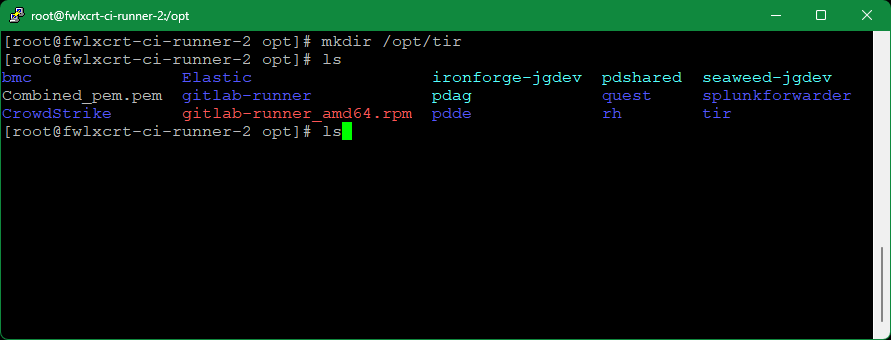

## TIR Deployment Using Docker-Compose

1.  On the target host system, create a target deployment folder (i.e. /opt/tir).

$ mkdir /opt/tir

1.  Copy over the latest bootstrap script from the pipeline job artifacts. This script is built in the pre-deploy stage of the current TIR gitlab pipeline and can be found in the “Prepare docker-compose” job artifacts (i.e. <https://gitlab.us.lmco.com/e348832/tir/-/jobs/125468922/artifacts/browse>).

*It is important to use the job artifact script as it compiles text from the other run-time scripts necessary for the TIR deployment.*

1.  Generate the supporting files.

    1.  Move the bootstrap\_tir.sh file into the target deployment folder.

    2.  Set the bootstrap\_tir.sh mode to executable

$ chmod +x /opt/tir/bootstrap\_tir.sh

1.  From the deployment folder as the working directory, run the executable

> $ ./bootstrap\_tir.sh

1.  Follow the instructions in the bootstrap to generate the supporting files

    1.  It will ask if a database is being deployed and then will provide questions with example answers as well as default values if no prompt is given

    2.  Tips:

        1.  Images: Use images from public/private repos that match images listed in the default example, the hosting registry may differ but the image:tag should be similar (i.e.
            your.private.registry/project/tir:v1.0.1 matches our.private.registry/our\_project/tir:v1.0.1).

        2.  SQLITE (optional): should be true if using sqlite instead of another SQL db instance – only visible when deploying a database

        3.  USE\_CU STOM\_REPO: This deployment allows for the nginx reverse proxy to restart upon receiving updated and valid SSL host certificates. It thus requires installation of the following packages: (openssl inotify-tools procps-ng psmisc). OpenSSL validates the certificates, inotify-tools
            allows for monitoring of the staged-certificate shared
            volume, and Procps-ng/psmisc allow the image to search for
            the running inotify process, and stop it, thus restarting
            the reverse proxy. **Set this variable to true if your
            server requires a private yum repository**.

1.  At the end of the setup, the bootstrap script will display a massage
    stating which files had been created based on the selections in the
    prompts. Note the next steps listed at the bottom.

1.  *If the server is using a private yum repository*, copy the
    following into the target deployment's nginx\_renew folder from the
    matching tir repository’s deployment folder:

    1.  A cachain cert (.pem file) for ca-trust

(For LM instances)

$ curl http://crl.external.lmco.com/trust/pem/combined/Combined\_pem.pem
\\

-o nginx\_renew/cachain.pem

1.  .repo file(s) to be used from where openssl, inotify-tools,
    procps-ng, psmisc can be installed.

(For LM instances)

$ sed -i "s/#INSERTTOKEN#/$EFOSS\_TOKEN/g" nginx\_renew/efoss.repo && \\

sed -i "s/#INSERTUSERNAME#/$EFOSS\_USER/g" nginx\_renew/efoss.repo

1.  A yum.conf file if necessary

1.  Install docker-compose, see
    https://cctdocs.pages.gitlab.us.lmco.com/ironforge/hosting/deployment/index.html
    and perform

    1.  Preparation

    2.  docker-compose

    3.  Netavark network\_backend install/config

2.  Use docker-compose to bring up the deployment

    1.  From your working directory bring up the environment with

$ docker-compose up -d

1.  To see logs on your compose up use

$ docker-compose logs \# you can add -f to follow

1.  To bring down the deployment, run the following:

$ docker-compose down

1.  Remove the volumes created by running

$ podman volume ls \# shows a list of created podman volumes

> $ podman volume rm tir-... \# Only use for volumes created by this
> docker-compose

# **Steps for TIR Cert Import and Verification**

1.  Click **Administration** tab

1.  Click on the **Configuration** tab

1.  Click on the CA Certificate Choose File box to open a File dialog
    window and choose your signed x509 formatted .crt file and hit
    Open - the name of the file will appear in the CA Certificate Text
    Box

1.  Note name of .crt file shows up in text field.

1.  Click on the Site Certificate Choose File box to open a File dialog
    window and choose your pem formatted site key and hit Open - the
    name of the file will appear in the Site Certificate Text Box

1.  Select Import

A modal window saying "Checking Certificates Please Wait... Circle" will
appear while the files are being loaded.

A message underneath the Certificate Import form Text Fields will appear
saying "Certificate Import Successful!" if the certs are accepted.

Notes:

-   The nginx listener checks imported certificates for:

    -   A .pem formatted key file

    -   A x509 formatted .crt file

    -   Cert files matching modulus

    -   CRT Common Name matching NGINX\_HOST variable value

-   If invalid cert files are loaded, an error will appear saying "Error
    in Cert Response" in the top right of the window

