1.  Click **Administration** tab

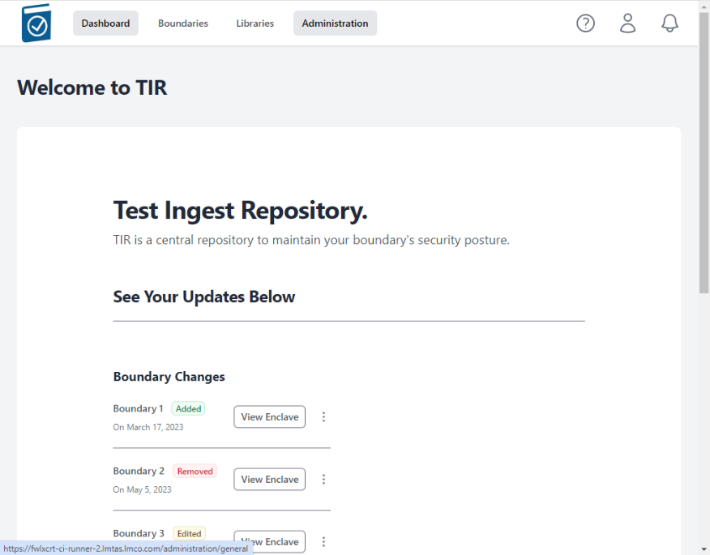

1.  Click on the **Configuration** tab

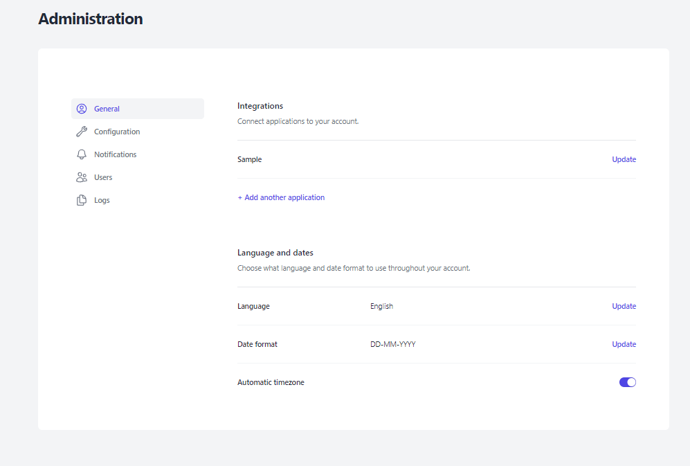

1.  Click on the CA Certificate Choose File box to open a File dialog
    window and choose your signed x509 formatted .crt file and hit
    Open - the name of the file will appear in the CA Certificate Text
    Box

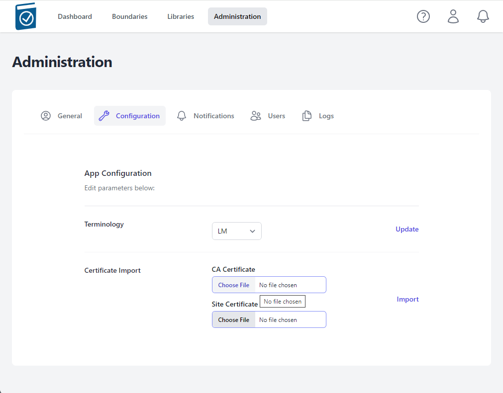

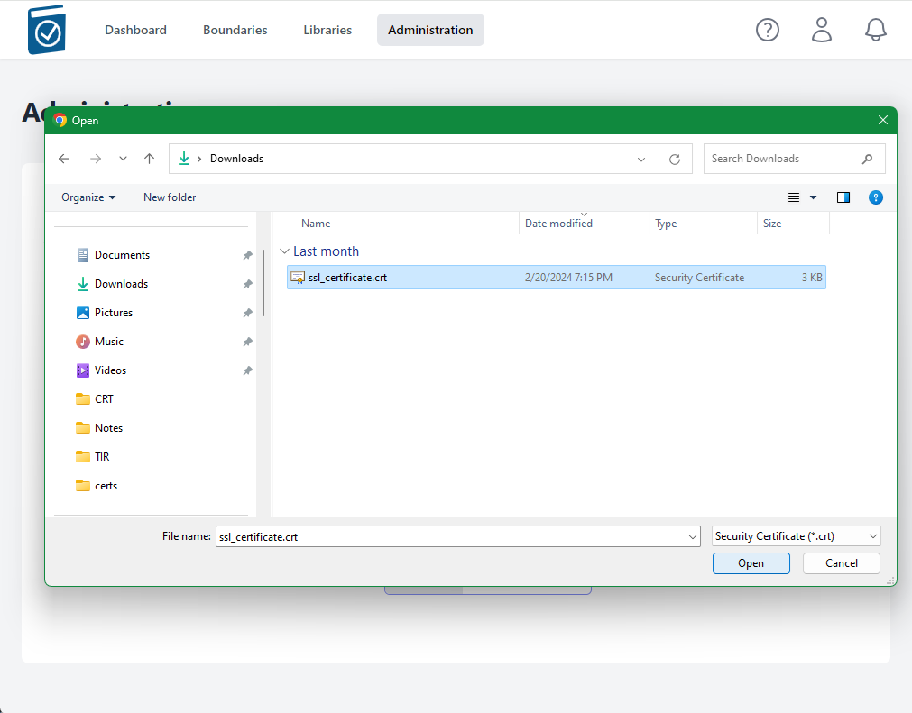

1.  Note name of .crt file shows up in text field.

1.  Click on the Site Certificate Choose File box to open a File dialog
    window and choose your pem formatted site key and hit Open - the
    name of the file will appear in the Site Certificate Text Box

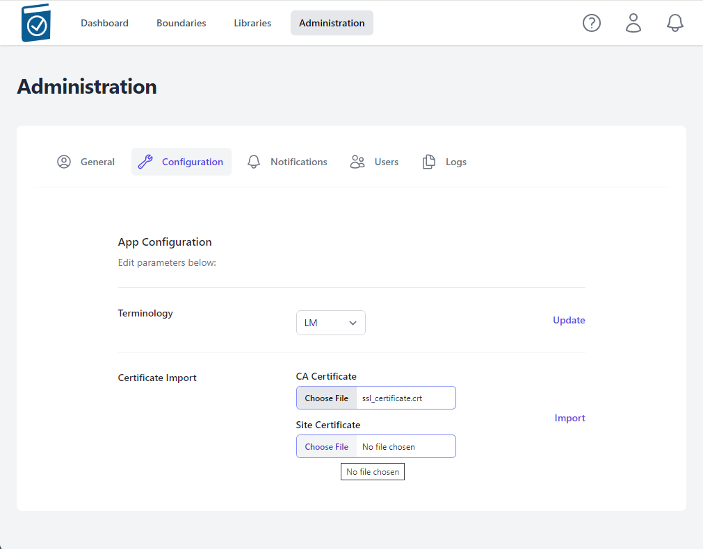

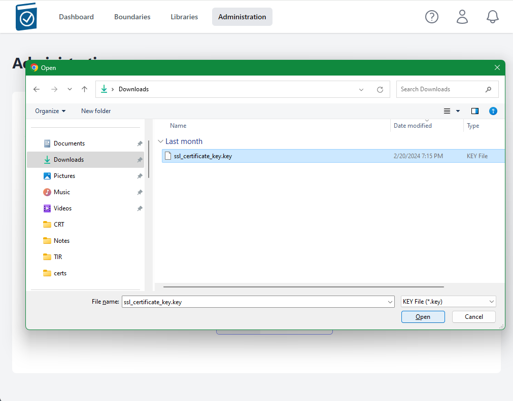

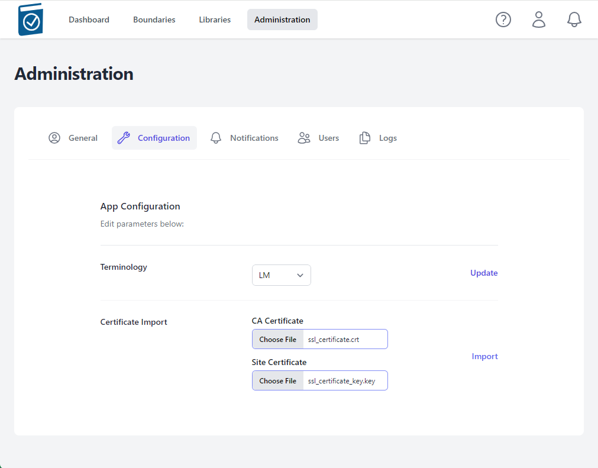

1.  Select Import

A modal window saying "Checking Certificates Please Wait... Circle" will
appear while the files are being loaded.

A message underneath the Certificate Import form Text Fields will appear
saying "Certificate Import Successful!" if the certs are accepted.

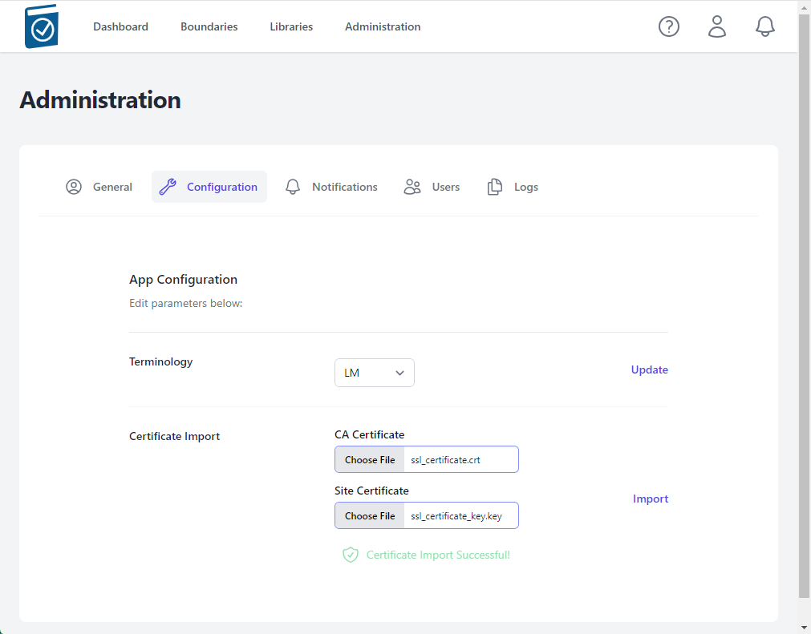

Notes:

-   The nginx listener checks imported certificates for:

    -   A .pem formatted key file

    -   A x509 formatted .crt file

    -   Cert files matching modulus

    -   CRT Common Name matching NGINX\_HOST variable value

-   If invalid cert files are loaded, an error will appear saying "Error
    in Cert Response" in the top right of the window

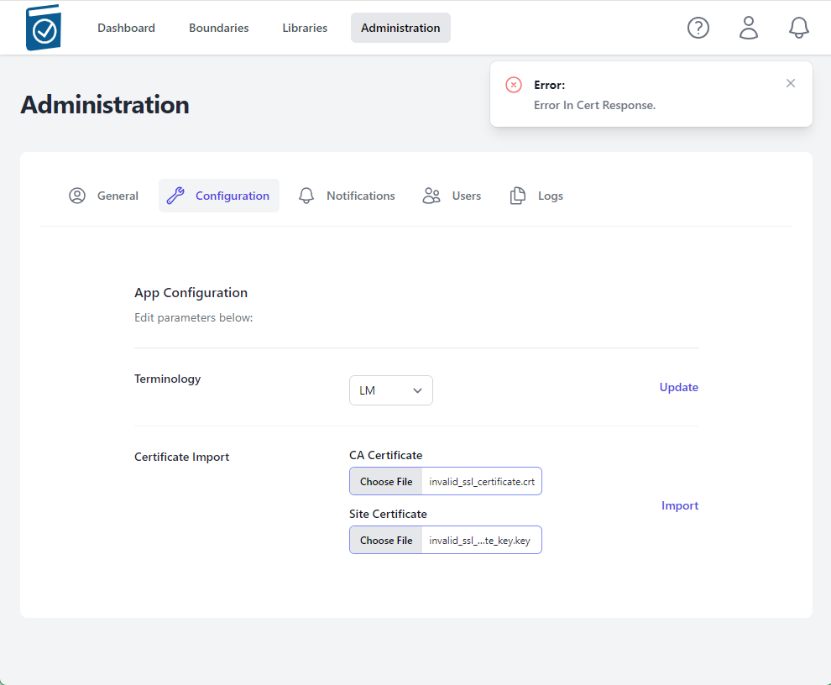

## Demonstrating Certificate Import

1.  Perform TIR Deployment using docker-compose steps (above)

2.  On the host, in the deployment folder, follow the compose logs

$ docker-compose logs -f

Wait for the database to be migrated/seeded completely and nginx image
to have all packages installed. You will see messages similar to the
following – from the tirserver, a lot of migrate messages and then it
will stop – that means it’s done. If you have a good eye, look for
**tirserver | { event: 'up', message: 'applied X
migrations.' }** messages. There will be a number of migrations
that are applied during this setup phase.

> …
>
> tirserver | Executing (default): INSERT INTO "seeder\_meta" ("name")
> VALUES ($1) RETURNING "name";
>
> tirserver | {
>
> tirserver | event: 'migrated',
>
> tirserver | name: '2023.12.07T05.38.17.TierRoles.ts',
>
> tirserver | durationSeconds: 0.011
>
> tirserver | }
>
> tirserver | { event: 'migrating', name:
> '2023.12.07T14.27.10.BoundaryRoles.ts' }
>
> …
>
> tirserver | { event: 'migrating', name:
> '2024.02.03T01.28.29.Classifications.ts' }
>
> tirserver | Executing (default): INSERT INTO "Classifications"
> ("id","name","abbreviation","creationDate","lastUpdate") VALUES
> (1,'Unclassified','U','2024-03-13T12:39:50.487+00:00','2024-03-13T12:39:50.487+00:00'),(2,'Controlled
> Unclassified
> Information','CUI','2024-03-13T12:39:50.487+00:00','2024-03-13T12:39:50.487+00:00'),(3,'Secret','S','2024-03-13T12:39:50.487+00:00','2024-03-13T12:39:50.487+00:00'),(4,'Top
> Secret','TS','2024-03-13T12:39:50.487+00:00','2024-03-13T12:39:50.487+00:00');
>
> tirserver | Executing (default): SELECT table\_name FROM
> information\_schema.tables WHERE table\_schema = 'public' AND
> table\_name = 'seeder\_meta'
>
> tirserver | Executing (default): SELECT i.relname AS name,
> ix.indisprimary AS primary, ix.indisunique AS unique, ix.indkey AS
> indkey, array\_agg(a.attnum) as column\_indexes, array\_agg(a.attname)
> AS column\_names, pg\_get\_indexdef(ix.indexrelid) AS definition FROM
> pg\_class t, pg\_class i, pg\_index ix, pg\_attribute a WHERE t.oid =
> ix.indrelid AND i.oid = ix.indexrelid AND a.attrelid = t.oid AND
> t.relkind = 'r' and t.relname = 'seeder\_meta' GROUP BY i.relname,
> ix.indexrelid, ix.indisprimary, ix.indisunique, ix.indkey ORDER BY
> i.relname;
>
> tirserver | Executing (default): INSERT INTO "seeder\_meta" ("name")
> VALUES ($1) RETURNING "name";
>
> tirserver | {
>
> tirserver | event: 'migrated',
>
> tirserver | name: '2024.02.03T01.28.29.Classifications.ts',
>
> tirserver | durationSeconds: 0.015
>
> tirserver | }
>
> **tirserver | { event: 'up', message: 'applied 7
> migrations.' }**

1.  Load site in browser using the hostname in .env for NGINX\_HOST. It
    will be insecure due to its originally Self-signed certs.

-   In Chrome, type **“thisisunsafe”**

-   in the browser to continue.

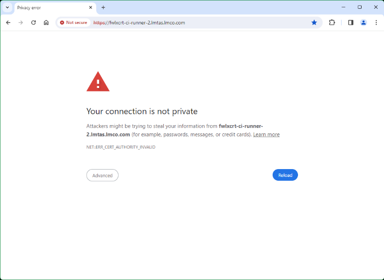

1.  Follow the steps in “Steps for TIR Cert Import and Verification”
    steps 1-3.

2.  Load invalid certs and note messages in docker-compose logs

    1.  Load non-formatted invalid certs

    2.  Load non-matching certs

    3.  Load matching but wrong site certs

3.  Load correct certs, see responses and messages in logs

Ctrl+C out of docker-compose logs, wait about 15 seconds and run the
following command to see status of tirserver and nginxproxy (and
postgresdatabase if applicable). Note uptime for proxy is less than
other two due to its recent restart.

$ podman ps

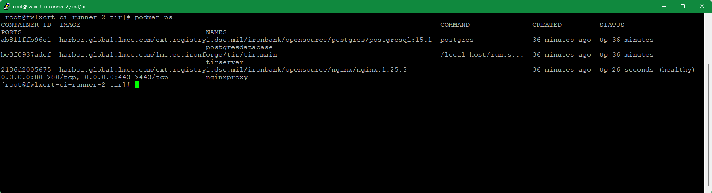

1.  Close tab and reopen in browser, note cert error is gone – copy
    http://hostname from address bar

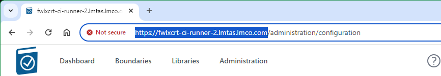

1.  Paste address into a new tab, and go.

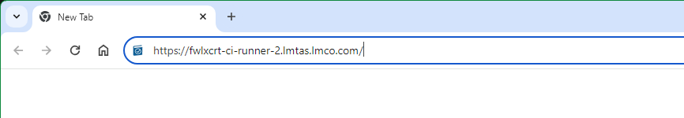

1.  Note site information next to address shows secure connection and
    Certificate is Valid. Click icon next to web address.

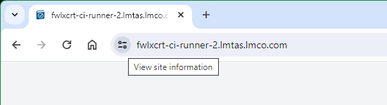

1.  Click on Connection is secure to view site details

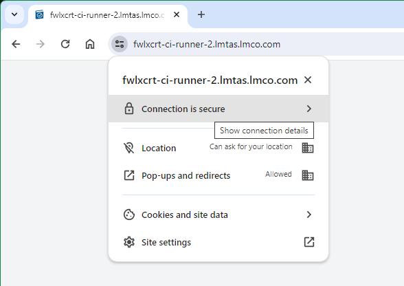

1.  Click on Certificate is valid to view Certificate information.

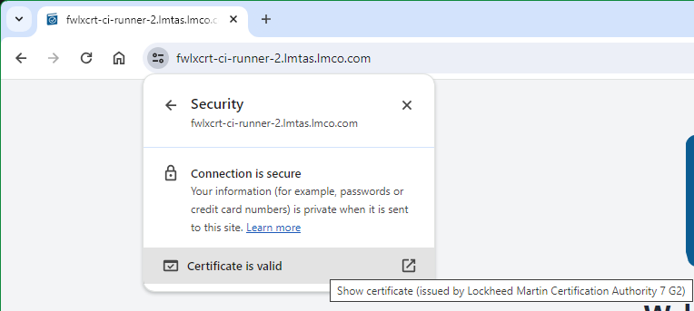

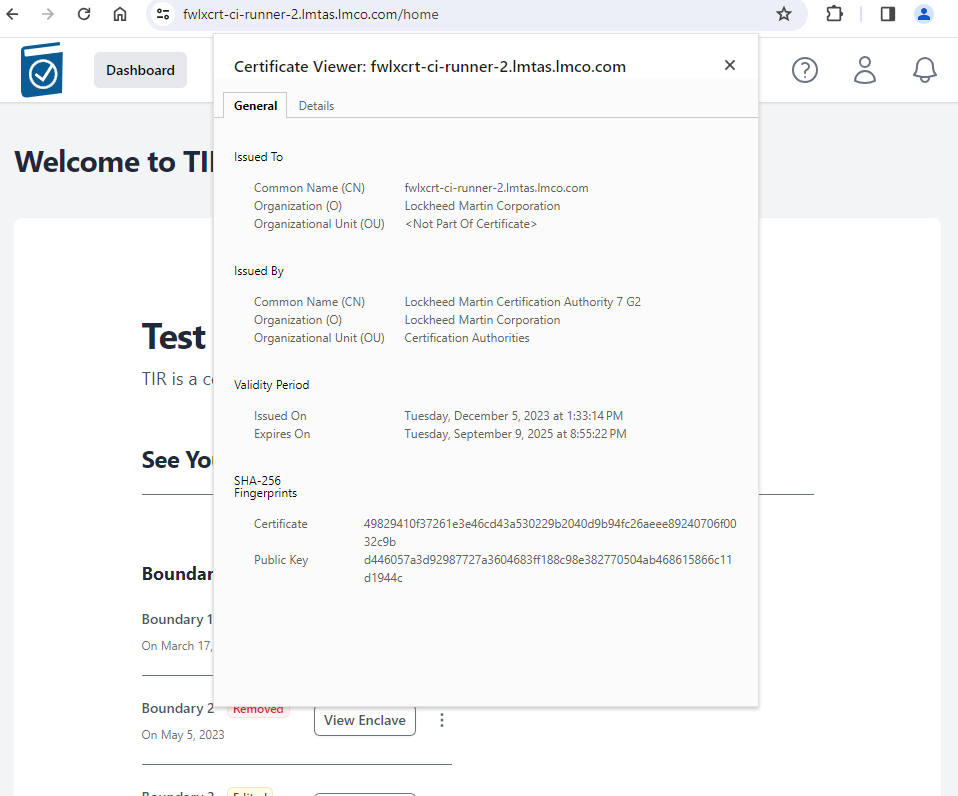