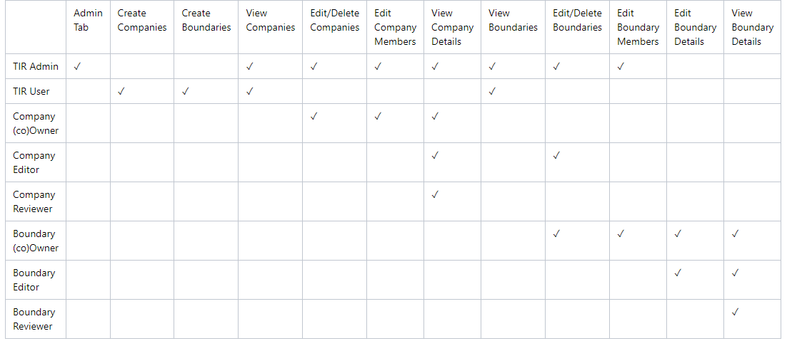
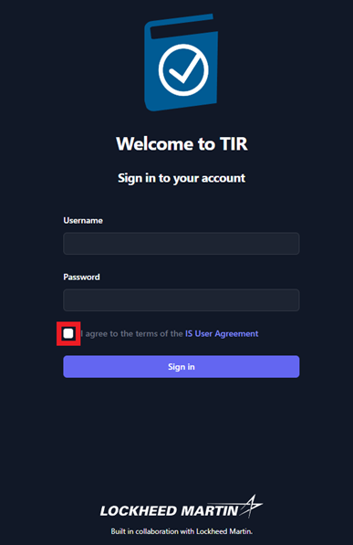

## Getting Started

TIR is a repository that will store and manage your system or network’s STIG compliance and Plans of Actions and Milestones (POA&M). Your TIR instance should be deployed and configured by your System Administrator, and access through a web browser. For information about deploying TIR to a new environment please see the Test Ingest Repository (TIR) Deployment Guide.

### Request Account Access

Please follow instructions defined by your program to request an account Administrators have access to create accounts and reset passwords.

### Account Permissions

TIR has two types of users, Administrators and Users. Administrators have access to the **Administration,** **Libraries**, and **Boundary** tabs. Users only have access to Libraries and Boundary tabs. TIR is setup as a hierarchical system with Companies and Boundaries. Users can be granted permissions to be Owners, Reviewers, and Editors for Companies and Boundaries. A summary of permissions is show in Table 1, below.

### Login

Once your account has been created, please navigate to the TIR home page. Enter your **Username** and P**assword**, then review the **IS User Agreement** and acknowledge that you have read it by clicking the check box. Then, click **Sign in**.

