## Interfaces

Upon a successful login, the user will be welcomed into TIR and the **Dashboard** will be displayed. At the top of the page, you will see three buttons: **Dashboard**, **Boundaries**, and **Libraries**. In later sections of this guide, you will find detailed instructions on how to properly configure and use each of these interfaces.

### Dashboard

The dashboard will show you the most recent changes to your TIR instance and will display any important upcoming dates that the user should be aware of. Some examples of displayable content include; recent changes to Boundaries and the newest Security Technical Implementation Guide (STIG) libraries imported.

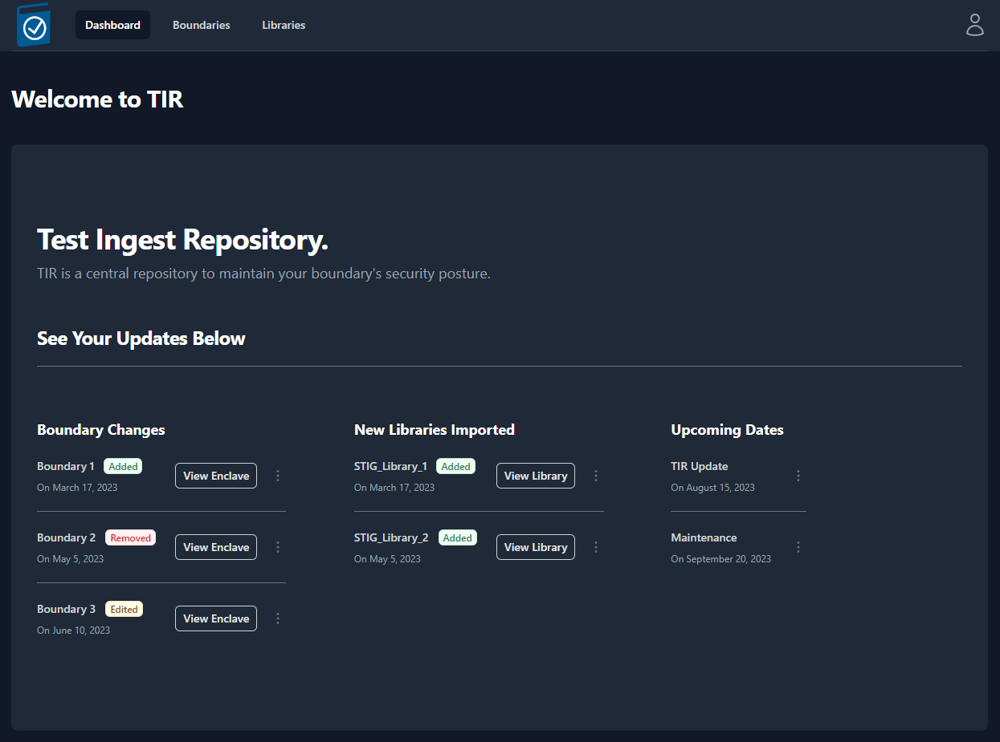

### Boundaries

The Boundary tab contains “Companies” and “Boundaries” in a hierarchical structure to best support multiple programs within a single TIR instance. Companies will be used to store and organize Boundaries. The Boundaries will store your Systems and all of the STIG and Nessus data associated with those Systems. Permissions can be granted to Companies or Boundaries and your permissions will be granted based on the Role of your user account (see Table 1 for user permissions).

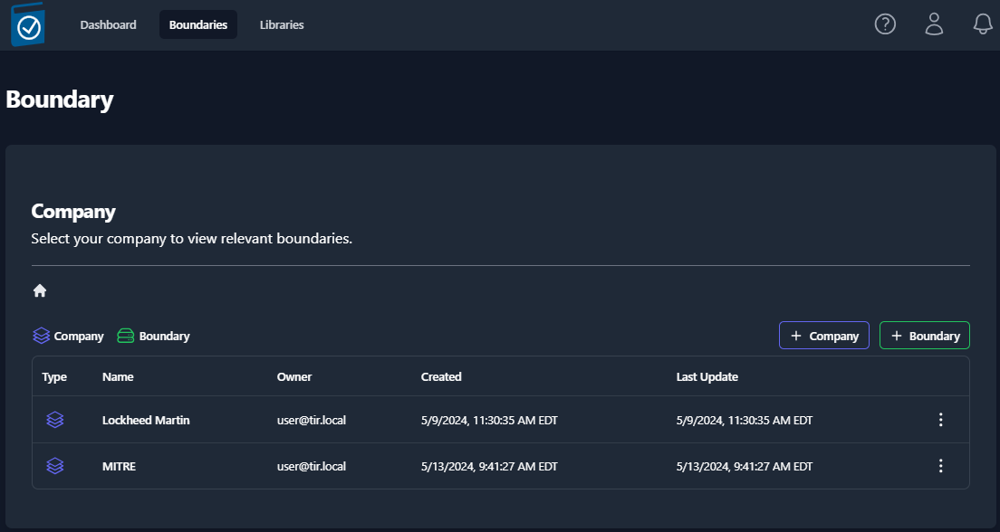

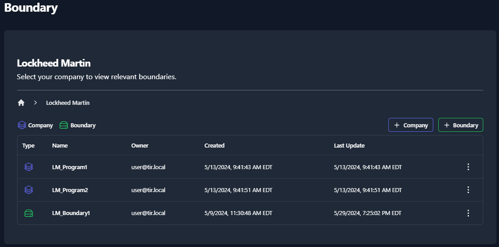

### Libraries

The Libraries tab provides the ability to import new STIG libraries and updated Control Correlation Identifiers (CCI) mappings for different NIST SP 800-53 revisions. 

#### STIG Libraries

The Department of Defense (DoD) releases quarterly updates to the STIG benchmarks. STIG Libraries can be downloaded at [public.cyber.mil](public.cyber.mil). These quarterly updates are released as .zip files. Once downloaded, the .zip files can be uploaded to TIR and made available to all users.

##### View STIG Libraries 

Navigate to the **Libraries** page by clicking the **Libraries** button at the top on the page.

The **Libraries** page will display all of the STIG libraries that have been uploaded to your TIR instance.

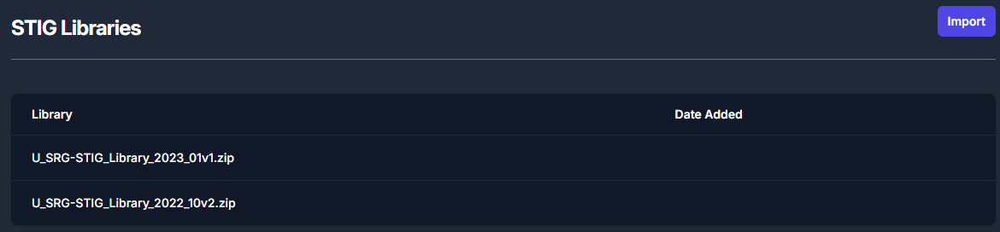

##### Import STIG Libraries

To import a new STIG library, navigate to the **Libraries** page and click the **Import** button inside the **STIG Libraries** section. For reference, this button can be found in the top right of *Figure 5: STIG Libraries*.

The **Import** button will open a file navigation window. Navigate to the .zip file containing the STIG Library and click **Open**.

Once imported, the STIG libraries will follow a standardized naming convention. The naming convention will follow this template: **U\_SRG-STIG\_Library\_{year}\_{month}{revision}.zip**.

Please refer to the table below for more examples.

<table>
<colgroup>
<col style="width: 8%" />
<col style="width: 29%" />
<col style="width: 14%" />
<col style="width: 47%" />
</colgroup>
<thead>
<tr class="header">
<th><strong>Year</strong></th>
<th><strong>Release Quarter/ Month</strong></th>
<th><strong>Revision</strong></th>
<th><strong>Naming Convention</strong></th>
</tr>
</thead>
<tbody>
<tr class="odd">
<td>2022</td>
<td>Q1 / January (01)</td>
<td>v1</td>
<td>U_SRG-STIG_Library_2022_01v1.zip</td>
</tr>
<tr class="even">
<td>2022</td>
<td>Q2 / April (04)</td>
<td>v2</td>
<td>U_SRG-STIG_Library_2022_04v2.zip</td>
</tr>
<tr class="odd">
<td>2023</td>
<td>Q3 / July (07)</td>
<td>v1</td>
<td>U_SRG-STIG_Library_2023_07v1.zip</td>
</tr>
<tr class="even">
<td>2023</td>
<td>Q4 / October (10)</td>
<td>v2</td>
<td>U_SRG-STIG_Library_2023_10v2.zip</td>
</tr>
</tbody>
</table>

<em>Table 2: STIG Library Naming Conventions</em>

#### CCI Matrix

CCI mappings are distributed by NIST and are updated as necessary. The latest CCI Matrix can be downloaded at the following <https://public.cyber.mil/stigs/cci/>. Please note that CCI mappings differ between SP 800-53 Rev 4 and Rev 5, and keeping this updated will ensure more granular mapping of STIGs to applicable CCIs.

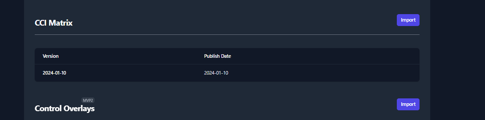

##### Import CCI Matrix Updates 

To import a new CCI Matrix, navigate to the Libraries page and click the Import button inside the CCI Matrix section. For reference, this button can be found in the top right of *Figure 6: CCI Matrix*.

### About Page

The **About Page** will let the user know what version of TIR they are currently accessing as well as the date that the current version was pushed to their environment.

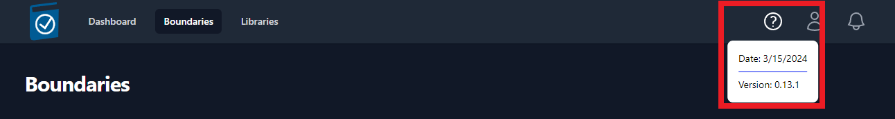

### User Profile

The User Profile icon looks like a person and is located in the top-right of the screen. To access your profile, click the **Icon** and then click **Your Profile** (as seen in *Figure 8*). If you wish to sign out, you can find the **Sign Out** button located under **Your Profile**.

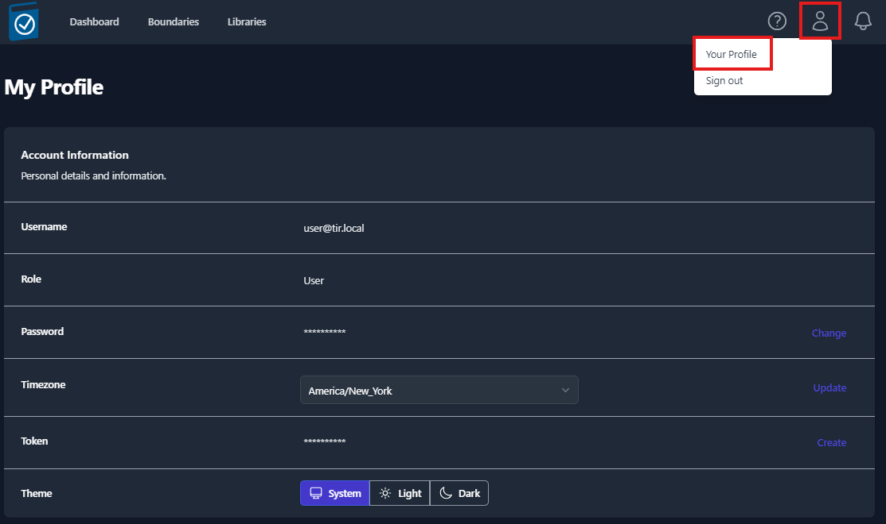

Your **User Profile** will display your **Username**, **Role**, **Hidden Password**, **Time zone**, **API Token**, and **Color Theme**.

-   To change your password, click the **Change** button located on the right-side of the **Password** row. Enter a **New Password**, **Confirm the Password**, and click **Save**.

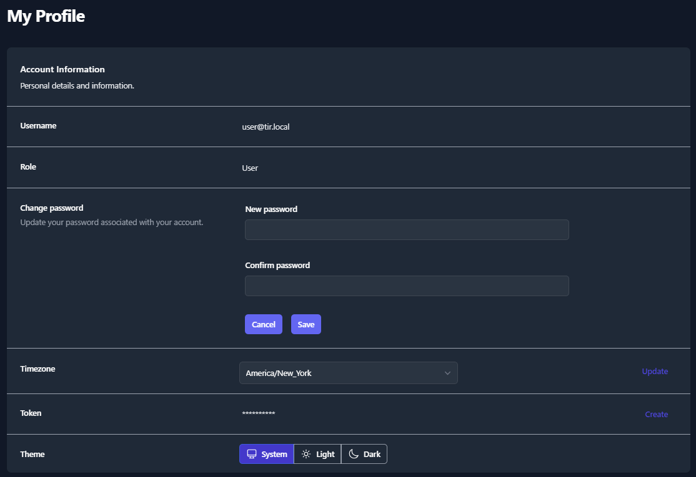

-   To update your Time zone, select a new time zone from the drop-down menu and click **Update** button located on the right-side of the **Timezone** row.

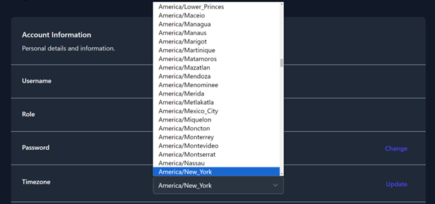

-   To create an **API Token**, click the **Create** button on the right-side of the **Token** row. Enter a **Token Name** and an **Expiration Data,** then click **Generate**. A pop-up window will appear that contains your **Token Code**. Please save that code before closing the window. A list of your existing tokens can be found in the **Token Table**. Please see *Figure 11* as an example.

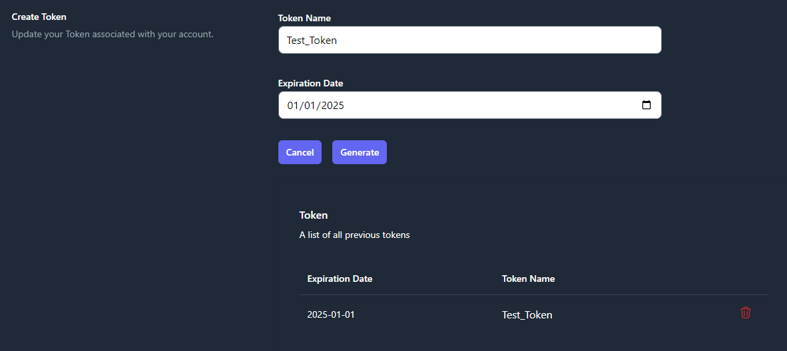

-   To change the **Coloring Theme** of TIR, choose **System**, **Light**, or **Dark** from the **Theme** row. The **System** option will use the theme from your client system’s settings.

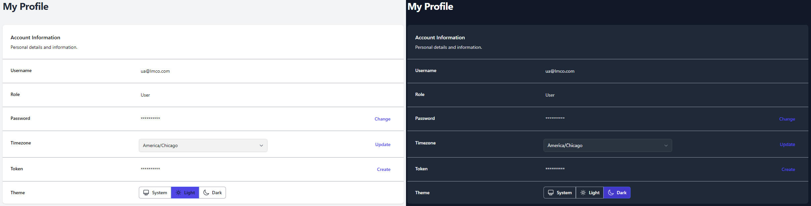

### Notifications

Users will receive notifications about important dates related to their Boundaries and when new STIG Libraries are available. The notification for a new STIG Library will be sent out to all Boundary Owners once a new STIG Library is imported into your TIR instance. These notifications will be displayed by the **Bell** icon in the top-right of the screen (as seen in *Figure 13*). A snippet of each unread notification will be displayed from this view.

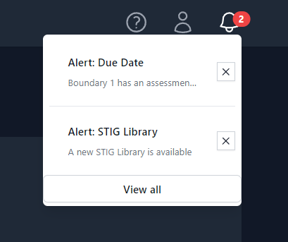

To view all of your notifications, press the **View all** button at the bottom of the Notification Bell menu (*Figure 13*). An example of the full notification page can be seen below in *Figure 14*.

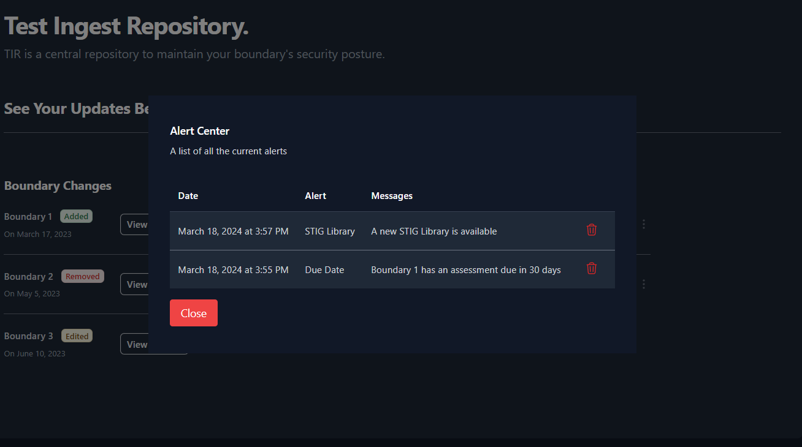