## Creating your Work Environment

The Test Ingest Repository is designed to a store your boundary composition in a hierarchical format. Before you can begin your cyber assessment, you will need to create the path to store your boundary’s scan data.

All instructions within this section will be explicitly from the **Boundaries** interface.

### Creating Companies

The **Boundaries** landing page will show you the highest level of your organizational structure.

The structure of your boundaries will depend greatly on where TIR is being hosted. For environments being accessed by a wide range of users, compartmentalization will be important. For smaller environments, the compartmentalization structure will not need to be as extravagant.

The owner of each boundary will be responsible for creating their **Boundary** inside of TIR. Before creating a boundary, please strategize on the access control elements of your boundary. When creating a boundary, the user will have the option to add a **Company** or add a **Boundary**. The **Companies** are used as a nesting structure to organize where your boundary is stored. The **Boundaries** will be a container that stores all of the cyber assessment data and will provide a workspace to address any findings. To compare to a traditional directory structure, the **Companies** will act as the higher-level directories and the **Boundaries** will act as the lowest level directory. **Systems** will be added to each boundary, and those **Systems** will be the equivalent to actual files existing in your directories.

To better illustrate this comparison to the traditional directory structure, please refer to the *Figure 15: Example Boundary Structures* below.

With that illustration in mind, let’s get started with creating boundaries inside of TIR. Navigate to the **Boundaries** page by clicking the **Boundaries** button at the top on the page. To create a new company, click the **\[+\] Company** button as shown in Figure 16.

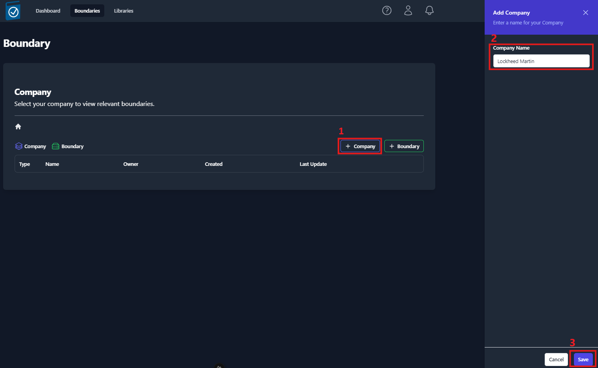

A side panel will open from the right of the screen. Enter the name of the company into the **Company Name** text field and click **Save**.

You should now see an item titled with the name you entered into the **Company Name** field. For demonstration purposes, we’ll use the example from *Figure 15*. We’ll start by creating a company for Lockheed Martin and MITRE, as seen in *Figure 17*.

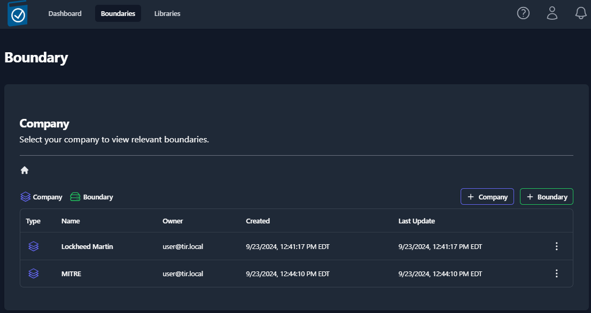

Navigate inside of your newly created Company by clicking on the item (ex: Lockheed Martin). Once navigating inside a new Company, you will see the **\[+\] Company** and **\[+\] Boundary** buttons. You have the ability to create as many nested Companies as you see fit.

There is only one restriction to the Company and Boundary structure. That is; Boundaries can NOT exist at the root level of your **Boundaries** tab. A boundary must be placed inside of a Company. Aside from the root level, Boundaries and Company can exist at the same level and Companies can be created to nest Boundaries as much as needed. The role of Companies is limit user access to certain Boundaries. Therefore, when creating your Company and Boundary structures, the users should be organizing their Boundaries in a manner that allows them to control access for their compartmentalized data.

### Creating a Boundary

Once you are ready to create a **Boundary**, navigate to an empty Company and click the **\[+\] Boundary** button. A side panel will slide out from right side of the screen (*Figure 18*) that will require you to fill out a couple fields. Once you have completed all of the fields, click the **Save** in the bottom-right of the side panel. See *Table 3* below for more information on the Boundary fields.

<table>
<colgroup>
<col style="width: 18%" />
<col style="width: 12%" />
<col style="width: 40%" />
<col style="width: 29%" />
</colgroup>
<thead>
<tr class="header">
<th><strong>Field</strong></th>
<th><strong>Required</strong></th>
<th><strong>Description</strong></th>
<th><strong>Default Value</strong></th>
</tr>
</thead>
<tbody>
<tr class="odd">
<td>Enclave Name</td>
<td>Yes</td>
<td>Name of your Boundary</td>
<td></td>
</tr>
<tr class="even">
<td>Owner</td>
<td>Yes</td>
<td>Owner of the Boundary</td>
<td>The current user</td>
</tr>
<tr class="odd">
<td>STIG Baseline</td>
<td>Yes</td>
<td>Set the STIG baseline</td>
<td>The latest STIG Baseline</td>
</tr>
<tr class="even">
<td>RMF Versions</td>
<td>Yes</td>
<td>Set the Cybersecurity Framework</td>
<td>NIST SP 800-53</td>
</tr>
<tr class="odd">
<td>Classification</td>
<td>Yes</td>
<td>Classification Marking</td>
<td></td>
</tr>
<tr class="even">
<td>Caveat</td>
<td>No</td>
<td>Additional Classification Markings</td>
<td></td>
</tr>
</tbody>
</table>

<em>Table 3:  Boundary Settings</em>

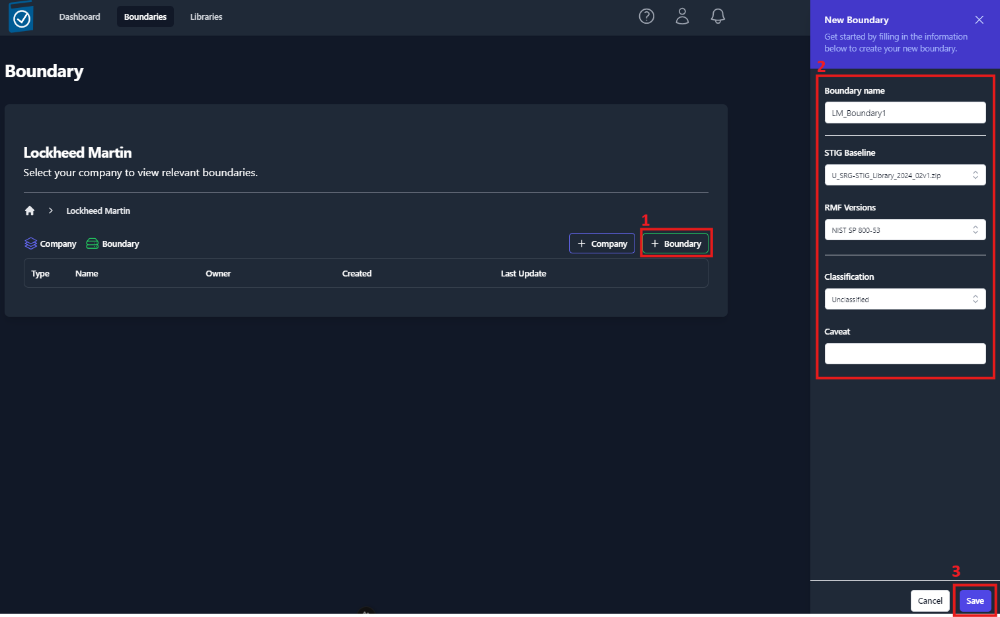

Your newly created boundary will appear in the table, as shown in *Figure 19: Viewing the list of created Boundaries*. To view your boundary, click on the item in the table.

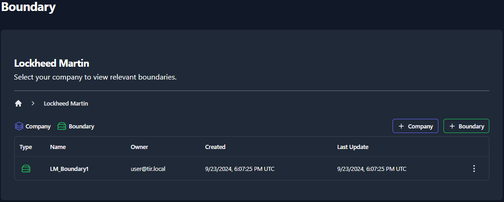

When a Boundary is selected, you will be taken to the Overview sub-tab of the Boundary dashboard. The boundary overview sub-tab will display a high-level overview of your systems and the findings associated with each system.

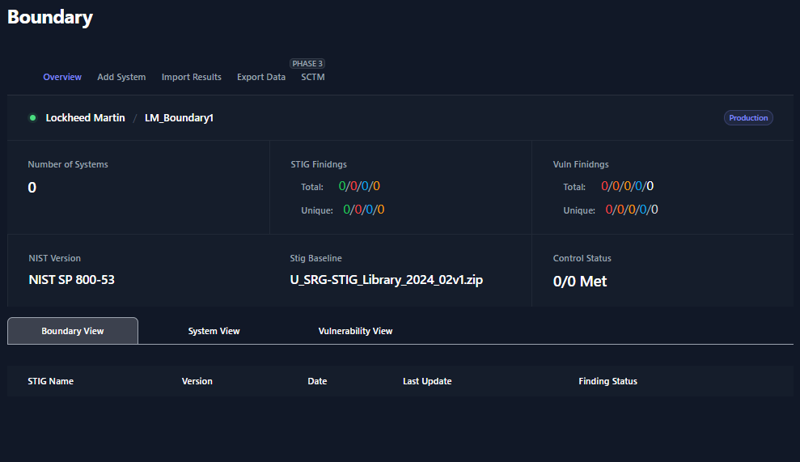

At the top of the Boundary Overview table you will find the **Path to your Boundary** with breadcrumbs that a linked back to each parent for easy navigation.

-   The **Number of Systems** field will display the amount of Systems that have been added to your boundary.

-   The **STIG Findings** fields will display a total number of STIG checks and the unique number of STIG checks. The total number of checks come from the sum of the total checks for each system. The number of unique checks come from the statuses of the checks contained inside the Boundary applied STIGs. For example, if two systems have the same STIG check set to Open, this will count as **two** open findings for the **Total** count but only **one** open finding for the **Unique** count. STIG checklists can be found in the **Boundary View** and **System View**.

-   The **Vuln Findings** fields (similar to STIG Findings) will display a total number of Nessus findings and the unique number of Nessus findings. Nessus findings can be found in the **Vulnerability View**.

-   The **NIST version** field will display RMF Framework that was assigned to your boundary.

-   The **STIG baseline** field will display the STIG Library set for this boundary. This STIG baseline can be updated as new STIG Libraries become available. To update this field for your boundary, see section **Updating the STIG Baseline for a Boundary** below.

-   The **Control Status** fields are for future development.

### Adding Systems to your Boundary

Navigate to the Boundary that you wish to add a system to. Click the **Add System** sub-tab and view the available options.

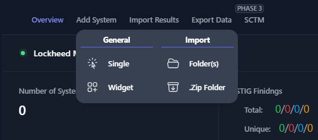

There are four options available when adding a system to your boundary:

<table>
<colgroup>
<col style="width: 17%" />
<col style="width: 55%" />
<col style="width: 26%" />
</colgroup>
<thead>
<tr class="header">
<th><strong>Field</strong></th>
<th><strong>Description</strong></th>
<th><strong>Required Inputs</strong></th>
</tr>
</thead>
<tbody>
<tr class="odd">
<td>Single</td>
<td><ul>
<li>
Manually create a single system
</li>
</ul></td>
<td>System Name</td>
</tr>
<tr class="even">
<td>Widget</td>
<td><ul>
<li>
Load blank STIG Checklists
</li>
<li>
Duplicate Existing Systems
</li>
</ul></td>
<td>
System Name

STIG Checklists
</td>
</tr>
<tr class="odd">
<td>Folder(s)</td>
<td><ul>
<li>
Import Scan Results (CKL, XCCDF, .Nessus)
</li>
</ul></td>
<td>Directory</td>
</tr>
<tr class="even">
<td>.Zip Folder</td>
<td><ul>
<li>
Import Scan Results (.ZIP)
</li>
</ul></td>
<td>.Zip Folder</td>
</tr>
</tbody>
</table>

<em>Table 4: System Creation</em>

The **Single** and **Widget** options are manual options for creating a system. The **Folder(s)** and **.Zip Folder** options allow you to create your boundary using your results from your cyber scans.

#### Add Single System

The single system add feature will allow to create a new system inside of your boundary. When creating a new system, you will be asked to assign the system a name and click Save. This newly created system will be blank. For this system to be functional, you will need to add STIG checklist(s) and/or scan results.

The remaining fields (Host Name, Host IP Address, Host MAC Address, Host Fully Qualified Domain Name) are important when mapping different types a scan results to this system. Please fill out this information if it is known at the time of creation. Many of the automated scanning tools will populate these fields in your checklists. If you are importing checklists that have these system fields populated, the import function will fill out these fields automatically.

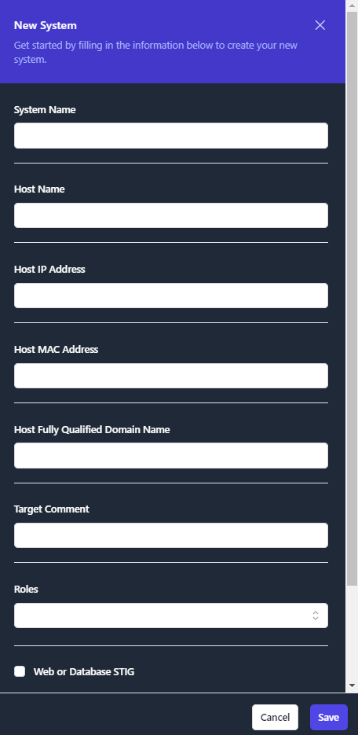

Once you have finished and click **Save**, you will be able to view your new System by clicking the **System View**.

#### Add System via Widget

The Widget feature is primarily used to duplicate existing Systems inside of your boundary. When adding Systems manually, this tool eliminates some of the manual steps of creating a new System. You’ll have the ability to duplicate as many systems as needed.

The Widget tool is useful when creating systems that mirror already existing systems in your boundary. For example, if you have multiple workstations that will contain the same STIGs, you can create the system and duplicate it for each mirrored workstation in your boundary.

To duplicate a system using the Widget, navigate inside of your boundary, click **Add System** and then click **Widget** (as seen in *Figure 21*). A pop-up window will appear (as seen in *Figure 23*) with the existing systems of your boundary pre-loaded. Locate the system that you wish to duplicate and click the **Duplicate** button on the right side of the row. This will create a new system and apply the exact same STIGs that previous system contained. To rename this new system, type the new name into the **System Name** field. To add additional STIGs, use the **STIGs** field. Finally, to remove any STIGs, navigate to the **Applied** STIGs field and click the **X** to the left of the STIG.

To create a brand new system from the widget, click the **\[+\] System** button. Then, rename the system using the **System Name** field. Add applicable STIGs using the **STIGs** drop-down menu.

Once you are satisfied with the new system(s) click the **Create Systems** button. For an example of using the widget tool, see *Figure 23*.

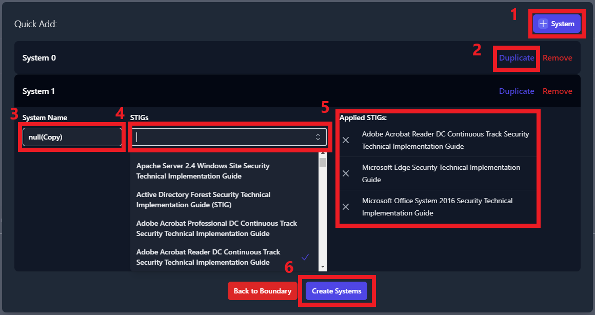

Once you have finished and click **Create Systems**, you will be able to view your new System by clicking the **System View**.

#### Add Systems by Importing Scan Results via Folder(s)

This method of adding systems will require scan results from each of the systems in your boundary. This import function supports CKL, CKLB, and XCCDF file formats, and automates the creation of the systems inside of your boundary.

There is a standard format that your cyber scan data will need to be organized in for this tool to correctly build your boundary. First, a parent folder for your boundary needs to be created. Then, navigate inside of your boundary folder and create a folder for each system in your boundary. Inside of each of these system folders, place all of the cyber scan data (.ckl, .cklb, and .xccdf files) associated to that system.

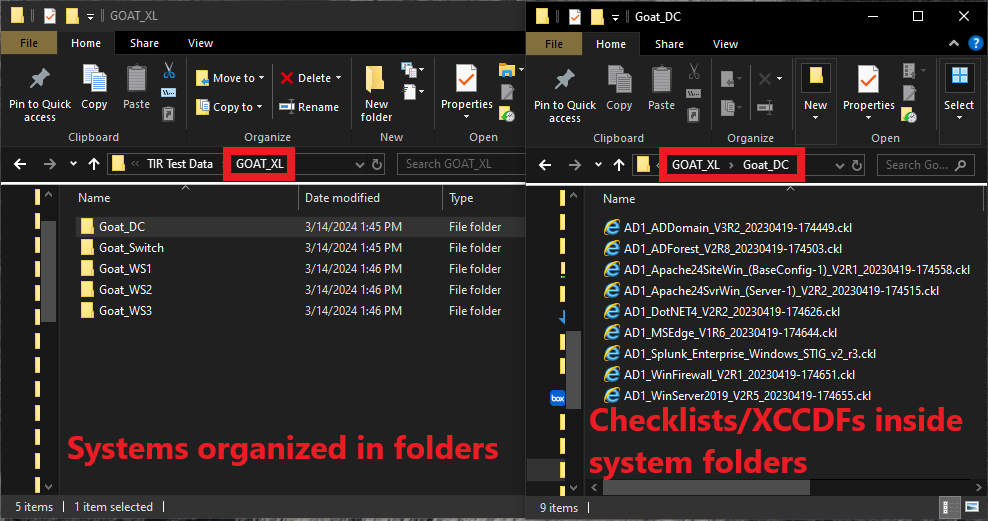

To create systems by using cyber scan data, navigate inside of your boundary, click **Add System** and then click **Folder(s)** (as seen in *Figure 25*). A file navigation window will open which will ask you to select a folder. It is very important that you select the parent folder that contains individual folders for each system on your boundary. When clicking the **Upload** button (inside the file navigation window), you should be looking at all of the folders with your system names and the parent folder should be displayed in the **Folder** field directly above the **Upload** button.

")

Once you click the **Upload** button, you will be prompted to confirm that you wish to upload all of your results. Click **Upload** on the prompt.

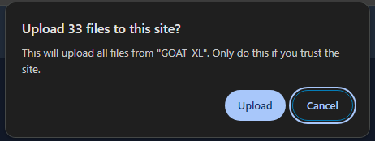

Once all of the files have been uploaded you will be able to view each system in the **System View** tab.

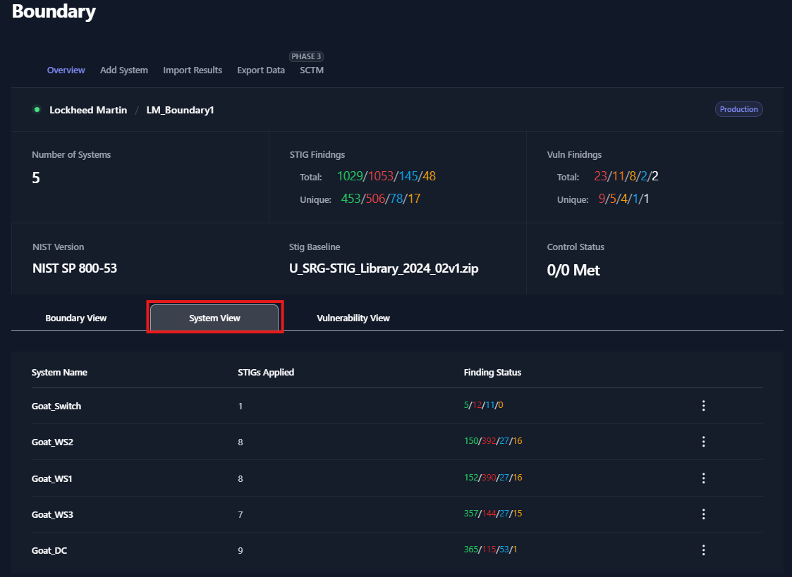

#### Add Systems by Importing Scan Results via .Zip Folder

Users have the option to zip up the results and import the .zip folder to create a new system. Each system will need their own .zip folder. Please rename the .zip folder to contain the System Name. In our example below, **Goat\_DC** is the name of the system that we are creating. The **Goat\_DC.zip** folder contains all of our checklist and XCCDF scan data. Please note; if you have multiple .zip folders to upload, they will need to be uploaded one at a time.

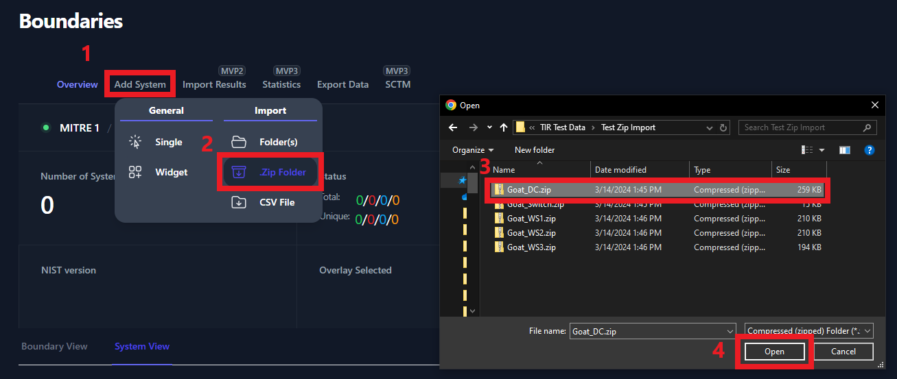

Once all of the files have been uploaded you will be able to view each system in the **System View** tab. For more information about the System View, please see the **System View** section.

### Manually Adding STIGs to a System

Manually adding STIGs is not necessary if you are able to upload scan results for your system. This feature allows you to grab blank checklists from the STIG Libraries and add them to a system. This could be used for STIG checklists that can not be scanned using automated scanning tools. Before adding STIGs to your systems, be sure that you have the latest STIG Library uploaded. See the **Import STIG Libraries** section for instructions on how to upload the latest STIG Library.

To add a blank STIG checklist to a system, navigate to your boundary and click **System View**. Next, select a system from the system view.

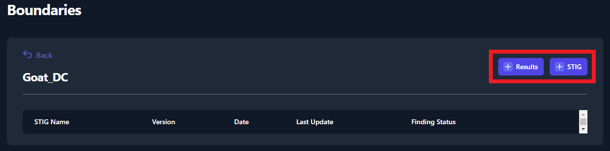

The two buttons found in the screenshot above (*Figure 29*) can be used to upload STIGs and Test Data Results to your systems. 

Once you have the latest STIG Library uploaded, navigate to your System and click the button titled **\[+\] STIG** (as seen in *Figure 29: Import Test Data*). A side panel will appear on the right side of your screen. Use the search bar (highlighted in *Figure 30: Adding STIGs to your System*) to find each STIG that is applicable for you System. Click on the STIG to add it to the **Applied STIGs** section at the bottom of the panel. Once you’ve added all of your STIGs, click the **Save** button at the very bottom of the panel.

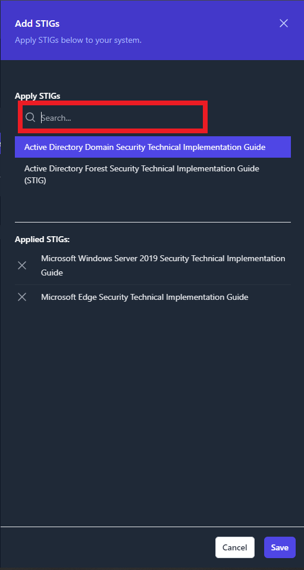

Once the STIGs have been added, you will see them displayed in list of STIGs for you system. See *Figure 31* below for an example.

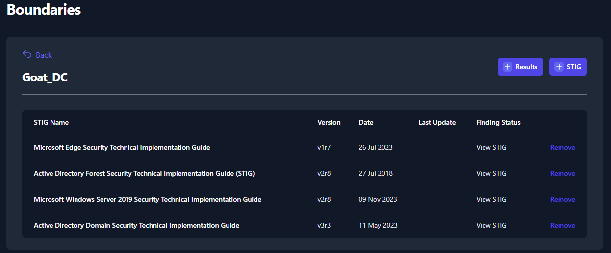