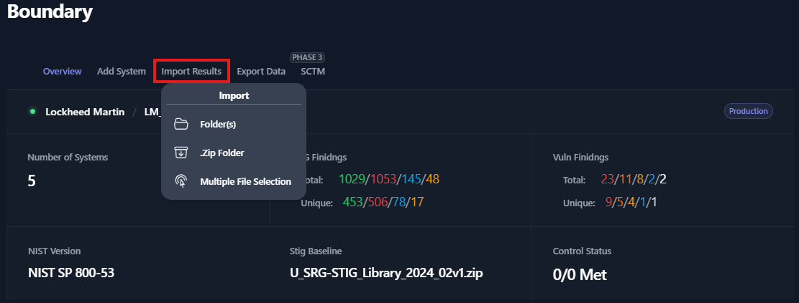
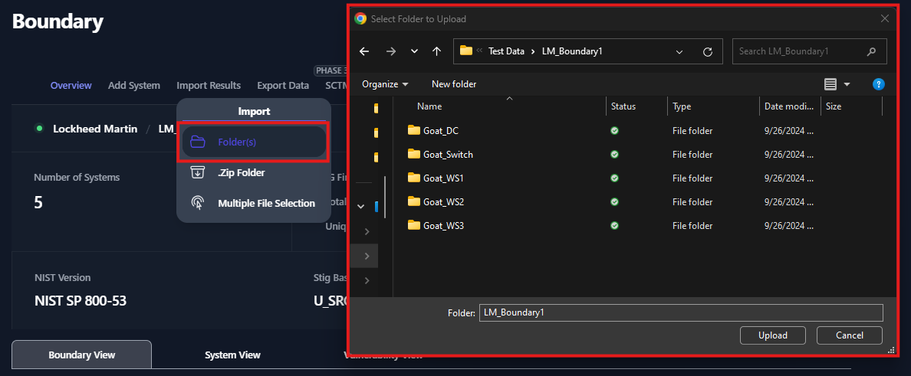
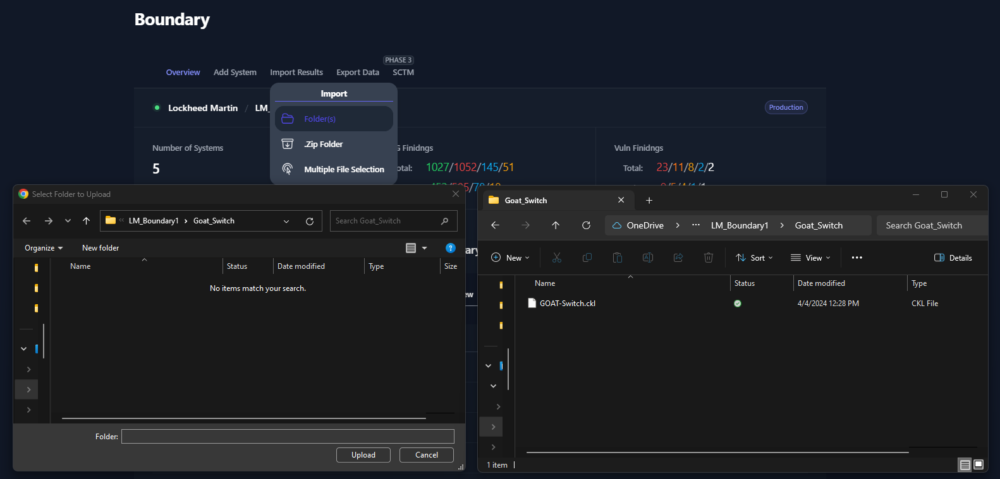
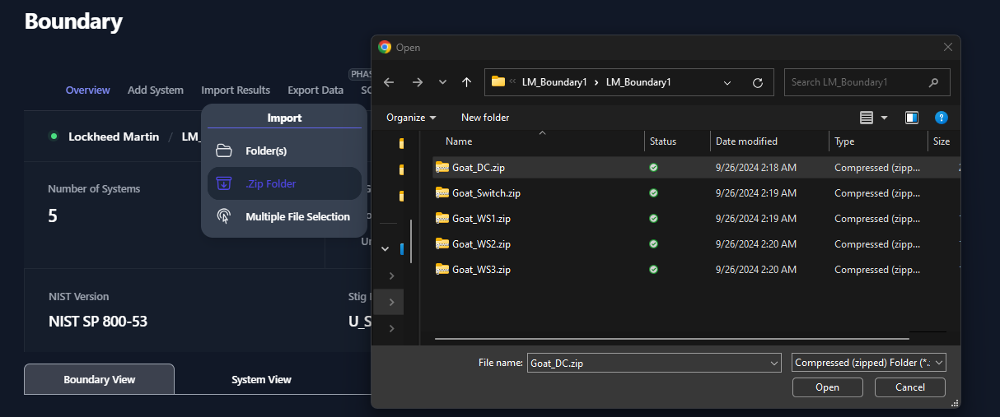
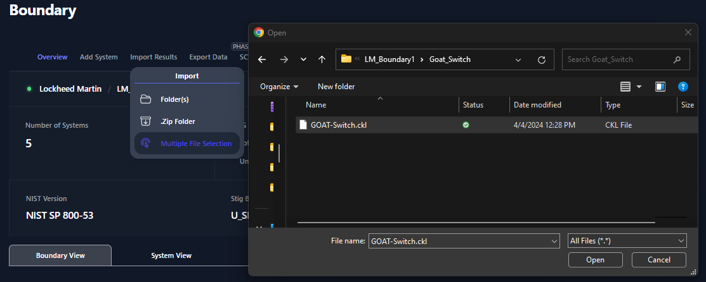
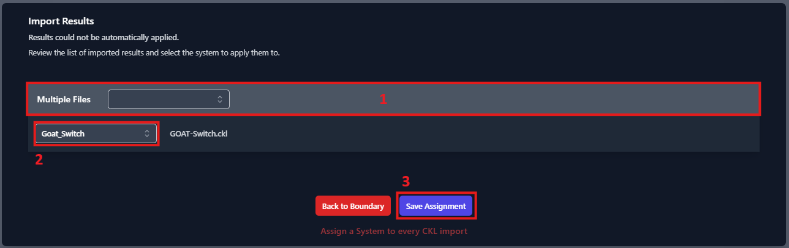

## Importing Scan Data

Once your Boundary and systems have been created, you will be able to import test data into your Boundary. If you have existing scan data in your boundary and are importing new scan results, the new scan results will overwrite the existing data. To do this, navigate to your Boundary and click the **Import Results** button.

</img>

<em>Figure 32: Import Scan Data</em>

You have three options when importing test data: **Import Folder**, **Import ZIP Folder**, and **Multiple File Selection**. See the below sections for more instructions on those import functions. All of these import functions can import checklists, XCCDF, and Nessus data. TIR identifies what type of scan data you are importing (based on the file type), maps it to the corresponding systems, and displays the information in the proper view.

### Import Results via Folder(s)

To use this import function, you first need to organize you scan data in a standard organization structure. Please create a folder for each of your systems and place all of the scan data for each system into their system folder. This will make it easy for TIR to map the scan data to the correct systems. If you choose not to organize your data in this way, you will have to manually assign the scan data files to your systems. To begin importing scan data via folders, click the **Import Results** button in your boundary and select **Folder(s)** from the menu. 

This will launch a file navigation window. Navigate to the folder that contains your test data. If you are importing scan data for every system in your boundary, then navigate to the parent folder that contains your system folders (as seen in the *Figure 33*) and click **Upload**. If prompted to confirm your upload, click **Upload** (as seen in *Figure 26*).

</img>

<em>Figure 33: Import Results via Folder</em>

If you wish to import test results for a just one of your systems, navigate inside that system folder that contains your test data and click **Upload**. The actual files will not be visible in this file navigation window because it is filtering for folders only. So, please verify that the scan data is present in a separate window (as seen in *Figure 34*).

</img>

<em>Figure 34: Import Results via Folder - Single System</em>

If you are prompted to confirm that you wish to upload your files, click **Upload** on the prompt (as seen in *Figure 26*).

### Import Results via Zip Folder

The **.Zip Folder** import is used to upload the test data for a single system. To use this import function, please zip the scan data for your system. The .zip folder should be titled [System Name].zip (where [System Name] is replaced by the actual System Name). To begin importing scan data via .zip folder, click the **Import Results** button in your boundary and select **.Zip Folder** from the menu.

A file navigation window will be displayed. Navigate to the .zip folder that contains your test data for your system, then press **Open**.

</img>

<em>Figure 35: Import Results via Zip Folder</em>

### Import Results via Multiple File Selection

With the Multiple File Selection, users are able to select specific scan data files and upload them into your boundary. The file types can include .ckl, .cklb, .Nessus, or .zip files. This import function can be used to upload specific checklist or Nessus data if it is re-scanned or updated. Since we are uploading individual files, these files will need to be mapped to a system manually. To begin importing scan data via multiple file selection, click the **Import Results** button in your boundary and select **Multiple File Selection** from the menu.

A file navigation window will be displayed. Navigate to the file(s) that you wish to upload, then press **Open**.

</img>

<em>Figure 36: Import Results via Selecting Files</em>

A second window will be displayed to allow you to map the scan data to the systems in your boundary. This window contains an expandable and collapsible section. Click the entire row to expand the section. For each file being imported, please select the system from the drop-down menu that will receive these updates. In the example below (*Figure 37*), we are only uploading one file.

</img>

<em>Figure 37: Assigning a System to Each Imported File</em>
