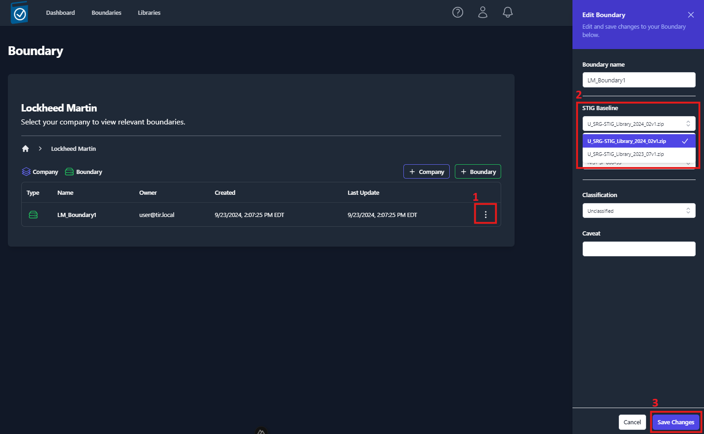
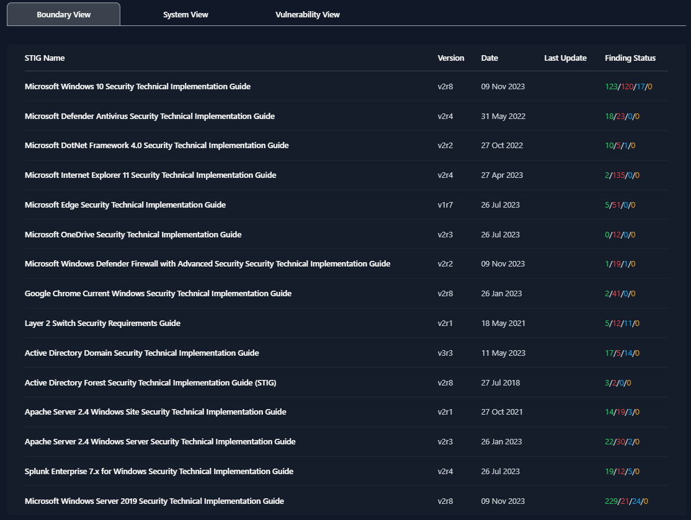
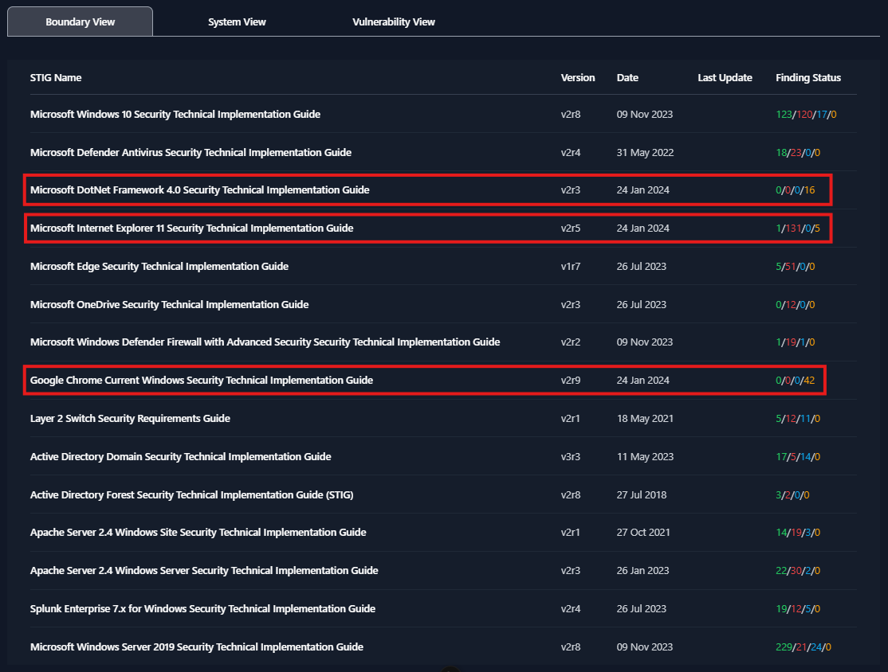

## Delta STIGs

TIR has the ability to show you which STIG checks have been added or updated when newer STIG Libraries are imported. Users have the option to select the STIG baseline that they want to use for each boundary. When a boundary is moves from older baseline to a newer baseline, there might be some applicable STIG checks that have been added or modified. The following section will show you how to update your STIG baseline and identify the deltas.

### Updating the STIG Baseline for a Boundary

1. Import STIG Libraries (see **Import STIG Libaries** section)
2. Navigate to your boundary’s **parent folder**, press the **three dots** to the right of your boundary, select **Edit**
3. Use the drop-down menu for **STIG Baseline** to select the newest STIG Baseline
4. Click **Save**

### Viewing Deltas

STIG Checks that have been added or modified will receive a status of **Not Reviewed**. To view the statuses, click on the boundary that you just upgraded to a newer STIG baseline. By default, the Boundary View will be selected and you will be able to view the unique findings for your boundary. In the figure below, all of my STIG checks have been reviewed and assigned a status. Meaning, there are no STIG checks with a status of **Not Reviewed**. This can be verified in *Figure X* by looking at the **Finding Status** column and seeing that the Not Reviewed counts (yellow number) are showing zero.

After upgrading the STIG baseline from **U_SRG-STIG-Library_2023_07v1** to **U_SRG-STIG-Library_2024_02v1** we can see that the boundary view is showing STIG checks with statuses of Not Reviewed for three of the STIGs in our boundary:

- Microsoft DotNet Framework 4.0 Security Technical Implementation Guide
- Microsoft Internet Explorer 11 Security Technical Implementation Guide
- Google Chrome Current Windows Security Technical Implementation Guide

See *Figure 40* below.

This means that those three STIGs received updates in the **U_SRG-STIG-Library_2024_02v1** STIG Library release. We can see that the **Date** column for those three STIGs were updated to **24 Jan 2024**, which is when that STIG Library was released. Now, I would be able to go check all of my STIG checks with a Not Reviewed status and evaluate those new/updated items for my boundary.
