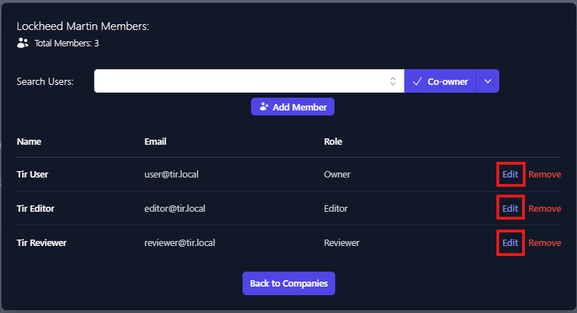

## Changing Company and Boundary Permissions

To add or modify Company and Boundary permissions, select the 3 buttons to the far right of the Company or Boundary and select Manage Members.

</img>

<em>Figure 41: Modify Company/Boundary Permissions</em>

### Adding Users

Clicking the **Manage Members** will display the Members dialog box, enter the username in the **Search Users** box.

</img>

<em>Figure 42: Adding Members – Search Users</em>

The Search Users box should provide a list of similar usernames. Select the user account you wish to add. Once selected click the down arrow next to Co-Owner and select the level of permission you wish to grant.

</img>

<em>Figure 43: Manage Members – Choose level of Access</em>

Once the level of access you wish to grant is selected, click **Add Member**. You will see the account added to the user permissions list for the applicable company/boundary.

</img>

<em>Figure 44:  Member Access – User Added with Co-owner Role</em>

Member access can be edited or removed from this view as well. This process is the same for both Companies and Boundaries.

### Editing User Permissions

Clicking the **Manage Members** will display the Members dialog box. Click the **Edit** button next to the user you wish change permissions for.

</img>

<em>Figure 45: Edit User Permissions</em>

This will enable the drop-down menu for the role field. To change the user's role, select the new role and click the **Save** button for that user. There is one limitation when editing roles, and that is that each boundary needs to have an Owner. If you are changing the role of user from Owner to Editor, you will first need to assign another user the Owner role.

</img>

<em>Figure 46: Edit User Role</em>

To remove a user, click the **Remove** button for that user. Owners can not be removed. If you wish to remove an owner from a Company or Boundary you must first grant another user the Owner role.

</img>

<em>Figure 47: Remove User</em>
