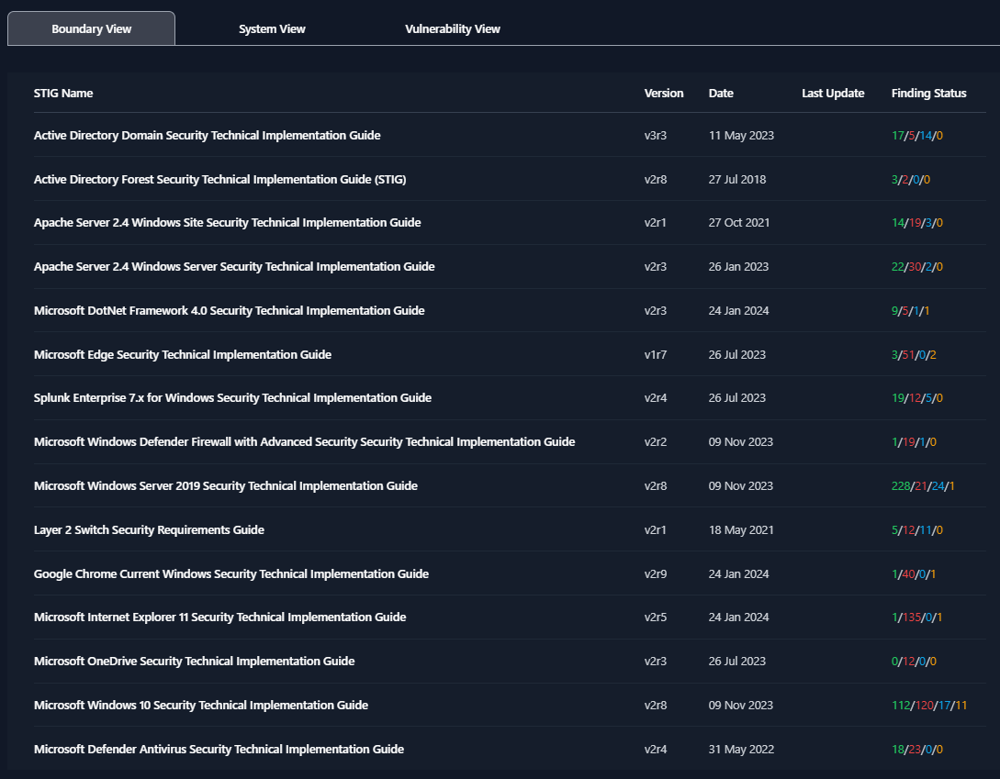
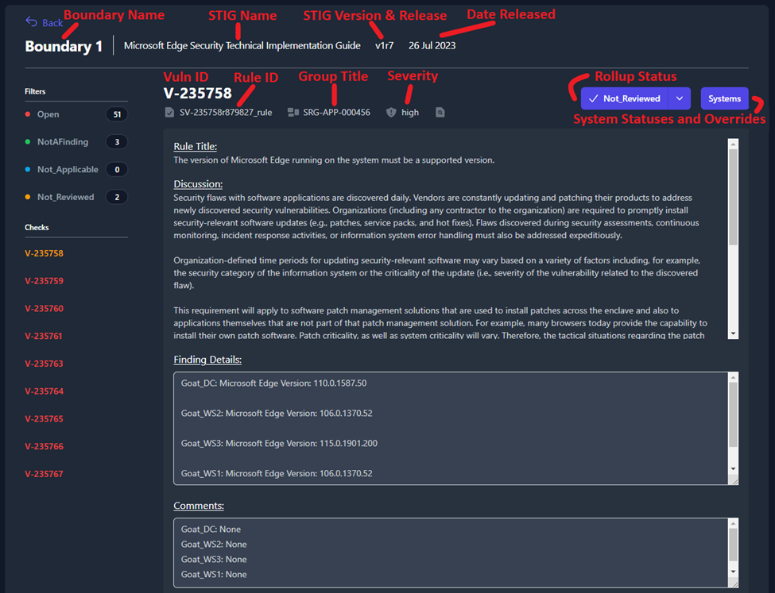
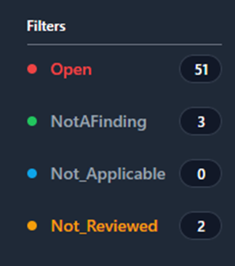
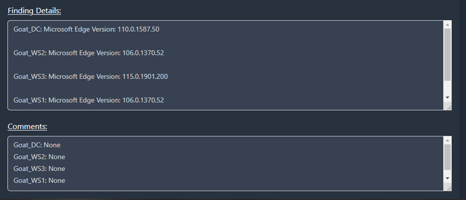
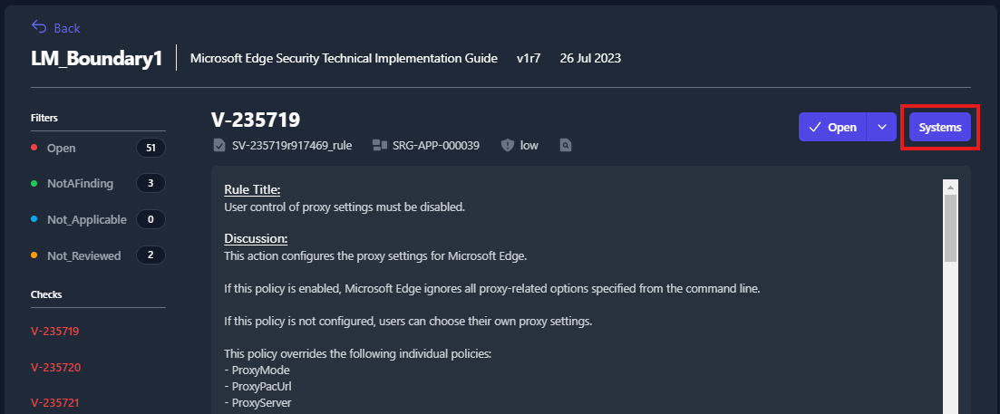
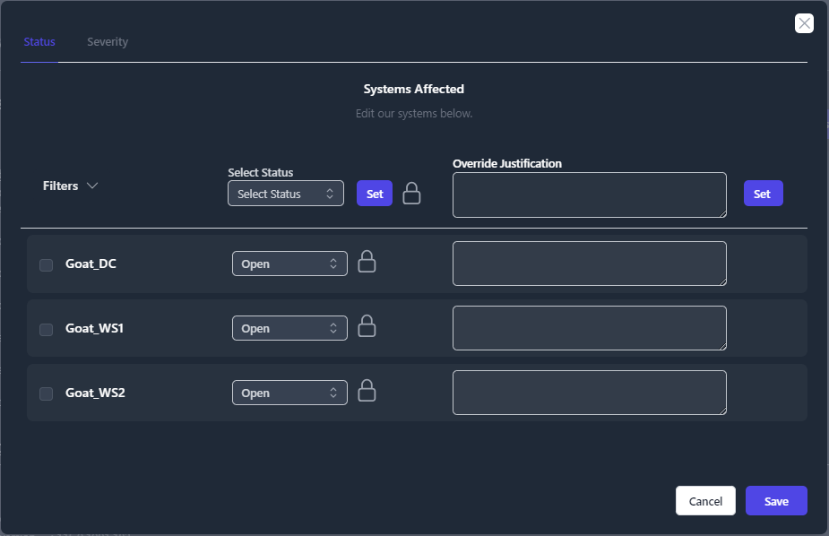

## Boundary View

The **Boundary View** allows you to view each STIG as a superset of the boundary. You will be able to target specific STIG checks and check the status of all the systems that contain that check. From the **Boundary View** you will be able to change the status and severity of STIG checks, however, you will not be able to edit the **Finding Details** and **Comments** for each individual system. To edit either one of those fields for a specific system, you will need to navigate to the **System View**.

Once you click the **Boundary View** tab, you will see a unique list of all the STIG checklists that have been added to systems in your boundary (as seen below in *Figure 48*).

To view the STIG checks inside each of these STIG checklists, simply click on the STIG. For this example, we will be looking at the **Microsoft Edge Security Technical Implementation Guide**.

Once you open the STIG View, you will see a variety of information related to the Boundary, STIG Library, and STIG Check. Each item is labeled below in *Figure 49*.

On the left side of the screen, you will see a section titled **Filters** that contain four status types: **Open**, **NotAFinding**, **Not\_Applicable**, and **Not\_Reviewed**. Each one of the status types can be toggled on and off to display the STIG checks with that status. When filters are selected, they will be colorized. For example, *Figure 50* is filtering so that only STIG checks with a status of **Open** (red) or **Not\_Reviewed** (yellow) will be displayed.

In *Figure 51* you will see that the **Finding Details** and **Comment** fields pull the data for this check from each system in your boundary. We can see that this check is pulling data from four separate systems in our boundary: **Goat\_DC**, **Goat\_WS2**, **Goat\_WS3**, and **Goat\_WS1**.

To view the status of each one of those systems, you will need to click the **Systems** button (highlighted in *Figure 52*).

A pop-up window will appear that displays all of the systems where this STIG check applies and the current status for each system.

From the Boundary View you will be able to update statuses, severities, and apply overrides for as many systems as you need. For more information about this feature see the **System Statuses and Severities with Overrides** section.

Additionally, from within the Boundary View, you have the ability to fill out the POAM fields for each STIG finding and track those findings until completion. For more information about these features see the **POA&M Fields** section (under **POA&M Management**).
