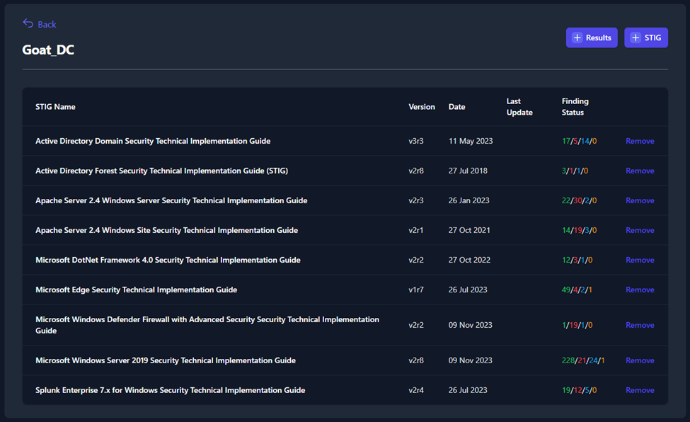

## System View

The **System View** tab shows you a list of all the systems inside your boundary, the number of STIGs applied to each system, and the total status counts for all of the checks applied to that system.

To view and edit the data pertaining to one of these systems, click on the system. The next page will show you the list of STIGs that apply to that system. This page will provide versions, dates, and statuses for each STIG. Click on one of the STIGs to open the **STIG View**.

This **STIG View** page will provide a variety of information related to the System, STIG Library, and STIG Check. These items are also available in the **Boundary View** and have been labeled in *Figure 49*. Additionally, like the **Boundary View**, you have the ability to filter STIG check based on their status (see *Figure 50*).

Unlike the **Boundary View**, the **System View** allows you to edit the **Finding Details** and **Comments** fields. To update the status or severity of each STIG check, use the **Severity** and **Finding Status**  drop-down menus in the upper-right (seen in *Figure 56*).

