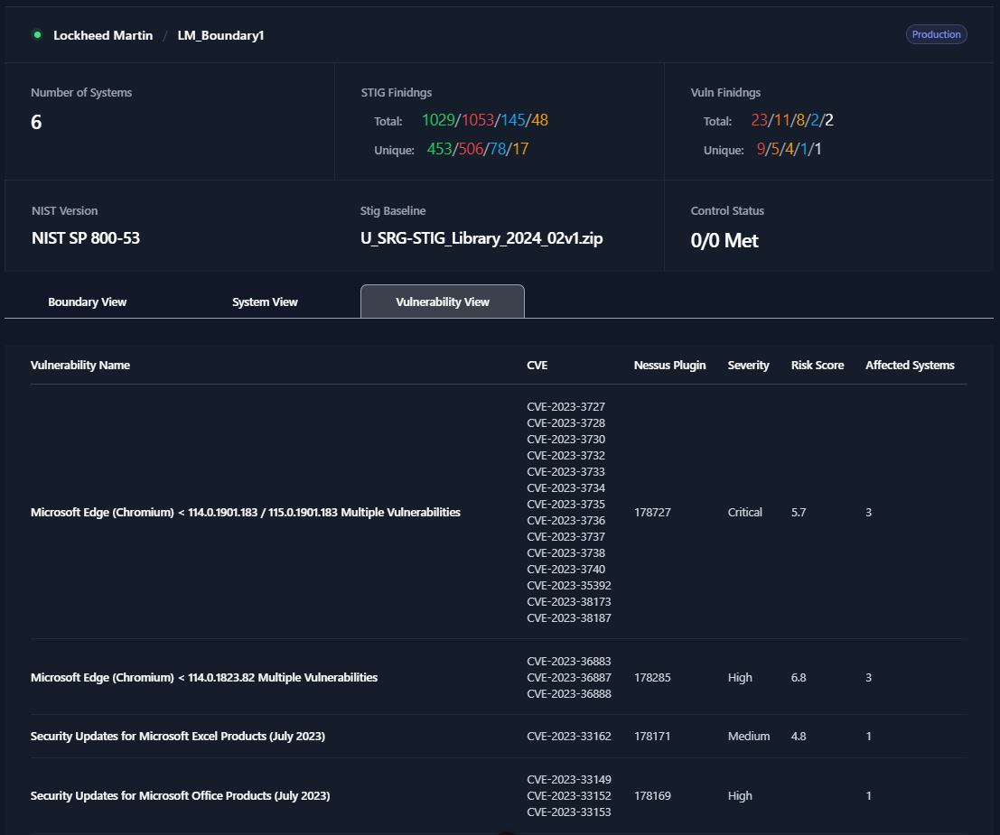
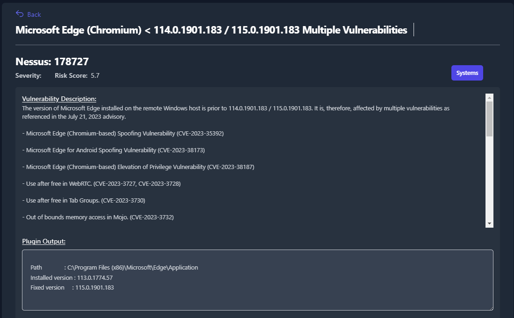

## Vulnerability View

The Vulnerability View will display all of the Nessus data for you Boundary. From here, you will be able to change the status and severity of Nessus findings. Once you click the **Vulnerability View** tab, you will see a unique list of all the Nessus findings in your boundary.

The first column in the table is the **Vulnerability Name**. This field will display the name of the Nessus check. The next column, **CVE**, will list out all of the CVEs associated to this Nessus finding. The **Nessus Plugin** column will provide the plugin ID for the Nessus plugin that contains this check. Next, the **Severity** column will provide the severity status for each Nessus check. The **Risk Score** columnn provides a risk score (from 0-10) of this finding. Lastly, the **Affected Systems** column will tell you how many systems in your boundary have that Nessus finding.

</img>

<em>Figure 57: Vulnerability View</em>

To display more information about any of the Nessus findings, simply click on the finding. This will load a new page with details about the finding. These details include a Severity, Risk Score, Vulnerability Description, Synopsis, Solution, CVEs, and Plugin Output. 

</img>

<em>Figure 58: Vulnerability View Detailed Findinging</em>

From the Vulnerability View you will be able to update statuses, severities, and apply overrides for as many systems as you need. For more information about this feature see the **System Statuses and Severities with Overrides** section. 

Additionally, from within the Vulnerability View, you have the ability to fill out the POA&M fields for each STIG finding and track those findings until completion. For more information about these features see the **POA&M Fields** section (under **POA&M Management**).
