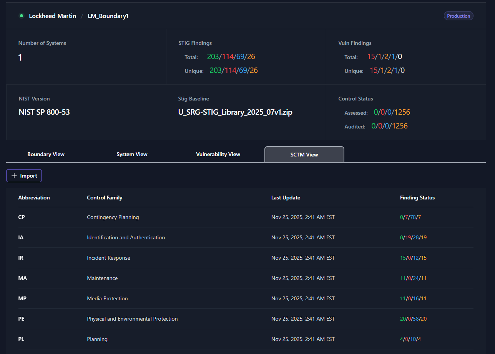
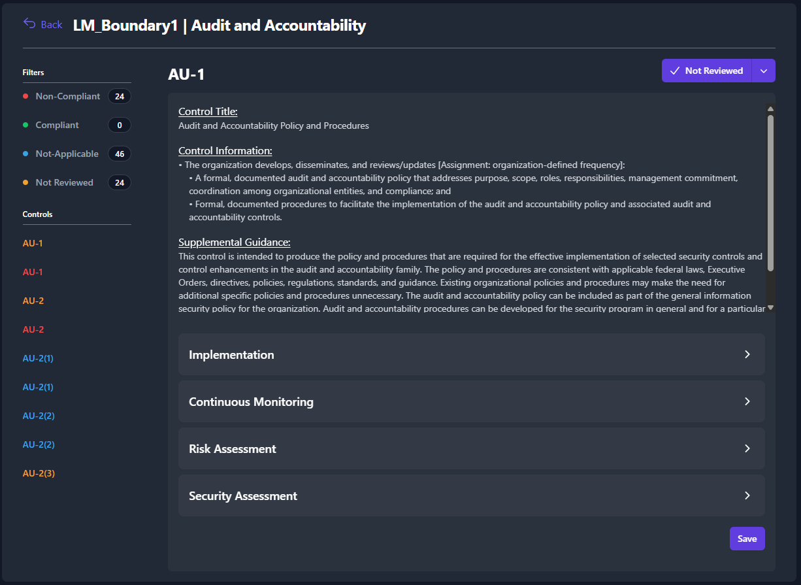
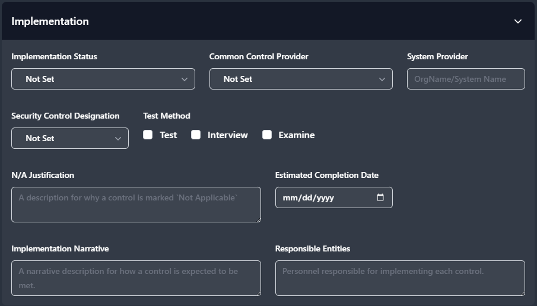
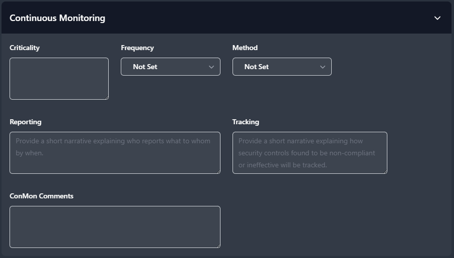
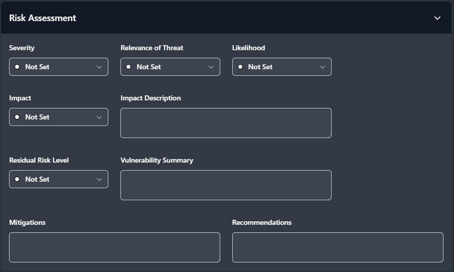
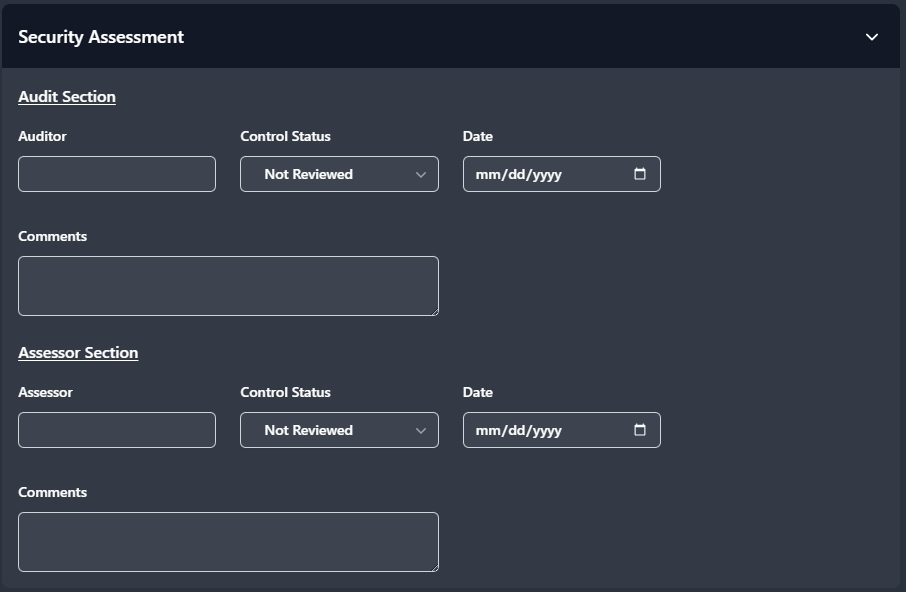
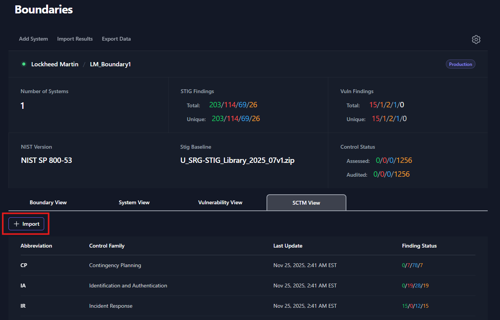

## SCTM View

The Security Control Traceability Matrix (SCTM) View is used to track and manage the compliance of the Security Controls for your boundary. From the **STCM View** tab, you will see each Control Family listed as a row in the table. 

The **SCTM View** table will show the **Control Abbreviation**, **Control Family**, **Last Update**, and **Finding Status**. The finding statuses for control families are **Compliant (Green)**, **Non-Compliant (Red)**, **Not Applicable (Blue)**, and **Not Reviewed (Yellow)**.

To display more details about a control family, simply click on the control family. A new page will load that shows you each of the security controls that belong to the control family. Each security control will have a **Control Title**, **Control Information**, and **Supplemental Guidance**. In addition to the security control details, there are four expandable and collapsible sections used to manage your SCTM data. These sections match the fields that you would find on an Enterprise Mission Assurance Support Service (eMASS) Implementation Plan. 

The first section is for **Implementation**. See the below screenshot for the list of available fields in the **Implementation** section. Each drop-down field will display the same options available that you would find in eMASS. 

The second section is for **Continuous Monitoring**.  See the below screenshot for the list of available fields in the **Continuous Monitoring** section.

The third section is for **Risk Assessment**.  See the below screenshot for the list of available fields in the **Risk Assessment** section.

The final section is for **Security Assessment**.  See the below screenshot for the list of available fields in the **Security Assessment** section. This section is used by **security auditors** and **security assessors** to record when audits and assessments are performed.

When any changes are made for a security control, the user must hit the **Save** button at the bottom of the page to save their changes.

## Importing eMASS Implementation Plans

A pre-existing eMASS Implementation Plans can be imported into your TIR boundary. All of the data from the eMASS Implementation Plan will be loaded into the matching fields found inside the SCTM View. To import an eMASS Implementation Plan into your boundary, navigate to the SCTM View and click on the **Import** button found just about the SCTM table.

