Once you have uploaded all of the test data on for your boundary, you have the ability to export your data into a **Plan of Action and Milestones (POA&M)**, a **Findings Worksheet**, or a  **Checklist**. To export your data, navigate to your Boundary and click the **Export Data** button (as seen in *Figure 64*).

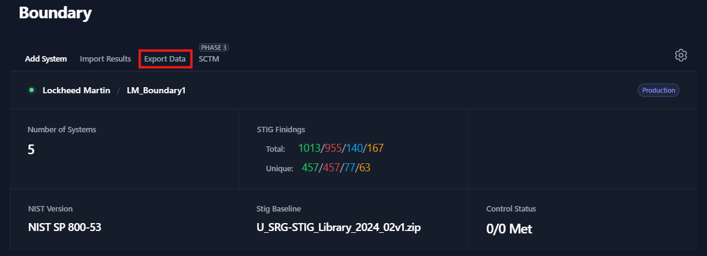

A popup window will appear, please use the tabs at the top of the popup window to specify the output type (POA&M, Findings, Checklist, STIG Security Assessment, Nessus).

## Plan of Action and Milestones (POA&M)

To export a POA&M; navigate to your Boundary, click the **Export Data** button, click the **POAM** tab, then click **Download POAM**.

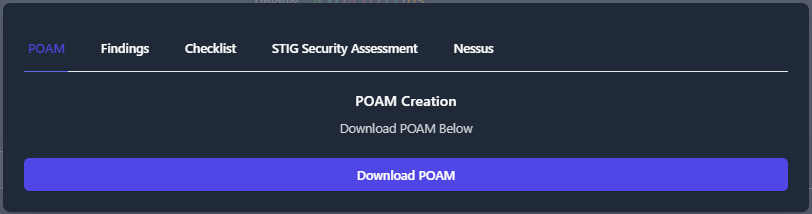

The POA&M will organize all of the findings data for each security control that is not being met.

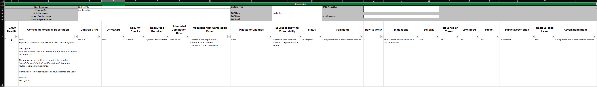 

## Findings

To export your data into a **Findings Worksheet**; navigate to your Boundary, click the **Export Data** button, and click the **Findings** tab. The Findings Worksheet allows you to export data based on their finding status. Check the box next to each of finding status’ that you want to export. Then press the **Download** Findings button. For this example, we will export only the **Open** findings for our Boundary.

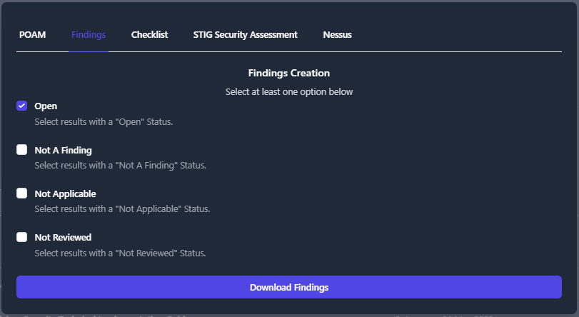

A file will be downloaded to your computer titled **Findings \*.xlsx**. This findings worksheet will display every finding with the statuses that you specified in the previous step.

The findings worksheet will create an item for each Vulnerability/Finding inside of your Boundary and list all of the Systems Affected by that vulnerability.

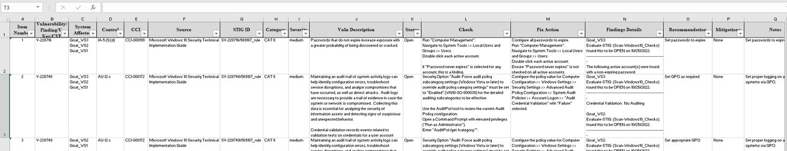

## Checklists

TIR provides a couple options for exporting checklists. The default option exports separate checklists for each STIG in a folder with the name of the system. The default format for checklist export is .ckl. If you wish to export in .cklb format, selct the **Checklist Version 3 (.cklb)** checkbox. The other option is to create a single checklist, containing all STIGs, for each system. To export a single checklist for each system, select the **Single STIG per Checklist** checkbox before clicking **Download Checklist**.

For the default option, select **Export Data**, select the **Checklist tab**, and click **Download Checklist.**

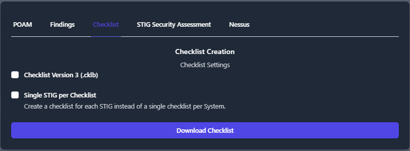

The output should look like the following:

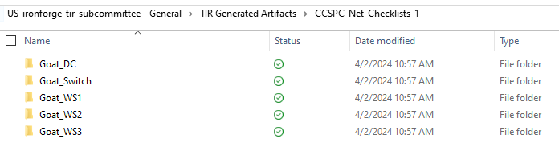

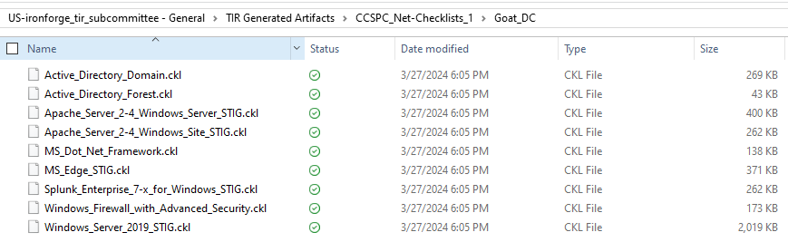

For a single checklist per system, select the **Single STIG per checklist** box.

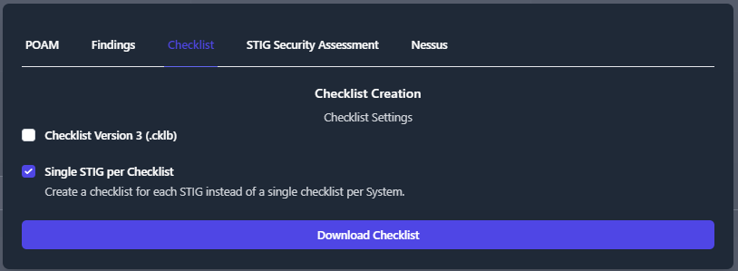

The output is as follows:

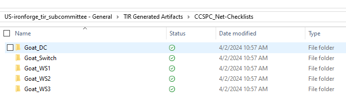

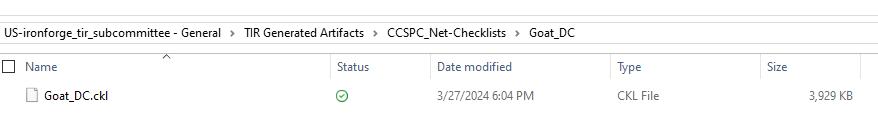

## STIG Security Assessment

The STIG Security Assessment (SSA) is a spreadsheet that provides passing and failing grades for CCI and Control Compliance. This spreadsheet will export all of the STIG checks in your boundary and map the STIG checks to the corresponding CCI and Control. If there are STIG checks with an Open status, then the corresponding CCI and Control will show a Failing status.

To export a SSA, navigate to your Boundary and click Export Data. Next, click the STIG Security Assessment Tab and then **Download**. This will download a the SSA spreadsheet to your local machine.

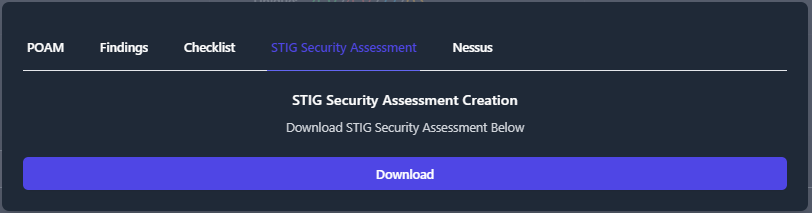

The first tab in the SSA is the **CCI Compliance** tab. The first column, CCI, will list each applicable CCI for your boundary. This column is followed by a **CCI Description**. The **Control** column will display control(s) associated with that CCI. The **Check** column will show which STIG Checklists, with the rule IDs, that have checks that are mapped to that control. The **CCI Compliance Status** will show a pass or fail grade. The **Finding Status** will show the status of each STIG check that is mapped to the CCI. If your CCI has a failing grade, you will see the STIG Check(s) that have a Open status in the **Finding Status** column.

For an example, see *Figure 76* below.

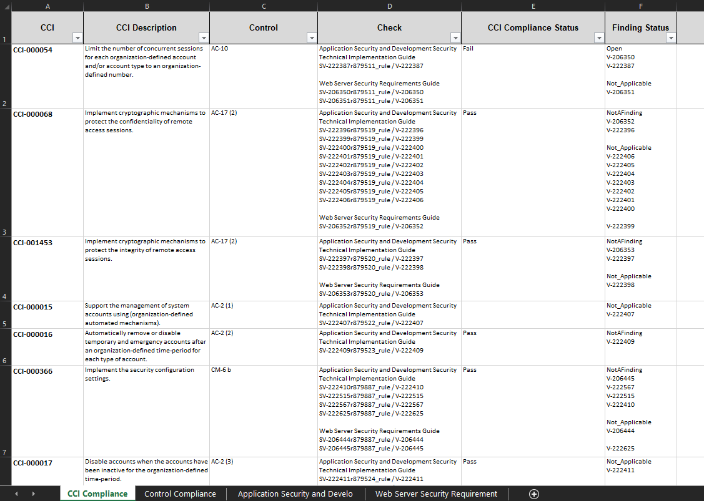

The next tab in the SSA is the **Control Compliance** tab. This tab organizes the data based by the Control and gives a passing or failing grade for each control. The first column, **Control** will list out each control applicable to your boundary. The **Control Description**, **Control Text**, and **Supplemental Guidance** columns will be blank for now. This data will be exported once the developement of Control Overlays is completed for TIR. The **Pass/Fail** column will display a passing or failing grade for the control. If any of CCIs for that control are failing then that control will receive a fail grade. The **CCIs** comlumn will list out all of the CCIs associated with each control and show you which CCIs are passing and which are failing.

For an example, see *Figure 77* below.

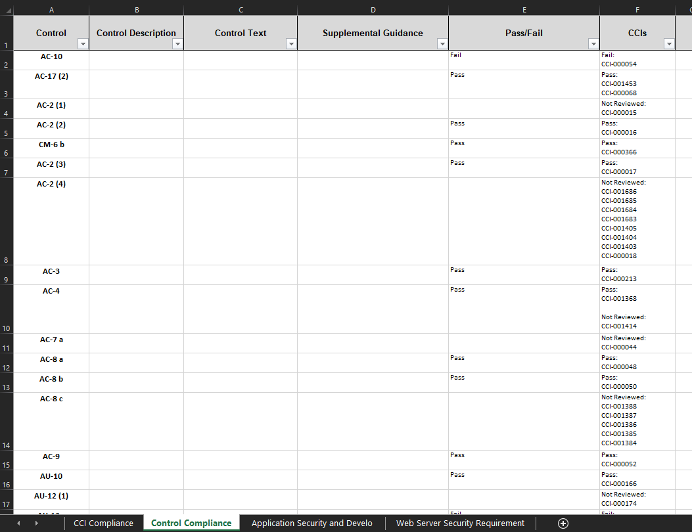

The remaining tabs in your SSA will give you detailed information about each STIG in your boundary. This tab starts with the **CCI** column, and lists out each CCI the is applicable for the STIG Checklist you are viewing. The **CCI Description** column will give you a brief description for what the CCI is validating. The **Control** column will list the control associated to the CCI. In the example below we are viewing an Application Security and Development STIG checklist. So, the next column will display the name of the STIG. In this case, **Application Security and Development Security Technical Implementation Guide Check**. This field will display the check text for all of the STIG checks associated to the CCI. Likewise, the next tab will display the fix action text for all of the STIG checks associated to the CCI. In this case, the column reads **Application Security and Development Security Technical Implementation Guide Fix Action**. The **CCI Compliance Status** column will give a passing and failing grade for each CCI. Lastly, the **Finding Status** will list out the V-Key for each STIG check associated to the CCI and provide the status for those checks. If any STIG checks are Open then the CCI Compliance Status will be set to Fail. If none of the STIG checks are open but you still have checks set to Not Reviewed, then the CCI Compliance Status will be left blank until those Not Reviewed checks are addressed.

For an example, see *Figure 78* below.

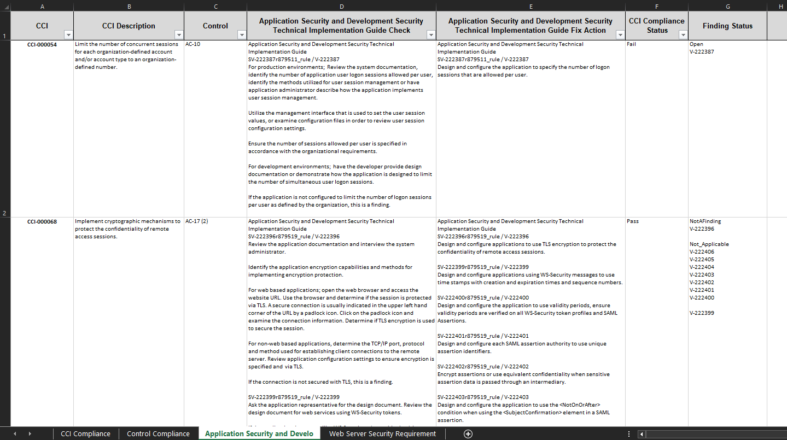

## Nessus

To export a Nessus CSV file; navigate to your Boundary, click the Export Data button, click the **Nessus** tab, then click **Download**.

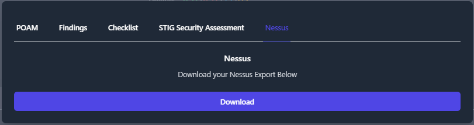

The Nessus CSV file provide all of your Nessus data organized by Plugin ID. For an example of a Nessus CSV export, please see the screenshot below. Please note, if your plugin IDs have correlating CVEs, they would be displayed in the CVE column.

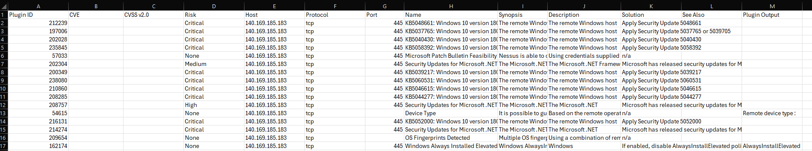 

## Ports Protocols and Services Management (PPSM)

To export a **Ports, Protocols, and Services Management (PPSM)** document, click on the **PPSM** tab from the Export Data screen, then click **Download**. 

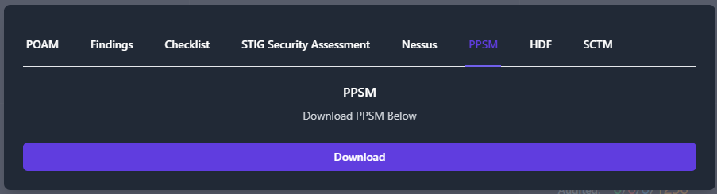 

The PPSM document uses the data from your Nessus results and gathers it into a document which displays information about the open ports on your boundary.

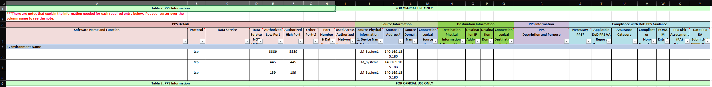 

## Heimdall Data Format (HDF)

To export your boundary in a Heimdall Data Format json file, click on the **HDF** tab, then click **Download**. The HDF export can be used to integrate your TIR boundary data with other MITRE SAF tooling solutions.

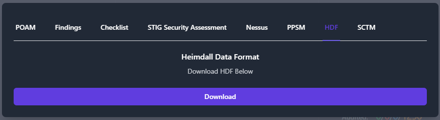

## Security Controls Traceability Matrix (SCTM)

To export the SCTM related documents, click on the **SCTM** tab of the **Export Data** screen. 

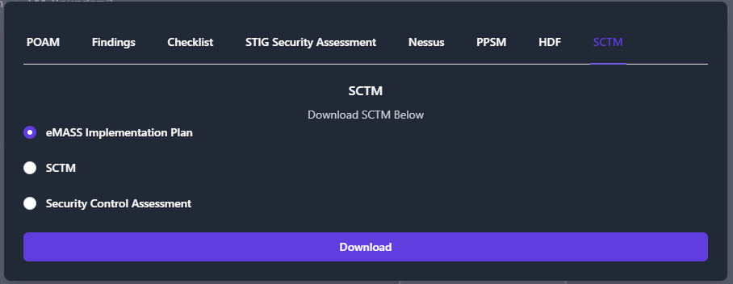

From here, there are a couple options for SCTM exports. The first option being the **eMASS Implementation Plan**. The eMASS Implementation Plan will contain all of the fields in the SCTM View. Including the fields found inside the Implementation, Continuous Monitoring, and Risk Assessment sections.

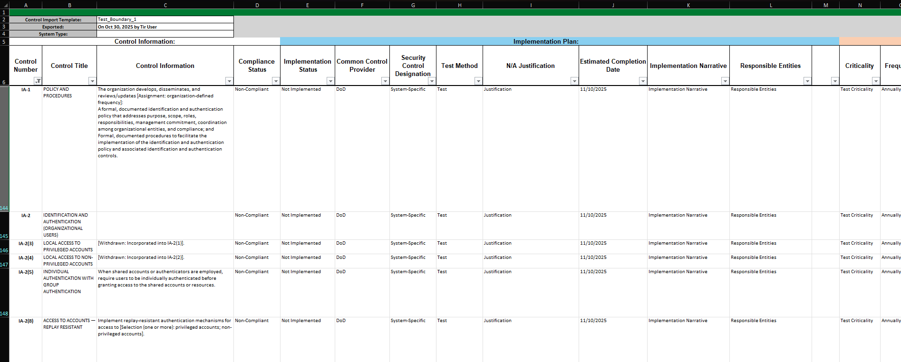

The next option is the SCTM export. To export a SCTM, select the **SCTM** button and click **Download**. An example of an SCTM can be found in the below screenshot.

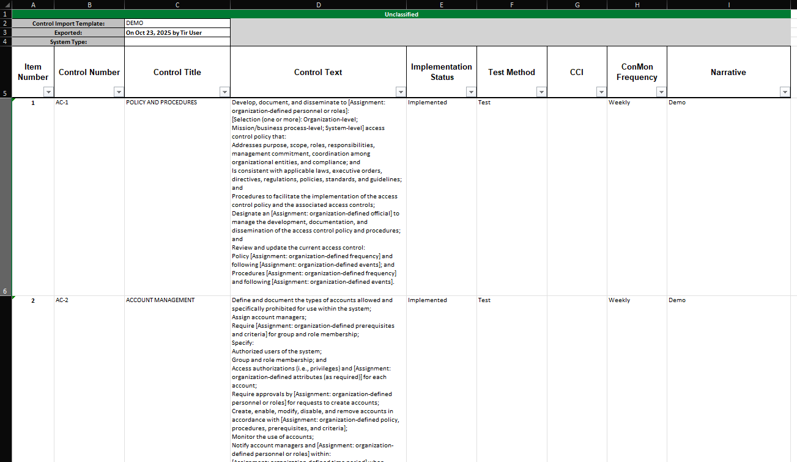 

The final option is the **Security Control Assessment** export. The **Security Control Assessment** will contain the information of each control with all of the relevant assessment data. The assessment data includes; Implementation Status, ConMon Frequency, Narrative, Technical Assessment Status, Technical Assessment Comments, Audit Status, Audit Comments, Overall Assessment Status, and Assessment Comments. 

To export a **Security Control Assessment**, select the **Security Control Assessment** button and click **Download**. An example of an **Security Control Assessment** can be found in the below screenshot.

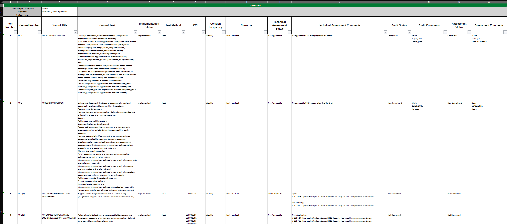 

## Software List

Documentation missing for the Software List export