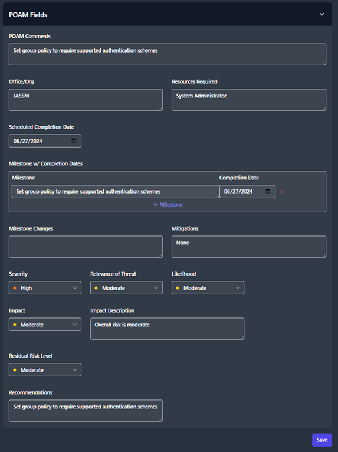

## POA&M Management

The Plan of Action and Milestones (POA&M) export will compile all your scan data along with the addition information you have provided about each open finding and organize it into a spreadsheet. The purpose of a POA&M is to document all of the security findings for your boundary and explain them in terms of the Risk Management Framework (RMF). The POA&M provides details of each finding and the risk associated with the finding. Additionally, the POA&M provides a method to explain why these findings exist and a path forward to addressing the findings (if possible). To fully cover all items on a POA&M, each finding needs to be addressed individually.

TIR allows users to view your findings from the **Boundary View** and **Vulnerability View** where users can address all of the systems that are affected by each finding. There is a built-in workflow with TIR that allows users to document the plan of action needed to address findings as they are discovered. This workflow includes a Milestone schedule that notifies all of the users belonging to your boundary that there is action needed to address certain findings. Milestones are assigned due dates which trigger notifications to each user when due dates are approaching.

When new scan results discover findings, action can be taken immediately. For findings that have existed on your systems for a period of time, the full history of this finding can be referenced and analyzed. These workflow items are all found in the **POA&M Fields** sections of the **Boundary View** and **Vulnerability View**.

### POAM Fields

From the **Boundary View** and **Vulnerability View**, each check will have a collapsible and expandable section titled **POAM Fields**. The user will have the ability to provide additional comments, program information, milestones, adjust risk levels, and more. These fields need to be filled out for each **Open** finding in your boundary. All of this data will be pulled directly into the POAM export.

After you’ve completed filling out the **POAM Fields** for an open finding, click the **Save** button at the bottom of the page.

As you continue to import more test results into your boundary during future scanning events, these POA&M fields will persist. As open items are worked, new milestones can be added and worked through your processes.
