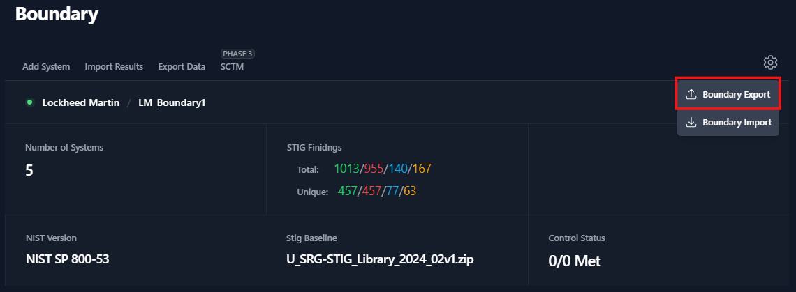
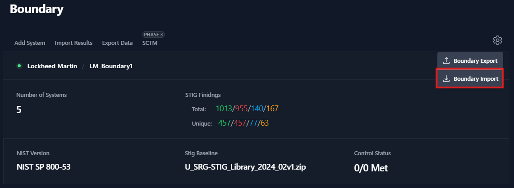

## Backup and Restore

User will have the ability to backup their entire boundaries. These backups will include all of the STIG Data, Nessus Data, POA&M Fields, Overrides, and much more. The backups are all-encompassing and are exported into a **.json** format.

To backup the data for a boundary, you will first need to navigate inside the boundary. Click the gear icon in the top-right side of the boundary overview page. Then, click **Boundary Export**.

The restore feature can be used to recover lost data inside TIR or transfer your boundary data from one TIR instance to another TIR instance.

To restore the data for a boundary, you will first need to navigate inside the boundary. If the boundary does not exist in your TIR instance, you will need to create a new boundary to store this data. From the boundary overview page, click the gear icon in the top-right and then click **Boundary Import**.

