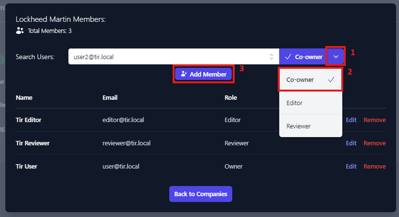
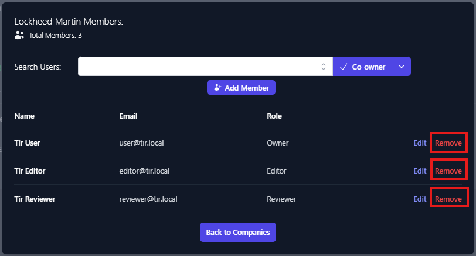
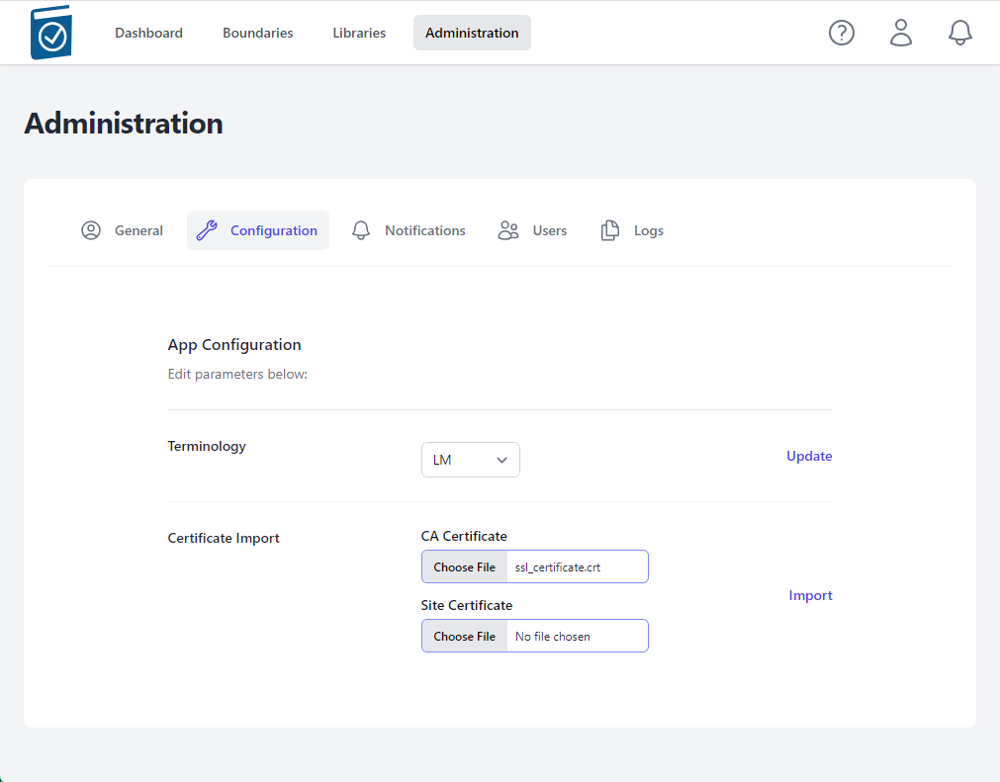

# Test Ingest Repository (TIR) Privileged User Guide

## Purpose

The purpose of this document is to provide a guide for Administrative functions for Test Ingest Repository (TIR). TIR is a MITRE Security Assessment Framework (SAF) tool that is used to support boundary and software compliance and continuous monitoring.

TIR Administrators only have access to certain features in the software. Administrators can configure TIR, and change permissions on Companies and Boundaries. Administrators cannot edit boundary details. This helps maintain required separation of roles and responsibilities within the TIR.

## Account Permissions

TIR has two types of users, Administrators and Users. Administrators have access to the **Administration,** **Libraries**, and **Boundary** tabs. Users only have access to Libraries and Boundary tabs. TIR is setup as a hierarchical system with Companies and Boundaries. Users can be granted permissions to be Owners, Reviewers, and Editors for
Companies and Boundaries. A summary of permissions is show in Table 1, below.

</img>

<em>Table 1: Access Control – User Permissions</em>

### Changing Company and Boundary Permissions

To add or modify Company and Boundary permissions, select the 3 buttons to the far right of the Company or Boundary and select Manage Members.

</img>

<em>Figure 1: Modify Company/Boundary Permissions</em>

#### Adding Users

Clicking the **Manage Members** will display the Members dialog box, enter the username in the **Search Users** box.

</img>

<em>Figure 2: Adding Members – Search Users</em>

The Search Users box should provide a list of similar usernames. Select the user account you wish to add. Once selected click the down arrow next to Co-Owner and select the level of permission you wish to grant.

</img>

<em>Figure 3: Manage Members – Choose level of Access</em>

Once the level of access you wish to grant is selected, click **Add Member**. You will see the account added to the user permissions list for the applicable company/boundary.

</img>

<em>Figure 4: Member Access – User Added with Co-owner Role</em>

Member access can be edited or removed from this view as well. This process is the same for both Companies and Boundaries.

#### Editing User Permissions

Clicking the **Manage Members** will display the Members dialog box. Click the **Edit** button next to the user you wish change permissions for.

</img>

<em>Figure 5: Edit User Permissions</em>

This will enable the drop-down menu for the role field. To change the user's role, select the new role and click the **Save** button for that user. There is one limitation when editing roles, and that is that each boundary needs to have an Owner. If you are changing the role of user from Owner to Editor, you will first need to assign another user the Owner role.

</img>

<em>Figure 6: Edit User Role</em>

To remove a user, click the **Remove** button for that user. Owners can not be removed. If you wish to remove an owner from a Company or Boundary you must first grant another user the Owner role.

</img>

<em>Figure 7: Remove User</em>

## Configuration

### Administrator Login

The default Local Administrator Username is admin@tir.local. The initial password will be provided. Enter your admin@tir.local and the initial **Password**, then review the **IS User Agreement** and acknowledge that you have read it by clicking the check box. Then, click **Sign in**.

</img>

<em>Figure 8: Login Page</em>

-   After successfully logging in for the first time, please change the TIR Admin password by completing the following:

-   Click the Profile Icon in the upper right corner of the welcome screen.

</img>

<em>Figure 9:  Selecting Your Profile</em>

-   Click Your **Profile** to bring up the TIR Admin profile.

</img>

<em>Figure 10: Changing The Local Admin Password</em>

-   In the **Password** row select **Change**

</img>

<em>Figure 11: Changing the Local Admin Password</em>

-   Enter **New password**

-   Enter **Confirm password**

-   Select Save

### Administrative Functions

The TIR Local Administrator account is allowed to perform a number of configuration tasks, like creating local accounts, setting up LDAP, uploading certificates, and configurating centralized Logging. These functions are executed in the **Administration** Tab.

#### The Administration Tab

The **Administration** tab is only available through Administrators. You access the **Administration** tab by selecting **Administration** at the top center of the web interface.

</img>

<em>Figure 12:  Location of the Administration Tab</em>

The four major **Administration** tab functions are configuration, Notifications, Users, and Logs.

A view of the **Administration** tab is below:

</img>

<em>Figure 13: Administration Tab</em>

##### Configuring LDAP

LDAP is configured during TIR deployment. Please see the TIR Deployment Guide for LDAP configuration procedures.

##### Configuration

Within the **Configuration** section an Administrator can change standard **Terminology** and import a **CA Certificate.**

</img>

<em>Figure 14: Configuration Functions</em>

##### Certificate Import and Verification

-   Click on the **CA Certificate** **Choose File** box to open a File dialog window and choose your signed x509 formatted .crt file and hit **Open** - the name of the file will appear in the **CA Certificate** Text Box

</img>

<em>Figure 15: Import Certificates</em>

</img>

<em>Figure 16: Choosing Certificate</em>

-   Note name of .crt file shows up in text field.

</img>

<em>Figure 17: CA Certificate Updated</em>

-   Click on the **Site Certificate** Choose File box to open a File dialog window and choose your .pem formatted site key and hit Open - the name of the file will appear in the Site Certificate Text Box

</img>

<em>Figure 18: Choose Site Certificate</em>

</img>

<em>Figure 19: Select Site Certificate File</em>

</img>

<em>Figure 20: Site Certificate Updated</em>

-   Select **Import**

</img>

<em>Figure 21: Import Certificates</em>

-   A modal window saying "Checking Certificates Please Wait... Circle" will appear while the files are being loaded.

</img>

<em>Figure 22: Certificate Import Process</em>

-   A message underneath the Certificate Import form Text Fields will appear saying "Certificate Import Successful!" if the certs are accepted.

</img>

<em>Figure 23: Successful Certificate Import Notification</em>

Notes:

-   The NGINX listener checks imported certificates for:

    -   A .pem formatted key file

    -   A x509 formatted .crt file

    -   Cert files matching modulus

    -   CRT Common Name matching NGINX\_HOST variable value

-   If invalid certificate files are loaded, an error will appear saying **Error in Cert Response** in the top right of the window

</img>

<em>Figure 24: Invalid Certificate Notification</em>

##### Notifications

Notifications are automatically generated at login for the following:

-   New STIG Library is available for applicable boundaries

-   POA&M Completion Dates coming due or overdue

-   Milestone Dates coming due or overdue

##### Users

The **User** functions allow an administrator to add local User or Administrator accounts and change passwords.

</img>

<em>Figure 25: Administration - Users Functions</em>

###### Adding a local Account

To add a local account, select **Add Users**

</img>

<em>Figure 26: Add Users</em>

This will bring up the **Add User** dialog Box. Complete the relevant data, to include **First Name**, **Last Name**, **Email Address** (username), set a unique password, and change the time zone. Select the **Role** from the drop-down menu. You have the option between **Admin** or **User**. Once you have finished, click the **Save** button to create the user.

</img>

<em>Figure 27: Add User Dialog Box</em>

###### Change User Password

To change a user’s password. Select the 3 buttons to the far right of the user account and select Edit.

</img>

<em>Figure 28: Change User Password – Edit Account</em>

The **Edit User** dialog box will appear on the right side of the screen. Enter a value for **New Password** and **Confirm Password** and click **Save**.

</img>

<em>Figure 29: Change Password – Edit User Dialog Box</em>

##### Logs

Centralized logging can be configured from the **Logs** function within the Administration tab.

To setup logging, select **Logs** from the **Administration** tab menu.

</img>

<em>Figure 30: Log Configuration</em>

There are three sections on the logging page: **Console**, **File**, and **Syslog**. The **Console** section will adjust which level of logs get outputed to the console on the host machine. The **File** section, will control which application logs are being saved off onto the system. The **Syslog** section will be used to configure the forwarding of your logs to a central location for storage and analysis.

Once properly configured click **Save**.

###### Console

-   **Log Level** controls which type of logs are sent to the console. There are eight different log levels to choose from (listed below). The higher level logs are inherited into all of the lower level logs. For example; if **Debug** selected, you will received logs from all eight of the log levels. If **Critical (crit)** is selected, you will receive logs from Emergency (emerg), Alert, and Critical (crit). The default setting of **Warning** should meet all required logging for SP 800-53 based authorizations.

    1. Emergency (emerg)
    2. Alert
    3. Critical (crit)
    4. Error
    5. Warning
    6. Notice
    7. Info
    8. Debug

###### File

-   **Enabled** can be toggled on/off to enable and disable logging to files.
-   **Log Level** determines which logs will be saved to files. See **Log Level** in the **Console** section (above) for details on the log levels.
-   **Path** is the directory to which the logs will be stored.
-   **Max File Size (MB)** is an adjustable setting to define the max size, in megabytes, of each log file being created.
-   **Days to Retain** is the amount of time you wish to keep the TIR logs before they are allowed to be deleted on the system
-   **Zip Archive** is a toggle option that (when enabled) will zip your log files into an archive. 

###### Syslog

-   **Syslog Target** is the centralized log server, like Splunk.
-   **Syslog Port** is the port being used to forward logs.
-   **Log Level** determines which logs will be forwarded to the centralized log server. 

### Libraries

The **Libraries** tab provides the ability to import new STIG libraries and updated Control Correlation Identifiers (CCI) mappings for different NIST SP 800-53 revisions.

#### STIG Libraries

The Department of Defense (DoD) releases quarterly updates to the STIG benchmarks. These quarterly updates are released as .zip files. Once downloaded, the .zip files can be uploaded to TIR and made available to all users.

##### View STIG Libraries 

Please navigate to the **Libraries** tab by clicking the **Libraries** button at the top on the page.

Note: The **Libraries** tab will display all of the STIG libraries that have been uploaded to your TIR instance.

</img>

<em>Figure 31: STIG Libraries</em>

Once imported, the STIG libraries will follow a standardized naming convention. The naming convention will follow this template: **U\_SRG-STIG\_Library\_{year}\_{month}{revision}.zip**.

Please refer to the table below for more examples.

<table>
<caption>
Table 1: Access Control – User Permissions
</caption>
<colgroup>
<col style="width: 8%" />
<col style="width: 29%" />
<col style="width: 14%" />
<col style="width: 47%" />
</colgroup>
<thead>
<tr class="header">
<th><strong>Year</strong></th>
<th><strong>Release Quarter/ Month</strong></th>
<th><strong>Revision</strong></th>
<th><strong>Naming Convention</strong></th>
</tr>
</thead>
<tbody>
<tr class="odd">
<td>2022</td>
<td>Q1 / January (01)</td>
<td>v1</td>
<td>U_SRG-STIG_Library_2022_01v1.zip</td>
</tr>
<tr class="even">
<td>2022</td>
<td>Q2 / April (04)</td>
<td>v2</td>
<td>U_SRG-STIG_Library_2022_04v2.zip</td>
</tr>
<tr class="odd">
<td>2023</td>
<td>Q3 / July (07)</td>
<td>v1</td>
<td>U_SRG-STIG_Library_2023_07v1.zip</td>
</tr>
<tr class="even">
<td>2023</td>
<td>Q4 / October (10)</td>
<td>v2</td>
<td>U_SRG-STIG_Library_2023_10v2.zip</td>
</tr>
</tbody>
</table>

<em>Table 2: STIG Library Naming Conventions</em>

#### Import STIG Libraries

To import a new STIG library, please navigate to the **Libraries** page and click the **Import** button inside the **STIG Libraries** section, as seen in Figure 14. For reference, this button can be found in the top right of *Figur*e 14: STIG Libraries.

The **Import** button will open a file navigation window. Please navigate to the .zip file containing the STIG Library and click **Open**.

#### CCI Matrix

CCI mappings are provided by NIST and updated as necessary. CCI mappings different between SP 800-53 Rev 4 and Rev 5. Keeping this updated ensure more granular mapping of STIGs to applicable CCIs.

</img>

<em>Figure 32: CCI Matrix</em>

##### Import CCI Matrix Updates 

To import a new CCI Matrix, please navigate to the Libraries page and click the **Import** button inside the CCI Matrix section. For reference, this button can be found in the top right of Figure 32: CCI Matrix.