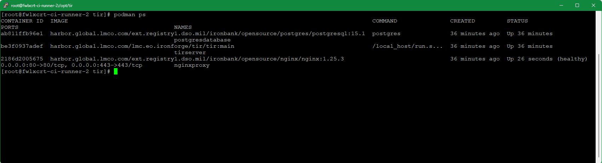
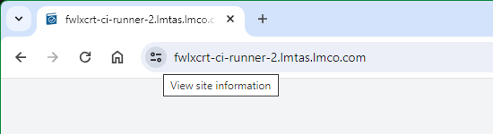

# Test Ingest Repository (TIR) Deployment Procedures

## Purpose

The purpose of this document is to provide a guide for the deployment of Test Ingest Repository (TIR). TIR is a MITRE Security Assessment Framework (SAF) tool that is used to support boundary and software compliance and continuous monitoring.

## TIR Deployment Using Docker-Compose

1.  On the target host system, create a target deployment folder (i.e. /opt/tir).

$ mkdir /opt/tir

1.  Copy over the latest bootstrap script from the pipeline job artifacts. This script is built in the pre-deploy stage of the current TIR gitlab pipeline and can be found in the “Prepare docker-compose” job artifacts (i.e. <https://gitlab.us.lmco.com/e348832/tir/-/jobs/125468922/artifacts/browse>).

*It is important to use the job artifact script as it compiles text from the other run-time scripts necessary for the TIR deployment.*

1.  Generate the supporting files.

    1.  Move the bootstrap\_tir.sh file into the target deployment folder.

    2.  Set the bootstrap\_tir.sh mode to executable

$ chmod +x /opt/tir/bootstrap\_tir.sh

1.  From the deployment folder as the working directory, run the executable

> $ ./bootstrap\_tir.sh

1.  Follow the instructions in the bootstrap to generate the supporting files

    1.  It will ask if a database is being deployed and then will provide questions with example answers as well as default values if no prompt is given

    2.  Tips:

        1.  Images: Use images from public/private repos that match images listed in the default example, the hosting registry may differ but the image:tag should be similar (i.e.
            your.private.registry/project/tir:v1.0.1 matches our.private.registry/our\_project/tir:v1.0.1).

        2.  SQLITE (optional): should be true if using sqlite instead of another SQL db instance – only visible when deploying a database

        3.  USE\_CU STOM\_REPO: This deployment allows for the nginx reverse proxy to restart upon receiving updated and valid SSL host certificates. It thus requires installation of the following packages: (openssl inotify-tools procps-ng psmisc). OpenSSL validates the certificates, inotify-tools
            allows for monitoring of the staged-certificate shared
            volume, and Procps-ng/psmisc allow the image to search for
            the running inotify process, and stop it, thus restarting
            the reverse proxy. **Set this variable to true if your
            server requires a private yum repository**.

1.  At the end of the setup, the bootstrap script will display a massage
    stating which files had been created based on the selections in the
    prompts. Note the next steps listed at the bottom.

1.  *If the server is using a private yum repository*, copy the
    following into the target deployment's nginx\_renew folder from the
    matching tir repository’s deployment folder:

    1.  A cachain cert (.pem file) for ca-trust

(For LM instances)

$ curl http://crl.external.lmco.com/trust/pem/combined/Combined\_pem.pem
\\

-o nginx\_renew/cachain.pem

1.  .repo file(s) to be used from where openssl, inotify-tools,
    procps-ng, psmisc can be installed.

(For LM instances)

$ sed -i "s/#INSERTTOKEN#/$EFOSS\_TOKEN/g" nginx\_renew/efoss.repo && \\

sed -i "s/#INSERTUSERNAME#/$EFOSS\_USER/g" nginx\_renew/efoss.repo

1.  A yum.conf file if necessary

1.  Install docker-compose, see
    https://cctdocs.pages.gitlab.us.lmco.com/ironforge/hosting/deployment/index.html
    and perform

    1.  Preparation

    2.  docker-compose

    3.  Netavark network\_backend install/config

2.  Use docker-compose to bring up the deployment

    1.  From your working directory bring up the environment with

$ docker-compose up -d

1.  To see logs on your compose up use

$ docker-compose logs \# you can add -f to follow

1.  To bring down the deployment, run the following:

$ docker-compose down

1.  Remove the volumes created by running

$ podman volume ls \# shows a list of created podman volumes

> $ podman volume rm tir-... \# Only use for volumes created by this
> docker-compose

# **Steps for TIR Cert Import and Verification**

1.  Click **Administration** tab

1.  Click on the **Configuration** tab

1.  Click on the CA Certificate Choose File box to open a File dialog
    window and choose your signed x509 formatted .crt file and hit
    Open - the name of the file will appear in the CA Certificate Text
    Box

1.  Note name of .crt file shows up in text field.

1.  Click on the Site Certificate Choose File box to open a File dialog
    window and choose your pem formatted site key and hit Open - the
    name of the file will appear in the Site Certificate Text Box

1.  Select Import

A modal window saying "Checking Certificates Please Wait... Circle" will
appear while the files are being loaded.

A message underneath the Certificate Import form Text Fields will appear
saying "Certificate Import Successful!" if the certs are accepted.

Notes:

-   The nginx listener checks imported certificates for:

    -   A .pem formatted key file

    -   A x509 formatted .crt file

    -   Cert files matching modulus

    -   CRT Common Name matching NGINX\_HOST variable value

-   If invalid cert files are loaded, an error will appear saying "Error
    in Cert Response" in the top right of the window

## Demonstrating Certificate Import

1.  Perform TIR Deployment using docker-compose steps (above)

2.  On the host, in the deployment folder, follow the compose logs

$ docker-compose logs -f

Wait for the database to be migrated/seeded completely and nginx image
to have all packages installed. You will see messages similar to the
following – from the tirserver, a lot of migrate messages and then it
will stop – that means it’s done. If you have a good eye, look for
**tirserver | { event: 'up', message: 'applied X
migrations.' }** messages. There will be a number of migrations
that are applied during this setup phase.

> …
>
> tirserver | Executing (default): INSERT INTO "seeder\_meta" ("name")
> VALUES ($1) RETURNING "name";
>
> tirserver | {
>
> tirserver | event: 'migrated',
>
> tirserver | name: '2023.12.07T05.38.17.TierRoles.ts',
>
> tirserver | durationSeconds: 0.011
>
> tirserver | }
>
> tirserver | { event: 'migrating', name:
> '2023.12.07T14.27.10.BoundaryRoles.ts' }
>
> …
>
> tirserver | { event: 'migrating', name:
> '2024.02.03T01.28.29.Classifications.ts' }
>
> tirserver | Executing (default): INSERT INTO "Classifications"
> ("id","name","abbreviation","creationDate","lastUpdate") VALUES
> (1,'Unclassified','U','2024-03-13T12:39:50.487+00:00','2024-03-13T12:39:50.487+00:00'),(2,'Controlled
> Unclassified
> Information','CUI','2024-03-13T12:39:50.487+00:00','2024-03-13T12:39:50.487+00:00'),(3,'Secret','S','2024-03-13T12:39:50.487+00:00','2024-03-13T12:39:50.487+00:00'),(4,'Top
> Secret','TS','2024-03-13T12:39:50.487+00:00','2024-03-13T12:39:50.487+00:00');
>
> tirserver | Executing (default): SELECT table\_name FROM
> information\_schema.tables WHERE table\_schema = 'public' AND
> table\_name = 'seeder\_meta'
>
> tirserver | Executing (default): SELECT i.relname AS name,
> ix.indisprimary AS primary, ix.indisunique AS unique, ix.indkey AS
> indkey, array\_agg(a.attnum) as column\_indexes, array\_agg(a.attname)
> AS column\_names, pg\_get\_indexdef(ix.indexrelid) AS definition FROM
> pg\_class t, pg\_class i, pg\_index ix, pg\_attribute a WHERE t.oid =
> ix.indrelid AND i.oid = ix.indexrelid AND a.attrelid = t.oid AND
> t.relkind = 'r' and t.relname = 'seeder\_meta' GROUP BY i.relname,
> ix.indexrelid, ix.indisprimary, ix.indisunique, ix.indkey ORDER BY
> i.relname;
>
> tirserver | Executing (default): INSERT INTO "seeder\_meta" ("name")
> VALUES ($1) RETURNING "name";
>
> tirserver | {
>
> tirserver | event: 'migrated',
>
> tirserver | name: '2024.02.03T01.28.29.Classifications.ts',
>
> tirserver | durationSeconds: 0.015
>
> tirserver | }
>
> **tirserver | { event: 'up', message: 'applied 7
> migrations.' }**

1.  Load site in browser using the hostname in .env for NGINX\_HOST. It
    will be insecure due to its originally Self-signed certs.

-   In Chrome, type **“thisisunsafe”**

-   in the browser to continue.

1.  Follow the steps in “Steps for TIR Cert Import and Verification”
    steps 1-3.

2.  Load invalid certs and note messages in docker-compose logs

    1.  Load non-formatted invalid certs

    2.  Load non-matching certs

    3.  Load matching but wrong site certs

3.  Load correct certs, see responses and messages in logs

Ctrl+C out of docker-compose logs, wait about 15 seconds and run the
following command to see status of tirserver and nginxproxy (and
postgresdatabase if applicable). Note uptime for proxy is less than
other two due to its recent restart.

$ podman ps

1.  Close tab and reopen in browser, note cert error is gone – copy
    http://hostname from address bar

1.  Paste address into a new tab, and go.

1.  Note site information next to address shows secure connection and
    Certificate is Valid. Click icon next to web address.

1.  Click on Connection is secure to view site details

1.  Click on Certificate is valid to view Certificate information.

