# Test Ingest Repository (TIR) General User Guide

# References

For documentation related to the deployment and installation of the Test
Ingest Repository please see the **Test Ingest Repository (TIR)
Deployment Guide**.

For documentation related to the administration of the Test Ingest
Repository please see **Test Ingest Repository (TIR) Privileged User
Guide**.

# Purpose

The purpose of this document is to provide a guide for General User
functions for Test Ingest Repository (TIR). This guide is designed for
authorized Information System Security Officers (ISSO), Information
System Security Managers (ISSM), and System Administrators responsible
for maintaining compliance and Continuous Monitoring (ConMon) for
systems and/or networks, where TIR is deployed.

TIR is a MITRE Security Assessment Framework (SAF) tool, built in
collaboration with Lockheed Martin, that is used to support boundary
compliance, software compliance, and continuous monitoring.

TIR Users have access to certain features in the software. TIR Users
have the ability to create new Companies and Boundaries. The user that
creates a Company or Boundary will be assigned the owner permissions of
that Company or Boundary by default. For Boundaries and Companies that
were not created by the user, access will need to be granted by an Admin
or Owner. This helps maintain required separation of roles and
responsibilities within TIR.

# Getting Started

TIR is a repository that will store and manage your system or network’s
STIG compliance and Plans of Actions and Milestones (POA&M). Your TIR
instance should be deployed and configured by your System Administrator,
and access through a web browser. For information about deploying TIR to
a new environment please see the Test Ingest Repository (TIR) Deployment
Guide.

## Request Account Access

Please follow instructions defined by your program to request an
account. Administrators have access to create accounts and reset
passwords.

## Account Permissions

TIR has two types of users, Administrators and Users. Administrators
have access to the **Administration,** **Libraries**, and **Boundary**
tabs. Users only have access to Libraries and Boundary tabs. TIR is
setup as a hierarchical system with Companies and Boundaries. Users can
be granted permissions to be Owners, Reviewers, and Editors for
Companies and Boundaries. A summary of permissions is show in Table 1,
below.

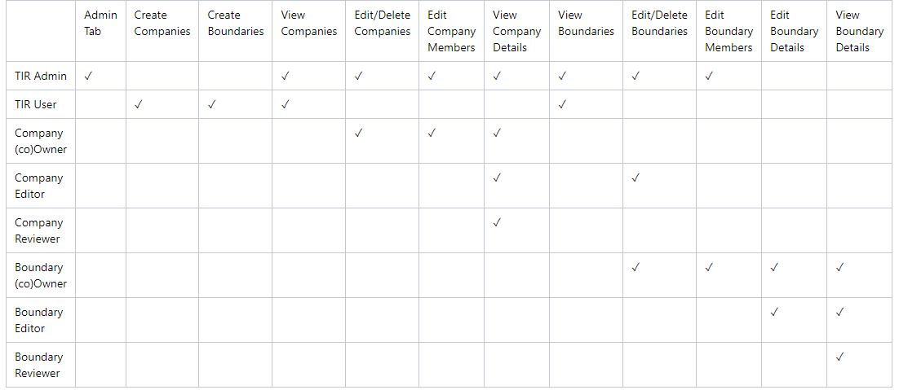

## Login

Once your account has been created, please navigate to the TIR home
page. Enter your **Username** and P**assword**, then review the **IS
User Agreement** and acknowledge that you have read it by clicking the
check box. Then, click **Sign in**.

# Interfaces

Upon a successful login, the user will be welcomed into TIR and the
**Dashboard** will be displayed. At the top of the page, you will see
three buttons: **Dashboard**, **Boundaries**, and **Libraries**. In
later sections of this guide, you will find detailed instructions on how
to properly configure and use each of these interfaces.

## Dashboard

The dashboard will show you the most recent changes to your TIR instance
and will display any important upcoming dates that the user should be
aware of. Some examples of displayable content include; recent changes
to Boundaries and the newest Security Technical Implementation Guide
(STIG) libraries imported.

## Boundaries

The Boundary tab contains “Companies” and “Boundaries” in a hierarchical
structure to best support multiple programs within a single TIR
instance. Companies will be used to store and organize Boundaries. The
Boundaries will store your Systems and all of the STIG data associated
with those Systems. Permissions can be granted to Companies or
Boundaries and your permissions will be granted based on the Role of
your user account (see Table 1 for user permissions).

## Libraries

The Libraries tab provides the ability to import new STIG libraries and
updated Control Correlation Identifiers (CCI) mappings for different
NIST SP 800-53 revisions.

### STIG Libraries

The Department of Defense (DoD) releases quarterly updates to the STIG
benchmarks. STIG Libraries can be downloaded at
[public.cyber.mil](public.cyber.mil). These quarterly updates are
released as .zip files. Once downloaded, the .zip files can be uploaded
to TIR and made available to all users.

#### View STIG Libraries 

Navigate to the **Libraries** page by clicking the **Libraries** button
at the top on the page.

The **Libraries** page will display all of the STIG libraries that have
been uploaded to your TIR instance.

#### Import STIG Libraries

To import a new STIG library, navigate to the **Libraries** page and
click the **Import** button inside the **STIG Libraries** section. For
reference, this button can be found in the top right of *Figure 5: STIG
Libraries*.

The **Import** button will open a file navigation window. Navigate to
the .zip file containing the STIG Library and click **Open**.

Once imported, the STIG libraries will follow a standardized naming
convention. The naming convention will follow this template:
**U\_SRG-STIG\_Library\_{year}\_{month}{revision}.zip**.

Please refer to the table below for more examples.

<table>
<caption>
Table 1: Access Control – User Permissions
</caption>
<colgroup>
<col style="width: 8%" />
<col style="width: 29%" />
<col style="width: 14%" />
<col style="width: 47%" />
</colgroup>
<thead>
<tr class="header">
<th><strong>Year</strong></th>
<th><strong>Release Quarter/ Month</strong></th>
<th><strong>Revision</strong></th>
<th><strong>Naming Convention</strong></th>
</tr>
</thead>
<tbody>
<tr class="odd">
<td>2022</td>
<td>Q1 / January (01)</td>
<td>v1</td>
<td>U_SRG-STIG_Library_2022_01v1.zip</td>
</tr>
<tr class="even">
<td>2022</td>
<td>Q2 / April (04)</td>
<td>v2</td>
<td>U_SRG-STIG_Library_2022_04v2.zip</td>
</tr>
<tr class="odd">
<td>2023</td>
<td>Q3 / July (07)</td>
<td>v1</td>
<td>U_SRG-STIG_Library_2023_07v1.zip</td>
</tr>
<tr class="even">
<td>2023</td>
<td>Q4 / October (10)</td>
<td>v2</td>
<td>U_SRG-STIG_Library_2023_10v2.zip</td>
</tr>
</tbody>
</table>

Table 1: Access Control – User Permissions

### CCI Matrix

CCI mappings are distributed by NIST and are updated as necessary. The
latest CCI Matrix can be downloaded at the following
<https://public.cyber.mil/stigs/cci/>. Please note that CCI mappings
differ between SP 800-53 Rev 4 and Rev 5, and keeping this updated will
ensure more granular mapping of STIGs to applicable CCIs.

#### Import CCI Matrix Updates 

To import a new CCI Matrix, navigate to the Libraries page and click the
Import button inside the CCI Matrix section. For reference, this button
can be found in the top right of Figure 6: CCI Matrix.

## About Page

The **About Page** will let the user know what version of TIR they are
currently accessing as well as the date that the current version was
pushed to their environment.

## User Profile

The User Profile icon looks like a person and is located in the
top-right of the screen. To access your profile, click the **Icon** and
then click **Your Profile** (as seen in Figure 8). If you wish to sign
out, you can find the **Sign Out** button located under **Your
Profile**.

Your **User Profile** will display your **Username**, **Role**, **Hidden
Password**, **Time zone**, **API Token**, and **Color Theme**.

-   To change your password, click the **Change** button located on the
    right-side of the **Password** row. Enter a **New Password**,
    **Confirm the Password**, and click **Save**.

-   To update your Time zone, select a new time zone from the drop-down
    menu and click **Update** button located on the right-side of the
    **Timezone** row.

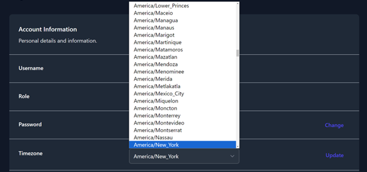

-   To create an **API Token**, click the **Create** button on the
    right-side of the **Token** row. Enter a **Token Name** and an
    **Expiration Data,** then click **Generate**. A pop-up window will
    appear that contains your **Token Code**. Please save that code
    before closing the window. A list of your existing tokens can be
    found in the **Token Table**. Please see Figure 11 as an example.

-   To change the **Coloring Theme** of TIR, choose **System**,
    **Light**, or **Dark** from the **Theme** row. The **System** option
    will use the theme from your client system’s settings.

## Notifications

Users will receive notifications about important dates related to their
Boundaries and when new STIG Libraries are available. The notification
for a new STIG Library will be sent out to all Boundary Owners once a
new STIG Library is imported into your TIR instance. These notifications
will be displayed by the **Bell** icon in the top-right of the screen
(as seen in Figure 13). A snippet of each unread notification will be
displayed from this view.

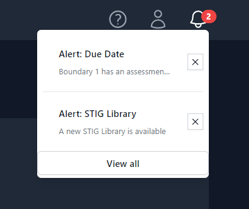

To view all of your notifications, press the **View all** button at the
bottom of the Notification Bell menu (Figure 13). An example of the full
notification page can be seen below in Figure 14.

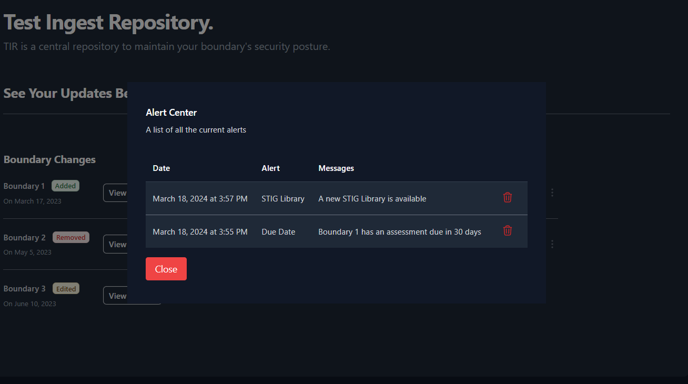

# Creating your Work Environment

The Test Ingest Repository is designed to a store your boundary
composition in a hierarchical format. Before you can begin your cyber
assessment, you will need to create the path to store your boundary’s
scan data.

All instructions within this section will be explicitly from the
**Boundaries** interface.

## Creating Companies

The **Boundaries** landing page will show you the highest level of your
organizational structure.

The structure of your boundaries will depend greatly on where TIR is
being hosted. For environments being accessed by a wide range of users,
compartmentalization will be important. For smaller environments, the
compartmentalization structure will not need to be as extravagant.

The owner of each boundary will be responsible for creating their
**Boundary** inside of TIR. Before creating a boundary, please
strategize on the access control elements of your boundary. When
creating a boundary, the user will have the option to add a **Company**
or add a **Boundary**. The **Companies** are used as a nesting structure
to organize where your boundary is stored. The **Boundaries** will be a
container that stores all of the cyber assessment data and will provide
a workspace to address any findings. To compare to a traditional
directory structure, the **Companies** will act as the higher-level
directories and the **Boundaries** will act as the lowest level
directory. **Systems** will be added to each boundary, and those
**Systems** will be the equivalent to actual files existing in your
directories.

To better illustrate this comparison to the traditional directory
structure, please refer to the Figure 15: Example Boundary Structures
below.

With that illustration in mind, let’s get started with creating
boundaries inside of TIR. Navigate to the **Boundaries** page by
clicking the **Boundaries** button at the top on the page. To create a
new company, click the **\[+\] Company** button as shown in Figure 16.

A side panel will open from the right of the screen. Enter the name of
the company into the **Company Name** text field and click **Save**.

You should now see an item titled with the name you entered into the
**Company Name** field. For demonstration purposes, we’ll use the
example from Figure 15. We’ll start by creating a company for MITRE 1
and MITRE 2, as seen in Figure 17.

Navigate inside of your newly created Company by clicking on the item
(ex: MITRE1). Once navigating inside a new Company, you will see the
**\[+\] Company** and **\[+\] Boundary** buttons. You have the ability
to create as many nested Companies as you see fit.

It is important to note that Boundaries can only exist at the lowest
level of a company. A company cannot hold both Boundaries and Companies
at the same level. This means; once you click the **\[+\] Boundary**
button inside a Company, you will not be able to nest any more
Companies. This works likewise for when you are nesting Companies. Once
you click the **\[+\] Company** button, you will not be able to create a
Boundaries at the level where a Company exists.

## Creating a Boundary

Once you are ready to create a **Boundary**, navigate to an empty
Company and click the **\[+\] Boundary** button. A side panel will slide
out from right side of the screen (Figure 18) that will require you to
fill out a couple fields. Once you have completed all of the fields,
click the **Save** in the bottom-right of the side panel. See Table 3
below for more information on the Boundary fields.

<table>
<caption>
Figure 1:
Login Page
</caption>
<colgroup>
<col style="width: 18%" />
<col style="width: 12%" />
<col style="width: 40%" />
<col style="width: 29%" />
</colgroup>
<thead>
<tr class="header">
<th><strong>Field</strong></th>
<th><strong>Required</strong></th>
<th><strong>Description</strong></th>
<th><strong>Default Value</strong></th>
</tr>
</thead>
<tbody>
<tr class="odd">
<td>Enclave Name</td>
<td>Yes</td>
<td>Name of your Boundary</td>
<td></td>
</tr>
<tr class="even">
<td>Owner</td>
<td>Yes</td>
<td>Owner of the Boundary</td>
<td>The current user</td>
</tr>
<tr class="odd">
<td>STIG Baseline</td>
<td>Yes</td>
<td>Set the STIG baseline</td>
<td>The latest STIG Baseline</td>
</tr>
<tr class="even">
<td>RMF Versions</td>
<td>Yes</td>
<td>Set the Cybersecurity Framework</td>
<td>NIST SP 800-53</td>
</tr>
<tr class="odd">
<td>Classification</td>
<td>Yes</td>
<td>Classification Marking</td>
<td></td>
</tr>
<tr class="even">
<td>Caveat</td>
<td>No</td>
<td>Additional Classification Markings</td>
<td></td>
</tr>
</tbody>
</table>

Figure 1: Login Page

Your newly created boundary will appear in the table, as shown in
*Figure 19: Viewing the list* of created Boundar*y*. To view your
boundary, click on the item in the table.

When a Boundary is selected, you will be taken to the Overview sub-tab
of the Boundary dashboard. The boundary overview sub-tab will display a
high-level overview of your systems and the findings associated with
each system.

-   At the top of the Boundary Overview table you will find the **Path
    to your Boundary** with breadcrumbs that a linked back to each
    parent for easy navigation.

-   The **Number of Systems** field will display the amount of Systems
    that have been added to your boundary.

-   The **Status** fields will display a total number of STIG checks and
    the unique number of STIG checks. The total number of checks come
    from the sum of the total checks for each system. The number of
    unique checks come from the statuses of the checks contained inside
    the Boundary applied STIGs. For example, if two systems have the
    same STIG check set to Open, this will count as **two** open
    findings for the **Total** count but only **one** open finding for
    the **Unique** count.

-   The **STIG baseline** field will display the STIG Library set for
    this boundary. This STIG baseline can be updated as new STIG
    Libraries become available. To update this field for your boundary:

    1.  Import STIG Libraries

    2.  Navigate to your boundary’s **parent folder**, press the **three
        dots** to the right of your boundary, select **Edit**

    3.  Use the drop-down menu for **STIG Baseline** to select the
        newest STIG Baseline

    4.  Click **Save**

-   The **NIST version** field will display RMF Framework that was
    assigned to your boundary.

-   The **Overlay Selected** and **Control Status** fields are for
    future development.

## Adding Systems to your Boundary

Navigate to the Boundary that you wish to add a system to. Click the
**Add System** sub-tab and view the available options.

There are five options available when adding a system to your boundary:

<table>
<caption>
Figure 2:
Dashboard
</caption>
<colgroup>
<col style="width: 17%" />
<col style="width: 55%" />
<col style="width: 26%" />
</colgroup>
<thead>
<tr class="header">
<th><strong>Field</strong></th>
<th><strong>Description</strong></th>
<th><strong>Required Inputs</strong></th>
</tr>
</thead>
<tbody>
<tr class="odd">
<td>Single</td>
<td><ul>
<li>
Manually create a single system
</li>
</ul></td>
<td>System Name</td>
</tr>
<tr class="even">
<td>Widget</td>
<td><ul>
<li>
Load blank STIG Checklists
</li>
<li>
Duplicate Existing Systems
</li>
</ul></td>
<td>
System Name

STIG Checklists
</td>
</tr>
<tr class="odd">
<td>Folder(s)</td>
<td><ul>
<li>
Import Scan Results (CKL, XCCDF)
</li>
</ul></td>
<td>Directory</td>
</tr>
<tr class="even">
<td>.Zip Folder</td>
<td><ul>
<li>
Import Scan Results (.ZIP)
</li>
</ul></td>
<td>.Zip Folder</td>
</tr>
<tr class="odd">
<td>CSV File</td>
<td><ul>
<li>
Import a List of Systems
</li>
</ul></td>
<td>.Csv File</td>
</tr>
</tbody>
</table>

Figure 2: Dashboard

The **Single** and **Widget** options are manual options for creating a
system. The **Folder(s)** and **.Zip Folder** options allow you to
create your boundary using your results from your cyber scans. The final
option for adding systems to your boundary is the **CSV File**. The CSV
File will allow you to pre-build out your boundary by providing a list
of names for each of your systems.

### Add Single System

The single system add feature will allow to create a new system inside
of your boundary. When creating a new system, you will be asked to
assign the system a name and click Save. This newly created system will
be blank. For this system to be functional, you will need to add STIG
checklist(s) and/or scan results.

### Add System via Widget

The Widget feature is primarily used to duplicate existing Systems
inside of your boundary. When adding Systems manually, this tool
eliminates some of the manual steps of creating a new System. You’ll
have the ability to duplicate as many systems as needed.

The Widget tool is useful when creating systems that mirror already
existing systems in your boundary. For example, if you have multiple
workstations that will contain the same STIGs, you can create the system
and duplicate it for each mirrored workstation in your boundary.

To duplicate a system using the Widget, navigate inside of your
boundary, click **Add System** and then click **Widget** (as seen in
Figure 21**)**. A pop-up window will appear (as seen in figure 21).
Locate the system that you wish to duplicate and click the **Duplicate**
button on the right side of the row. This will create a new system and
apply the exact same STIGs that previous system contained. To rename
this new system, type the new name into the **System Name** field. To
add additional STIGs, use the **STIGs** field. Finally, to remove any
STIGs, navigate to the **Applied** STIGs field and click the **X** to
the left of the STIG.

Once you are satisfied with the new system(s) click the **Create
Systems** button. For an example of using the widget tool, see Figure
23.

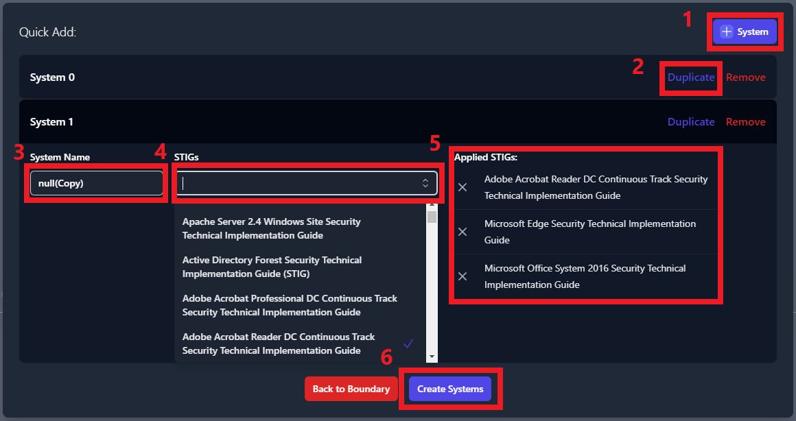

### Add Systems by Importing Scan Results via Folder(s)

This method of adding systems will require scan results from each of the
systems in your boundary. This import function supports CKL and XCCDF
file formats, and automates the creation of the systems inside of your
boundary.

There is a standard format that your cyber scan data will need to be
organized in for this tool to correctly build your boundary. First, a
parent folder for your boundary needs to be created. Then, navigate
inside of your boundary folder and create a folder for each system in
your boundary. Inside of each of these system folders, place all of the
cyber scan data (.ckl and .xccdf files) associated to that system.

To create systems by using cyber scan data, navigate inside of your
boundary, click **Add System** and then click **Folder(s)** (as seen in
Figure 25**)**. A file navigation window will open which will ask you to
select a folder. It is very important that you select the parent folder
that contains individual folders for each system on your boundary. When
clicking the **Upload** button (inside the file navigation window), you
should be looking at all of the folders with your system names and the
parent folder should be displayed in the **Folder** field directly above
the **Upload** button.

Once you click the **Upload** button, you will be prompted to confirm
that you wish to upload all of your results. Click **Upload** on the
prompt.

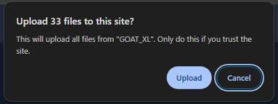

Once all of the files have been uploaded you will be able to view each
system in the **System View** tab. For more information about the System
View, please see Section 8.2: System View.

### Add Systems by Importing Scan Results via .Zip Folder

Users have the option to zip up the results and import the .zip folder
to create a new system. Each system will need their own .zip folder.
Please rename the .zip folder to contain the System Name. In our example
below, **Goat\_DC** is the name of the system that we are creating. The
**Goat\_DC.zip** folder contains all of our checklist and XCCDF scan
data. Please note; if you have multiple .zip folders to upload, they
will need to be uploaded one at a time.

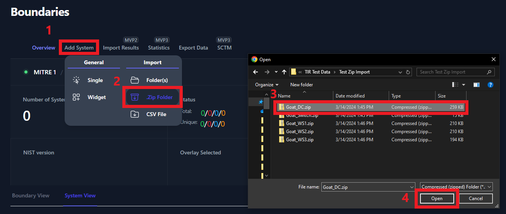

### Add Systems by Importing Scan Results via CSV File

This feature is planned for a later release.

# Changing Boundary and/or Company Permissions

### Modify Company Permissions

To modify Company permissions select the 3 buttons to the far right of
the Company and select Manage Users.

-   Then the Members dialog box comes up, enter the username in the
    **Search Users** box.

-   The Search Users box should provide a list of similar usernames.
    Select the user account you wish to add.

-   Once selected click the down arrow next to Co-Owner and select the
    level of permission you wish to grant.

-   Once the level of access you wish to grant is selected, Click **Add
    Member**

-   You will see the account added to the user permissions list for the
    applicable company.

Member access can be edited or removed from this view as well.

### Modify Boundary Permissions

To modify Boundary permissions select the 3 buttons to the far right of
the Company and select Manage Users.

-   Then the Members dialog box comes up, enter the username in the
    **Search Users** box.

The Search Users box should provide a list of similar usernames. Select
the user account you wish to add.

Once selected click the down arrow next to Co-Owner and select the level
of permission you wish to grant.

Once the level of access you wish to grant is selected, Click **Add
Member**

You will see the account added to the user permissions list for the
applicable company.

Member access can be edited or removed from this view as well.

# Import Test Data for System

Once your Boundary has been created, you will need to import your test
data into your Boundary. To do this, navigate to your Boundary, click on
the System you wish to upload test data of.

The two buttons found in the screenshot above will be used to upload
STIGs and Test Data Results to your systems. Follow the steps in the
sections below for more detailed instructions on uploading test data.

## Manually Adding STIGs to a System

Before adding STIGs to your systems, be sure that you have the latest
STIG Library uploaded. See Section 4.3.1.2 for instructions on how to
upload the latest STIG Library.

Once you have the latest STIG Library uploaded, navigate to your System
and click the button titled **\[+\] STIG** (as seen in Figure 37: Upload
Test Data to your System). A side panel will appear on the right side of
your screen. Use the search bar (highlighted in Figure 38: Adding STIGs
to your System) to find each STIG that is applicable for you System.
Click on the STIG to add it to the **Applied STIGs** section at the
bottom of the panel. Once you’ve added all of your STIGs, click the
**Save** button at the very bottom of the panel.

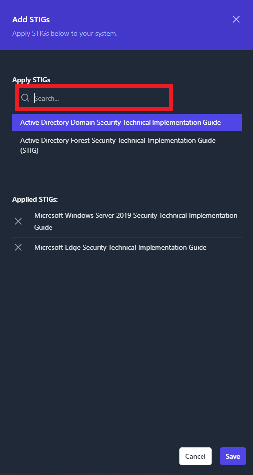

Once the STIGs have been added, you will see them displayed in the
Boundary page. See Figure 39 below for an example.

## Adding Checklists and XCCDF Results Data to a System

To add results data, navigate to you System and click the **\[+\]
Results** button (as seen in Figure 37). You will have three options
when importing test data: **Import Folder**, **Import ZIP Folder**, and
**Multiple File Selection**. See the below sections for more
instructions on those import functions. All of these import functions
can import checklist and XCCDF data. You do NOT need to upload the blank
STIG benchmarks to your system prior to importing results.  
The import results functions will add the checklists to the existing
System.

### Import Results via Folder

To use this import function, please place all of your test data for your
System into a single folder. Next, navigate to your System, click the
**\[+\] Results** button then click **Import Folder**. This will launch
a file navigation window. Navigate to the folder that contains your test
data and click **Upload**. The actual files will not be visible in the
file navigation window so please verify that the result data is present
in a separate window (as seen in Figure 40).

Notice that we only uploaded four STIG benchmarks in Section 7.1 but we
uploaded results of nine different STIG checklists. All nine checklists
will be uploaded to your System, as seen below in Figure 41.

### Import Results via Zip Folder

To use this import function, please place all of your test data for your
System into a single .zip folder. Next, navigate to your System, click
the **\[+\] Results** button then click **Import ZIP Folder**. A file
navigation window will be displayed. Navigate to the .zip folder that
contains your test data for your system, then press **Open**.

Upon a successful upload of test data, the test data will be displayed
inside your System (identical to Figure 41).

### Import Results via Multiple File Selection

To use this import function, please place all of your test data for your
System into a single .zip folder. Next, navigate to your System, click
the **\[+\] Results** button then click **Multiple File Selection**. A
file navigation window will be displayed. Navigate to your checklist
and/or XCCDF data and select each file that you would like to upload and
click **Open**.

Upon a successful upload of test data, the test data will be displayed
inside your System (identical to Figure 41).

# POA&M Management

TIR is a repository to store and manage your test artifacts. TIR
provides a **Boundary View** and a **System View** to manage your data.
The **Boundary View** allows you to view each STIG as a superset of the
boundary. Meaning; from a single STIG check view, you will be able to
view and edit the status of each system that contains that check. The
**System View** will show you the list of systems inside your boundary
and will allow you to view all checks related to that individual system.

The access these views, navigate to your Boundary and click the
**Boundary View** or **System View** (as seen in Figure 41).

**Figure 41: Boundary and System Views**

## 8.1 Boundary View

As mentioned in the summary under Section 8, the **Boundary View**
allows you to view each STIG as a superset of the boundary. You will be
able to target specific STIG checks and check the status of all the
systems that contain that check. From the **Boundary View** you will be
able to change the status of STIG checks, however, you will not be able
to edit the **Finding Details** and **Comments** for each individual
system. To edit either one of those fields for a specific system, you
will need to navigate to the **System View**.

Once you click the **Boundary View** tab, you will see a unique list of
all the STIG checklists that have been added to systems in your boundary
(as seen below in Figure 42).

**Figure 42: Boundary View Tab**

To view the STIG checks inside each of these STIG checklists, simply
click on the STIG. For this example, we will be looking at the
**Microsoft Edge Security Technical Implementation Guide**.

Once you open the STIG View, you will see a variety of information
related to the Boundary, STIG Library, and STIG Check. Each item is
labeled below in Figure 43.

**Figure 43: STIG View Data Key**

On the left side of the screen, you will see a section titled
**Filters** that contain four status types: **Open**, **NotAFinding**,
**Not\_Applicable**, and **Not\_Reviewed**. Each one of the status types
can be toggled on and off to display the STIG checks with that status.
When filters are selected, they will be colorized. For example, Figure
44 is filtering so that only STIG checks with a status of **Open** (red)
or **Not\_Reviewed** (yellow) will be displayed.

**Figure 44: Filtering by Status**

###  System Statuses and Overrides

In Figure 45 you will see that the **Finding Details** and **Comment**
fields pull the data for this check from each system in your boundary.
We can see that this check is pulling data from four separate systems in
our boundary: **Goat\_DC**, **Goat\_WS2**, **Goat\_WS3**, and
**Goat\_WS1**.

**Figure 45: Finding Details and Comments inside of the Boundary View**

To view the status of each one of those systems, you will need to click
the **Systems** button (highlighted in Figure 46).

**Figure 46: Systems Button**

A pop-up window will appear that displays all of the systems where this
STIG check applies and the current status for each system.

**Figure 47: System Status and Overrides**

To make an update to a system; select the **checkbox** next to that
system, change the **Current** status field using the drop-down menu,
then click **Save**.

If you want to change the status of multiple systems at once, select the
**checkbox** next to each system that you are changing. The **Filters**
drop-down in the upper left will allow you to select multiple systems
with the single click of a button. Once the desired systems are checked,
select the new status from the **Set Finding Status** drop-down (at the
top of the middle column) and click the **Set** button directly next to
that drop-down menu.

The third column is for **Overrides**. Override rules can be set on a
STIG check so that the status you assign to this check persists on the
selected systems when new test data is imported in the future. This
override feature should be used almost exclusively to set statuses of
**Not Applicable** for checks that are deemed **Not Applicable** to your
boundary. Using this feature to set an override status of
**NotAFinding** could cause you to miss a potential open finding in the
future if security settings or Group Policy Objects (GPOs) are disabled
or removed. To apply an override, select the **checkbox** next to each
targeted system, select the override status from the **Set Override
Status** drop-down menu, then click the **Set** button directly next to
that drop-down menu.

Once all of your changes have been made, click the **Save** button in
the bottom-right corner of the pop-up window.

\[Add screenshot show the asterisk to overrides\]

### POAM Fields

From the **Boundary View**, each STIG check will have collapsible and
expandable section titled **POAM Fields**. The user will have the
ability to provide additional comments, program information, milestones,
adjust risk levels, and more. These fields need to be filled out for
each **Open** finding in your boundary. All of this data will be pulled
directly into the POAM export.

After you’ve completed filling out the **POAM Fields** for you STIG
check, click the **Save** button at the bottom of the page.

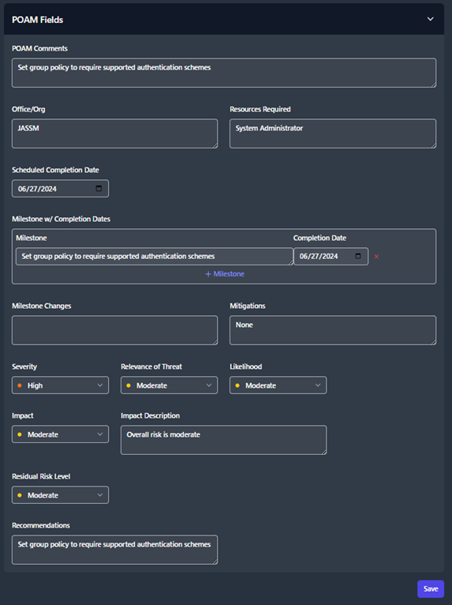

**Figure 48: POAM Fields**

## System View

The **System View** tab shows you a list of all the systems inside your
boundary, the number of STIGs applied to each system, and the total
status counts for all of the checks applied to that system.

**Figure 49: System View Tab**

To view and edit the data pertaining to one of these systems, click on
the system. The next page will show you the list of STIGs that apply to
that system. This page will provide versions, dates, and statuses for
each STIG. Click on one of the STIGs to open the **STIG View**.

**Figure 50: System View STIG List**

This **STIG View** page will provide a variety of information related to
the System, STIG Library, and STIG Check. These items are also available
in the **Boundary View** and have been labeled in Figure 43.
Additionally, like the **Boundary View**, you have the ability to filter
STIG check based on their status (see Figure 44).

Unlike the **Boundary View**, the **System View** allows you to edit the
**Finding Details** and **Comments** fields. To update the status of
each STIG check, use the status drop-down menu in the upper-right (seen
in Figure 51).

**Figure 51: Changing the Status from the System View**

# Exports

Once you have uploaded all of the test data on for your boundary, you
have the ability to export your data into a **Plan of Action and
Milestones (POA&M)**, a **Findings Worksheet**, or a **Checklist**. To
export your data, navigate to your Boundary and click the **Export
Data** button (as seen in Figure 44).

A popup window will appear, please use the tabs at the top of the popup
window to specify the output type (POAM, Findings, Checklist).

## Plan of Action and Milestones (POA&M)

To export a POA&M; navigate to your Boundary, click the **Export Data**
button, click the **POAM** tab, then click **Download POAM**.

The POA&M will organize all of the findings data for each security
control that is not being met.

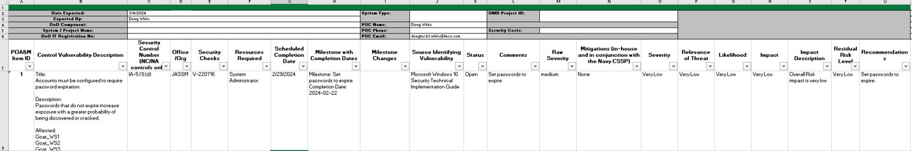

## Findings

To export your data into a **Findings Worksheet**; navigate to your
Boundary, click the **Export Data** button, and click the **Findings**
tab. The Findings Worksheet allows you to export data based on their
finding status. Check the box next to each of finding status’ that you
want to export. Then press the **Download** Findings button. For this
example, we will export only the **Open** findings for our Boundary.

A file will be downloaded to your computer titled **Findings \*.xlsx**.
This findings worksheet will display every finding with the statuses
that you specified in the previous step.

The findings worksheet will create an item for each
Vulnerability/Finding inside of your Boundary and list all of the
Systems Affected by that vulnerability.

## Checklists

TIR provides two options for exporting checklists. The default option
exports separate checklists for each STIG in a folder with the name of
the system. The second option creates a single checklist, containing all
STIGs, in a folder with the name of the system.

For the default option, select **Export Data**, select the **Checklist
tab**, and click **Download Checklist.**

The output should look like the following:

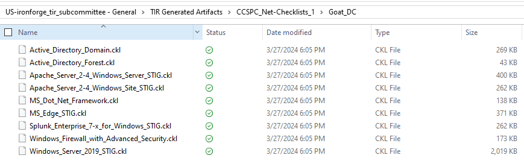

For a single checklist per system, select the **Single STIG per
checklist** box.

The output is as follows:

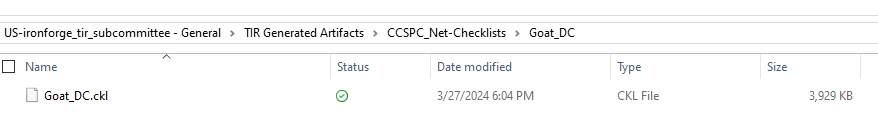
