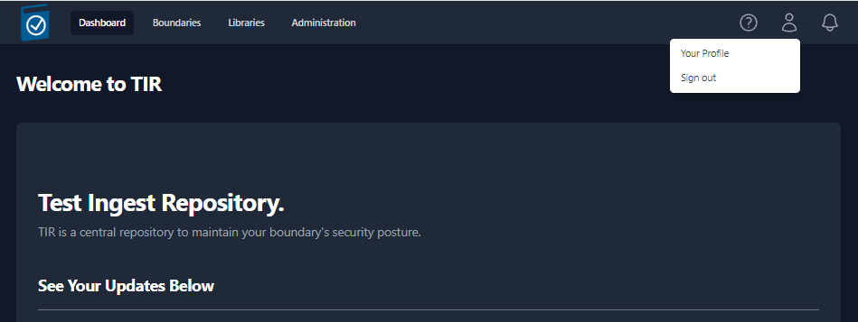
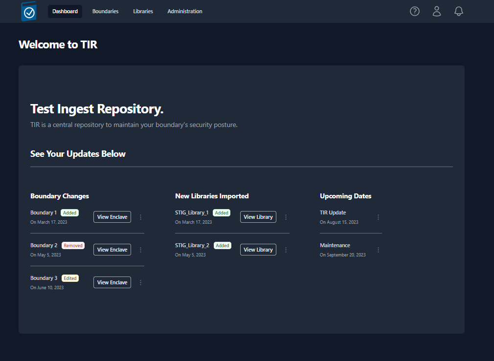
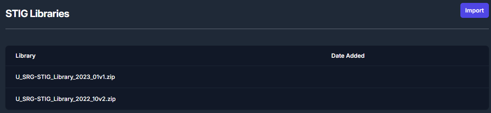

# Test Ingest Repository (TIR) General User Guide

## References

For documentation related to the deployment and installation of the Test Ingest Repository please see the **Test Ingest Repository (TIR) Deployment Guide**.

For documentation related to the administration of the Test Ingest Repository please see **Test Ingest Repository (TIR) Privileged User Guide**.

## Purpose

The purpose of this document is to provide a guide for General User functions for Test Ingest Repository (TIR). This guide is designed for authorized Information System Security Officers (ISSO), Information System Security Managers (ISSM), and System Administrators responsible for maintaining compliance and Continuous Monitoring (ConMon) for systems and/or networks, where TIR is deployed.

TIR is a MITRE Security Assessment Framework (SAF) tool, built in collaboration with Lockheed Martin, that is used to support boundary compliance, software compliance, and continuous monitoring.

TIR Users have access to certain features in the software. TIR Users have the ability to create new Companies and Boundaries. The user that creates a Company or Boundary will be assigned the owner permissions of that Company or Boundary by default. For Boundaries and Companies that were not created by the user, access will need to be granted by an Admin or Owner. This helps maintain required separation of roles and responsibilities within TIR.

## Getting Started

TIR is a repository that will store and manage your system or network’s STIG compliance and Plans of Actions and Milestones (POA&M). Your TIR instance should be deployed and configured by your System Administrator, and access through a web browser. For information about deploying TIR to a new environment please see the Test Ingest Repository (TIR) Deployment Guide.

### Request Account Access

Please follow instructions defined by your program to request an account Administrators have access to create accounts and reset passwords.

### Account Permissions

TIR has two types of users, Administrators and Users. Administrators have access to the **Administration,** **Libraries**, and **Boundary** tabs. Users only have access to Libraries and Boundary tabs. TIR is setup as a hierarchical system with Companies and Boundaries. Users can be granted permissions to be Owners, Reviewers, and Editors for Companies and Boundaries. A summary of permissions is show in Table 1, below.

</img>

<em>Table 1: Access Control - User Permissions</em>

### Login

Once your account has been created, please navigate to the TIR home page. Enter your **Username** and P**assword**, then review the **IS User Agreement** and acknowledge that you have read it by clicking the check box. Then, click **Sign in**.

</img>

<em>Figure 1: Login Page</em>

## Interfaces

Upon a successful login, the user will be welcomed into TIR and the **Dashboard** will be displayed. At the top of the page, you will see three buttons: **Dashboard**, **Boundaries**, and **Libraries**. In later sections of this guide, you will find detailed instructions on how to properly configure and use each of these interfaces.

### Dashboard

The dashboard will show you the most recent changes to your TIR instance and will display any important upcoming dates that the user should be aware of. Some examples of displayable content include; recent changes to Boundaries and the newest Security Technical Implementation Guide (STIG) libraries imported.

</img>

<em>Figure 2: Dashboard</em>

### Boundaries

The Boundary tab contains “Companies” and “Boundaries” in a hierarchical structure to best support multiple programs within a single TIR instance. Companies will be used to store and organize Boundaries. The Boundaries will store your Systems and all of the STIG and Nessus data associated with those Systems. Permissions can be granted to Companies or Boundaries and your permissions will be granted based on the Role of your user account (see Table 1 for user permissions).

</img>

<em>Figure 3: Companies in the Boundary Tab</em>

</img>

<em>Figure 4:  Boundaries nested under Companies</em>

### Libraries

The Libraries tab provides the ability to import new STIG libraries and updated Control Correlation Identifiers (CCI) mappings for different NIST SP 800-53 revisions.

#### STIG Libraries

The Department of Defense (DoD) releases quarterly updates to the STIG benchmarks. STIG Libraries can be downloaded at [public.cyber.mil](public.cyber.mil). These quarterly updates are released as .zip files. Once downloaded, the .zip files can be uploaded to TIR and made available to all users.

##### View STIG Libraries

Navigate to the **Libraries** page by clicking the **Libraries** button at the top on the page.

The **Libraries** page will display all of the STIG libraries that have been uploaded to your TIR instance.

</img>

<em>Figure 5: STIG Libraries</em>

##### Import STIG Libraries

To import a new STIG library, navigate to the **Libraries** page and click the **Import** button inside the **STIG Libraries** section. For reference, this button can be found in the top right of *Figure 5: STIG Libraries*.

The **Import** button will open a file navigation window. Navigate to the .zip file containing the STIG Library and click **Open**.

Once imported, the STIG libraries will follow a standardized naming convention. The naming convention will follow this template: **U\_SRG-STIG\_Library\_{year}\_{month}{revision}.zip**.

Please refer to the table below for more examples.

<table>
<colgroup>
<col style="width: 8%" />
<col style="width: 29%" />
<col style="width: 14%" />
<col style="width: 47%" />
</colgroup>
<thead>
<tr class="header">
<th><strong>Year</strong></th>
<th><strong>Release Quarter/ Month</strong></th>
<th><strong>Revision</strong></th>
<th><strong>Naming Convention</strong></th>
</tr>
</thead>
<tbody>
<tr class="odd">
<td>2022</td>
<td>Q1 / January (01)</td>
<td>v1</td>
<td>U_SRG-STIG_Library_2022_01v1.zip</td>
</tr>
<tr class="even">
<td>2022</td>
<td>Q2 / April (04)</td>
<td>v2</td>
<td>U_SRG-STIG_Library_2022_04v2.zip</td>
</tr>
<tr class="odd">
<td>2023</td>
<td>Q3 / July (07)</td>
<td>v1</td>
<td>U_SRG-STIG_Library_2023_07v1.zip</td>
</tr>
<tr class="even">
<td>2023</td>
<td>Q4 / October (10)</td>
<td>v2</td>
<td>U_SRG-STIG_Library_2023_10v2.zip</td>
</tr>
</tbody>
</table>

<em>Table 2: STIG Library Naming Conventions</em>

#### CCI Matrix

CCI mappings are distributed by NIST and are updated as necessary. The latest CCI Matrix can be downloaded at the following <https://public.cyber.mil/stigs/cci/>. Please note that CCI mappings differ between SP 800-53 Rev 4 and Rev 5, and keeping this updated will ensure more granular mapping of STIGs to applicable CCIs.

</img>

<em>Figure 6: CCI Matrix</em>

##### Import CCI Matrix Updates

To import a new CCI Matrix, navigate to the Libraries page and click the Import button inside the CCI Matrix section. For reference, this button can be found in the top right of *Figure 6: CCI Matrix*.

### About Page

The **About Page** will let the user know what version of TIR they are currently accessing as well as the date that the current version was pushed to their environment.

</img>

<em>Figure 7: About Page</em>

### User Profile

The User Profile icon looks like a person and is located in the top-right of the screen. To access your profile, click the **Icon** and then click **Your Profile** (as seen in *Figure 8*). If you wish to sign out, you can find the **Sign Out** button located under **Your Profile**.

</img>

<em>Figure 8: User Profile</em>

Your **User Profile** will display your **Username**, **Role**, **Hidden Password**, **Time zone**, **API Token**, and **Color Theme**.

- To change your password, click the **Change** button located on the right-side of the **Password** row. Enter a **New Password**, **Confirm the Password**, and click **Save**.

</img>

<em>Figure 9: Change Password</em>

- To update your Time zone, select a new time zone from the drop-down menu and click **Update** button located on the right-side of the **Timezone** row.

</img>

<em>Figure 10: Time Zones</em>

- To create an **API Token**, click the **Create** button on the right-side of the **Token** row. Enter a **Token Name** and an **Expiration Data,** then click **Generate**. A pop-up window will appear that contains your **Token Code**. Please save that code before closing the window. A list of your existing tokens can be found in the **Token Table**. Please see *Figure 11* as an example.

</img>

<em>Figure 11: Create API Token</em>

- To change the **Coloring Theme** of TIR, choose **System**, **Light**, or **Dark** from the **Theme** row. The **System** option will use the theme from your client system’s settings.

</img>

<em>Figure 12: Light Mode vs Dark Mode</em>

### Notifications

Users will receive notifications about important dates related to their Boundaries and when new STIG Libraries are available. The notification for a new STIG Library will be sent out to all Boundary Owners once a new STIG Library is imported into your TIR instance. These notifications will be displayed by the **Bell** icon in the top-right of the screen (as seen in *Figure 13*). A snippet of each unread notification will be displayed from this view.

</img>

<em>Figure 13: Notification Bell</em>

To view all of your notifications, press the **View all** button at the bottom of the Notification Bell menu (*Figure 13*). An example of the full notification page can be seen below in *Figure 14*.

</img>

<em>Figure 14: Notification Alert Center</em>

## Creating your Work Environment

The Test Ingest Repository is designed to a store your boundary composition in a hierarchical format. Before you can begin your cyber assessment, you will need to create the path to store your boundary’s scan data.

All instructions within this section will be explicitly from the **Boundaries** interface.

### Creating Companies

The **Boundaries** landing page will show you the highest level of your organizational structure.

The structure of your boundaries will depend greatly on where TIR is being hosted. For environments being accessed by a wide range of users, compartmentalization will be important. For smaller environments, the compartmentalization structure will not need to be as extravagant.

The owner of each boundary will be responsible for creating their **Boundary** inside of TIR. Before creating a boundary, please strategize on the access control elements of your boundary. When creating a boundary, the user will have the option to add a **Company** or add a **Boundary**. The **Companies** are used as a nesting structure to organize where your boundary is stored. The **Boundaries** will be a container that stores all of the cyber assessment data and will provide a workspace to address any findings. To compare to a traditional directory structure, the **Companies** will act as the higher-level directories and the **Boundaries** will act as the lowest level directory. **Systems** will be added to each boundary, and those **Systems** will be the equivalent to actual files existing in your directories.

To better illustrate this comparison to the traditional directory structure, please refer to the *Figure 15: Example Boundary Structures* below.

</img>

<em>Figure 15: Example Boundary Structures</em>

With that illustration in mind, let’s get started with creating boundaries inside of TIR. Navigate to the **Boundaries** page by clicking the **Boundaries** button at the top on the page. To create a new company, click the **\[+\] Company** button as shown in Figure 16.

</img>

<em>Figure 16: Creating a Company</em>

A side panel will open from the right of the screen. Enter the name of the company into the **Company Name** text field and click **Save**.

You should now see an item titled with the name you entered into the **Company Name** field. For demonstration purposes, we’ll use the example from *Figure 15*. We’ll start by creating a company for Lockheed Martin and MITRE, as seen in *Figure 17*.

</img>

<em>Figure 17: Companies Example</em>

Navigate inside of your newly created Company by clicking on the item (ex: Lockheed Martin). Once navigating inside a new Company, you will see the **\[+\] Company** and **\[+\] Boundary** buttons. You have the ability to create as many nested Companies as you see fit.

There is only one restriction to the Company and Boundary structure. That is; Boundaries can NOT exist at the root level of your **Boundaries** tab. A boundary must be placed inside of a Company. Aside from the root level, Boundaries and Company can exist at the same level and Companies can be created to nest Boundaries as much as needed. The role of Companies is limit user access to certain Boundaries. Therefore, when creating your Company and Boundary structures, the users should be organizing their Boundaries in a manner that allows them to control access for their compartmentalized data.

### Creating a Boundary

Once you are ready to create a **Boundary**, navigate to an empty Company and click the **\[+\] Boundary** button. A side panel will slide out from right side of the screen (*Figure 18*) that will require you to fill out a couple fields. Once you have completed all of the fields, click the **Save** in the bottom-right of the side panel. See *Table 3* below for more information on the Boundary fields.

<table>
<colgroup>
<col style="width: 18%" />
<col style="width: 12%" />
<col style="width: 40%" />
<col style="width: 29%" />
</colgroup>
<thead>
<tr class="header">
<th><strong>Field</strong></th>
<th><strong>Required</strong></th>
<th><strong>Description</strong></th>
<th><strong>Default Value</strong></th>
</tr>
</thead>
<tbody>
<tr class="odd">
<td>Enclave Name</td>
<td>Yes</td>
<td>Name of your Boundary</td>
<td></td>
</tr>
<tr class="even">
<td>Owner</td>
<td>Yes</td>
<td>Owner of the Boundary</td>
<td>The current user</td>
</tr>
<tr class="odd">
<td>STIG Baseline</td>
<td>Yes</td>
<td>Set the STIG baseline</td>
<td>The latest STIG Baseline</td>
</tr>
<tr class="even">
<td>RMF Versions</td>
<td>Yes</td>
<td>Set the Cybersecurity Framework</td>
<td>NIST SP 800-53</td>
</tr>
<tr class="odd">
<td>Classification</td>
<td>Yes</td>
<td>Classification Marking</td>
<td></td>
</tr>
<tr class="even">
<td>Caveat</td>
<td>No</td>
<td>Additional Classification Markings</td>
<td></td>
</tr>
</tbody>
</table>

<em>Table 3:  Boundary Settings</em>

</img>

<em>Figure 18: Creating a Boundary</em>

Your newly created boundary will appear in the table, as shown in *Figure 19: Viewing the list of created Boundaries*. To view your boundary, click on the item in the table.

</img>

<em>Figure 19: Viewing the list of created Boundaries</em>

When a Boundary is selected, you will be taken to the Overview sub-tab of the Boundary dashboard. The boundary overview sub-tab will display a high-level overview of your systems and the findings associated with each system.

</img>

<em>Figure 20: Boundary Overview</em>

At the top of the Boundary Overview table you will find the **Path to your Boundary** with breadcrumbs that a linked back to each parent for easy navigation.

- The **Number of Systems** field will display the amount of Systems that have been added to your boundary.

- The **STIG Findings** fields will display a total number of STIG checks and the unique number of STIG checks. The total number of checks come from the sum of the total checks for each system. The number of unique checks come from the statuses of the checks contained inside the Boundary applied STIGs. For example, if two systems have the same STIG check set to Open, this will count as **two** open findings for the **Total** count but only **one** open finding for the **Unique** count. STIG checklists can be found in the **Boundary View** and **System View**.

- The **Vuln Findings** fields (similar to STIG Findings) will display a total number of Nessus findings and the unique number of Nessus findings. Nessus findings can be found in the **Vulnerability View**.

- The **NIST version** field will display RMF Framework that was assigned to your boundary.

- The **STIG baseline** field will display the STIG Library set for this boundary. This STIG baseline can be updated as new STIG Libraries become available. To update this field for your boundary, see section **Updating the STIG Baseline for a Boundary** below.

- The **Control Status** fields are for future development.

### Adding Systems to your Boundary

Navigate to the Boundary that you wish to add a system to. Click the **Add System** sub-tab and view the available options.

</img>

<em>Figure 21: Add System Options</em>

There are four options available when adding a system to your boundary:

<table>
<colgroup>
<col style="width: 17%" />
<col style="width: 55%" />
<col style="width: 26%" />
</colgroup>
<thead>
<tr class="header">
<th><strong>Field</strong></th>
<th><strong>Description</strong></th>
<th><strong>Required Inputs</strong></th>
</tr>
</thead>
<tbody>
<tr class="odd">
<td>Single</td>
<td><ul>
<li>
Manually create a single system
</li>
</ul></td>
<td>System Name</td>
</tr>
<tr class="even">
<td>Widget</td>
<td><ul>
<li>
Load blank STIG Checklists
</li>
<li>
Duplicate Existing Systems
</li>
</ul></td>
<td>
System Name

STIG Checklists
</td>
</tr>
<tr class="odd">
<td>Folder(s)</td>
<td><ul>
<li>
Import Scan Results (CKL, XCCDF, .Nessus)
</li>
</ul></td>
<td>Directory</td>
</tr>
<tr class="even">
<td>.Zip Folder</td>
<td><ul>
<li>
Import Scan Results (.ZIP)
</li>
</ul></td>
<td>.Zip Folder</td>
</tr>
</tbody>
</table>

<em>Table 4: System Creation</em>

The **Single** and **Widget** options are manual options for creating a system. The **Folder(s)** and **.Zip Folder** options allow you to create your boundary using your results from your cyber scans.

#### Add Single System

The single system add feature will allow to create a new system inside of your boundary. When creating a new system, you will be asked to assign the system a name and click Save. This newly created system will be blank. For this system to be functional, you will need to add STIG checklist(s) and/or scan results.

The remaining fields (Host Name, Host IP Address, Host MAC Address, Host Fully Qualified Domain Name) are important when mapping different types a scan results to this system. Please fill out this information if it is known at the time of creation. Many of the automated scanning tools will populate these fields in your checklists. If you are importing checklists that have these system fields populated, the import function will fill out these fields automatically.

</img>

<em>Figure 22: Add Single System</em>

Once you have finished and click **Save**, you will be able to view your new System by clicking the **System View**.

#### Add System via Widget

The Widget feature is primarily used to duplicate existing Systems inside of your boundary. When adding Systems manually, this tool eliminates some of the manual steps of creating a new System. You’ll have the ability to duplicate as many systems as needed.

The Widget tool is useful when creating systems that mirror already existing systems in your boundary. For example, if you have multiple workstations that will contain the same STIGs, you can create the system and duplicate it for each mirrored workstation in your boundary.

To duplicate a system using the Widget, navigate inside of your boundary, click **Add System** and then click **Widget** (as seen in *Figure 21*). A pop-up window will appear (as seen in *Figure 23*) with the existing systems of your boundary pre-loaded. Locate the system that you wish to duplicate and click the **Duplicate** button on the right side of the row. This will create a new system and apply the exact same STIGs that previous system contained. To rename this new system, type the new name into the **System Name** field. To add additional STIGs, use the **STIGs** field. Finally, to remove any STIGs, navigate to the **Applied** STIGs field and click the **X** to the left of the STIG.

To create a brand new system from the widget, click the **\[+\] System** button. Then, rename the system using the **System Name** field. Add applicable STIGs using the **STIGs** drop-down menu.

Once you are satisfied with the new system(s) click the **Create Systems** button. For an example of using the widget tool, see *Figure 23*.

</img>

<em>Figure 23: Duplicate a System by using the Widget</em>

Once you have finished and click **Create Systems**, you will be able to view your new System by clicking the **System View**.

#### Add Systems by Importing Scan Results via Folder(s)

This method of adding systems will require scan results from each of the systems in your boundary. This import function supports CKL, CKLB, and XCCDF file formats, and automates the creation of the systems inside of your boundary.

There is a standard format that your cyber scan data will need to be organized in for this tool to correctly build your boundary. First, a parent folder for your boundary needs to be created. Then, navigate inside of your boundary folder and create a folder for each system in your boundary. Inside of each of these system folders, place all of the cyber scan data (.ckl, .cklb, and .xccdf files) associated to that system.

</img>

<em>Figure 24: Standardized Organizational Structure for Folder Imports</em>

To create systems by using cyber scan data, navigate inside of your boundary, click **Add System** and then click **Folder(s)** (as seen in *Figure 25*). A file navigation window will open which will ask you to select a folder. It is very important that you select the parent folder that contains individual folders for each system on your boundary. When clicking the **Upload** button (inside the file navigation window), you should be looking at all of the folders with your system names and the parent folder should be displayed in the **Folder** field directly above the **Upload** button.

</img>

<em>Figure 25: Adding Systems via Folder(s)</em>

Once you click the **Upload** button, you will be prompted to confirm that you wish to upload all of your results. Click **Upload** on the prompt.

</img>

<em>Figure 26: Confirm Upload</em>

Once all of the files have been uploaded you will be able to view each system in the **System View** tab.

</img>

<em>Figure 27: Verifying Successful Creation of Systems</em>

#### Add Systems by Importing Scan Results via .Zip Folder

Users have the option to zip up the results and import the .zip folder to create a new system. Each system will need their own .zip folder. Please rename the .zip folder to contain the System Name. In our example below, **Goat\_DC** is the name of the system that we are creating. The **Goat\_DC.zip** folder contains all of our checklist and XCCDF scan data. Please note; if you have multiple .zip folders to upload, they will need to be uploaded one at a time.

</img>

<em>Figure 28: Adding System via .Zip Folder</em>

Once all of the files have been uploaded you will be able to view each system in the **System View** tab. For more information about the System View, please see the **System View** section.

### Manually Adding STIGs to a System

Manually adding STIGs is not necessary if you are able to upload scan results for your system. This feature allows you to grab blank checklists from the STIG Libraries and add them to a system. This could be used for STIG checklists that can not be scanned using automated scanning tools. Before adding STIGs to your systems, be sure that you have the latest STIG Library uploaded. See the **Import STIG Libraries** section for instructions on how to upload the latest STIG Library.

To add a blank STIG checklist to a system, navigate to your boundary and click **System View**. Next, select a system from the system view.

</img>

<em>Figure 29: Import Scan Data</em>

The two buttons found in the screenshot above (*Figure 29*) can be used to upload STIGs and Test Data Results to your systems.

Once you have the latest STIG Library uploaded, navigate to your System and click the button titled **\[+\] STIG** (as seen in *Figure 29: Import Test Data*). A side panel will appear on the right side of your screen. Use the search bar (highlighted in *Figure 30: Adding STIGs to your System*) to find each STIG that is applicable for you System. Click on the STIG to add it to the **Applied STIGs** section at the bottom of the panel. Once you’ve added all of your STIGs, click the **Save** button at the very bottom of the panel.

</img>

<em>Figure 30: Adding STIGs to your System</em>

Once the STIGs have been added, you will see them displayed in list of STIGs for you system. See *Figure 31* below for an example.

</img>

<em>Figure 31: Example of STIG Import Completion</em>

## Importing Scan Data

Once your Boundary and systems have been created, you will be able to import test data into your Boundary. If you have existing scan data in your boundary and are importing new scan results, the new scan results will overwrite the existing data. To do this, navigate to your Boundary and click the **Import Results** button.

</img>

<em>Figure 32: Import Scan Data</em>

You have three options when importing test data: **Import Folder**, **Import ZIP Folder**, and **Multiple File Selection**. See the below sections for more instructions on those import functions. All of these import functions can import checklists, XCCDF, and Nessus data. TIR identifies what type of scan data you are importing (based on the file type), maps it to the corresponding systems, and displays the information in the proper view.

### Import Results via Folder(s)

To use this import function, you first need to organize you scan data in a standard organization structure. Please create a folder for each of your systems and place all of the scan data for each system into their system folder. This will make it easy for TIR to map the scan data to the correct systems. If you choose not to organize your data in this way, you will have to manually assign the scan data files to your systems. To begin importing scan data via folders, click the **Import Results** button in your boundary and select **Folder(s)** from the menu.

This will launch a file navigation window. Navigate to the folder that contains your test data. If you are importing scan data for every system in your boundary, then navigate to the parent folder that contains your system folders (as seen in the *Figure 33*) and click **Upload**. If prompted to confirm your upload, click **Upload** (as seen in *Figure 26*).

</img>

<em>Figure 33: Import Results via Folder</em>

If you wish to import test results for a just one of your systems, navigate inside that system folder that contains your test data and click **Upload**. The actual files will not be visible in this file navigation window because it is filtering for folders only. So, please verify that the scan data is present in a separate window (as seen in *Figure 34*).

</img>

<em>Figure 34: Import Results via Folder - Single System</em>

If you are prompted to confirm that you wish to upload your files, click **Upload** on the prompt (as seen in *Figure 26*).

### Import Results via Zip Folder

The **.Zip Folder** import is used to upload the test data for a single system. To use this import function, please zip the scan data for your system. The .zip folder should be titled [System Name].zip (where [System Name] is replaced by the actual System Name). To begin importing scan data via .zip folder, click the **Import Results** button in your boundary and select **.Zip Folder** from the menu.

A file navigation window will be displayed. Navigate to the .zip folder that contains your test data for your system, then press **Open**.

</img>

<em>Figure 35: Import Results via Zip Folder</em>

### Import Results via Multiple File Selection

With the Multiple File Selection, users are able to select specific scan data files and upload them into your boundary. The file types can include .ckl, .cklb, .Nessus, or .zip files. This import function can be used to upload specific checklist or Nessus data if it is re-scanned or updated. Since we are uploading individual files, these files will need to be mapped to a system manually. To begin importing scan data via multiple file selection, click the **Import Results** button in your boundary and select **Multiple File Selection** from the menu.

A file navigation window will be displayed. Navigate to the file(s) that you wish to upload, then press **Open**.

</img>

<em>Figure 36: Import Results via Selecting Files</em>

A second window will be displayed to allow you to map the scan data to the systems in your boundary. This window contains an expandable and collapsible section. Click the entire row to expand the section. For each file being imported, please select the system from the drop-down menu that will receive these updates. In the example below (*Figure 37*), we are only uploading one file.

</img>

<em>Figure 37: Assigning a System to Each Imported File</em>

## Delta STIGs

TIR has the ability to show you which STIG checks have been added or updated when newer STIG Libraries are imported. Users have the option to select the STIG baseline that they want to use for each boundary. When a boundary is moves from older baseline to a newer baseline, there might be some applicable STIG checks that have been added or modified. The following section will show you how to update your STIG baseline and identify the deltas.

### Updating the STIG Baseline for a Boundary

1. Import STIG Libraries (see **Import STIG Libaries** section)
2. Navigate to your boundary’s **parent folder**, press the **three dots** to the right of your boundary, select **Edit**
3. Use the drop-down menu for **STIG Baseline** to select the newest STIG Baseline
4. Click **Save**

</img>

<em>Figure 38: Updating STIG Baseline</em>

### Viewing Deltas

STIG Checks that have been added or modified will receive a status of **Not Reviewed**. To view the statuses, click on the boundary that you just upgraded to a newer STIG baseline. By default, the Boundary View will be selected and you will be able to view the unique findings for your boundary. In the figure below, all of my STIG checks have been reviewed and assigned a status. Meaning, there are no STIG checks with a status of **Not Reviewed**. This can be verified in *Figure X* by looking at the **Finding Status** column and seeing that the Not Reviewed counts (yellow number) are showing zero.

</img>

<em>Figure 39: Statuses before STIG Baseline Upgrade</em>

After upgrading the STIG baseline from **U_SRG-STIG-Library_2023_07v1** to **U_SRG-STIG-Library_2024_02v1** we can see that the boundary view is showing STIG checks with statuses of Not Reviewed for three of the STIGs in our boundary:

- Microsoft DotNet Framework 4.0 Security Technical Implementation Guide
- Microsoft Internet Explorer 11 Security Technical Implementation Guide
- Google Chrome Current Windows Security Technical Implementation Guide

See *Figure 40* below.

</img>

<em>Figure 40: Statuses after STIG Baseline Upgrade</em>

This means that those three STIGs received updates in the **U_SRG-STIG-Library_2024_02v1** STIG Library release. We can see that the **Date** column for those three STIGs were updated to **24 Jan 2024**, which is when that STIG Library was released. Now, I would be able to go check all of my STIG checks with a Not Reviewed status and evaluate those new/updated items for my boundary.

## Changing Company and Boundary Permissions

To add or modify Company and Boundary permissions, select the 3 buttons to the far right of the Company or Boundary and select Manage Members.

</img>

<em>Figure 41: Modify Company/Boundary Permissions</em>

### Adding Users

Clicking the **Manage Members** will display the Members dialog box, enter the username in the **Search Users** box.

</img>

<em>Figure 42: Adding Members – Search Users</em>

The Search Users box should provide a list of similar usernames. Select the user account you wish to add. Once selected click the down arrow next to Co-Owner and select the level of permission you wish to grant.

</img>

<em>Figure 43: Manage Members – Choose level of Access</em>

Once the level of access you wish to grant is selected, click **Add Member**. You will see the account added to the user permissions list for the applicable company/boundary.

</img>

<em>Figure 44:  Member Access – User Added with Co-owner Role</em>

Member access can be edited or removed from this view as well. This process is the same for both Companies and Boundaries.

### Editing User Permissions

Clicking the **Manage Members** will display the Members dialog box. Click the **Edit** button next to the user you wish change permissions for.

</img>

<em>Figure 45: Edit User Permissions</em>

This will enable the drop-down menu for the role field. To change the user's role, select the new role and click the **Save** button for that user. There is one limitation when editing roles, and that is that each boundary needs to have an Owner. If you are changing the role of user from Owner to Editor, you will first need to assign another user the Owner role.

</img>

<em>Figure 46: Edit User Role</em>

To remove a user, click the **Remove** button for that user. Owners can not be removed. If you wish to remove an owner from a Company or Boundary you must first grant another user the Owner role.

</img>

<em>Figure 47: Remove User</em>

## Boundary View

The **Boundary View** allows you to view each STIG as a superset of the boundary. You will be able to target specific STIG checks and check the status of all the systems that contain that check. From the **Boundary View** you will be able to change the status and severity of STIG checks, however, you will not be able to edit the **Finding Details** and **Comments** for each individual system. To edit either one of those fields for a specific system, you will need to navigate to the **System View**.

Once you click the **Boundary View** tab, you will see a unique list of all the STIG checklists that have been added to systems in your boundary (as seen below in *Figure 48*).

</img>

<em>Figure 48: Boundary View</em>

To view the STIG checks inside each of these STIG checklists, simply click on the STIG. For this example, we will be looking at the **Microsoft Edge Security Technical Implementation Guide**.

Once you open the STIG View, you will see a variety of information related to the Boundary, STIG Library, and STIG Check. Each item is labeled below in *Figure 49*.

</img>

<em>Figure 49: STIG View Data Key</em>

On the left side of the screen, you will see a section titled **Filters** that contain four status types: **Open**, **NotAFinding**, **Not\_Applicable**, and **Not\_Reviewed**. Each one of the status types can be toggled on and off to display the STIG checks with that status. When filters are selected, they will be colorized. For example, *Figure 50* is filtering so that only STIG checks with a status of **Open** (red) or **Not\_Reviewed** (yellow) will be displayed.

</img>

<em>Figure 50: Filtering by Status</em>

In *Figure 51* you will see that the **Finding Details** and **Comment** fields pull the data for this check from each system in your boundary. We can see that this check is pulling data from four separate systems in our boundary: **Goat\_DC**, **Goat\_WS2**, **Goat\_WS3**, and **Goat\_WS1**.

</img>

<em>Figure 51: Finding Details and Comments inside of the Boundary View</em>

To view the status of each one of those systems, you will need to click the **Systems** button (highlighted in *Figure 52*).

</img>

<em>Figure 52: Systems Button</em>

A pop-up window will appear that displays all of the systems where this STIG check applies and the current status for each system.

</img>

<em>Figure 53: System Status in the Boundary View</em>

From the Boundary View you will be able to update statuses, severities, and apply overrides for as many systems as you need. For more information about this feature see the **System Statuses and Severities with Overrides** section.

Additionally, from within the Boundary View, you have the ability to fill out the POAM fields for each STIG finding and track those findings until completion. For more information about these features see the **POA&M Fields** section (under **POA&M Management**).

## System View

The **System View** tab shows you a list of all the systems inside your boundary, the number of STIGs applied to each system, and the total status counts for all of the checks applied to that system.

</img>

<em>Figure 54: System View Tab</em>

To view and edit the data pertaining to one of these systems, click on the system. The next page will show you the list of STIGs that apply to that system. This page will provide versions, dates, and statuses for each STIG. Click on one of the STIGs to open the **STIG View**.

</img>

<em>Figure 55: System View STIG List</em>

This **STIG View** page will provide a variety of information related to the System, STIG Library, and STIG Check. These items are also available in the **Boundary View** and have been labeled in *Figure 49*. Additionally, like the **Boundary View**, you have the ability to filter STIG check based on their status (see *Figure 50*).

Unlike the **Boundary View**, the **System View** allows you to edit the **Finding Details** and **Comments** fields. To update the status or severity of each STIG check, use the **Severity** and **Finding Status**  drop-down menus in the upper-right (seen in *Figure 56*).

</img>

<em>Figure 56: Changing the Status and Severity from the System View</em>

## Vulnerability View

The Vulnerability View will display all of the Nessus data for you Boundary. From here, you will be able to change the status and severity of Nessus findings. Once you click the **Vulnerability View** tab, you will see a unique list of all the Nessus findings in your boundary.

The first column in the table is the **Vulnerability Name**. This field will display the name of the Nessus check. The next column, **CVE**, will list out all of the CVEs associated to this Nessus finding. The **Nessus Plugin** column will provide the plugin ID for the Nessus plugin that contains this check. Next, the **Severity** column will provide the severity status for each Nessus check. The **Risk Score** columnn provides a risk score (from 0-10) of this finding. Lastly, the **Affected Systems** column will tell you how many systems in your boundary have that Nessus finding.

</img>

<em>Figure 57: Vulnerability View</em>

To display more information about any of the Nessus findings, simply click on the finding. This will load a new page with details about the finding. These details include a Severity, Risk Score, Vulnerability Description, Synopsis, Solution, CVEs, and Plugin Output.

</img>

<em>Figure 58: Vulnerability View Detailed Findinging</em>

From the Vulnerability View you will be able to update statuses, severities, and apply overrides for as many systems as you need. For more information about this feature see the **System Statuses and Severities with Overrides** section.

Additionally, from within the Vulnerability View, you have the ability to fill out the POA&M fields for each STIG finding and track those findings until completion. For more information about these features see the **POA&M Fields** section (under **POA&M Management**).

## System Statuses and Severities with Overrides

The **System** button is available in the **Boundary View** and **Vulnerability View**. From this view you will be able to update the status and severities of each system in your boundary. Additionally, you have the ability to apply overrides for each of these updates. Override rules can be set on findings so that the status you assign to a finding will persist on the selected systems when new test data is imported in the future. This override feature should be used almost exclusively to set statuses of **Not Applicable** for checks that are deemed **Not Applicable** to your boundary. Using this feature to get an override status of **NotAFinding** could cause you to miss a potential open finding in the future if security settings or Group Policy Objects (GPOs) are disabled or removed.

### Updating Statuses with Overrides

To view the status of each of your systems, you will need to click the **Systems** button (highlighted in *Figure 52*). A pop-up window will appear that displays all of the systems where this finding applies and the current status for each system.

</img>

<em>Figure 59: Updating Statuses for Systems</em>

To make an update to a system; select the **checkbox** next to that system, change the status field using the drop-down menu, then click **Save**.

If you want to change the status of multiple systems at once, select the **checkbox** next to each system that you are changing. The **Filters** drop-down in the upper left will allow you to select multiple systems with the single click of a button. Once the desired systems are checked, select the new status from the **Select Status** drop-down (at the top of the middle column) and click the **Set** button directly next to that drop-down menu.

The lock button next to each status is for **Overrides**. To apply an override, check the boxes for each system that you wish to override. Select the status that you wish to set from the drop-down menu. Then, click the **Lock** button directly next to that drop-down menu for each check that you are overriding. Once the **Lock** button is set to the locked state, this status will be overriden each time new scan results are imported. Lastly, provide an Override Justification in the text box to the right of the stautses.

Once all of your changes have been made, click the **Save** button in the bottom-right corner of the pop-up window.

</img>

<em>Figure 60: Applying Status Overrides</em>

Once an override has been applied, an icon will be displayed next to the check that signifies that there is a override. See *Figure 61* for an example of the override icon.

</img>

<em>Figure 61: Override Icon</em>

### Updating Severities with Overrides

Updating severities works identically like the status updates. To update the severity of a finding, click the **Systems** button, then click the **Severity** tab on the pop-up menu. Select the checkboxes next to each system the you are changing, then update the severity in the drop-down menu for each system. If you want to apply the same severity change to multiple systems, you can check the boxes for the systems you are updating and set the status in the **Select Severity** (at the top of the table) and click **Set**. This will apply the severity to each system that is checked.

</img>

<em>Figure 62: Updating Severities</em>

To apply a severity override, select the severity that you wish to set from the drop-down menu. Then, click the **Lock** button directly next to that drop-down menu for each check that you are overriding. Once the **Lock** button is set to the locked state, this severity will be overriden each time new scan results are imported. Lastly, provide an Override Justification in the text box to the right of the stautses.

</img>

<em>Figure 63: Severity Overrides</em>

Once all of your changes have been made, click the **Save** button in the bottom-right corner of the pop-up window.

## Exports

Once you have uploaded all of the test data on for your boundary, you have the ability to export your data into a **Plan of Action and Milestones (POA&M)**, a **Findings Worksheet**, or a  **Checklist**. To export your data, navigate to your Boundary and click the **Export Data** button (as seen in *Figure 64*).

</img>

<em>Figure 64: Export Data</em>

A popup window will appear, please use the tabs at the top of the popup window to specify the output type (POA&M, Findings, Checklist, STIG Security Assessment, Nessus).

### Plan of Action and Milestones (POA&M)

To export a POA&M; navigate to your Boundary, click the **Export Data** button, click the **POAM** tab, then click **Download POAM**.

</img>

<em>Figure 65: Export POA&M</em>

The POA&M will organize all of the findings data for each security control that is not being met.

</img>

<em>Figure 66: POA&M Export</em>

### Findings

To export your data into a **Findings Worksheet**; navigate to your Boundary, click the **Export Data** button, and click the **Findings** tab. The Findings Worksheet allows you to export data based on their finding status. Check the box next to each of finding status’ that you want to export. Then press the **Download** Findings button. For this example, we will export only the **Open** findings for our Boundary.

</img>

<em>Figure 67: Exporting Findings Spreadsheet</em>

A file will be downloaded to your computer titled **Findings \*.xlsx**. This findings worksheet will display every finding with the statuses that you specified in the previous step.

The findings worksheet will create an item for each Vulnerability/Finding inside of your Boundary and list all of the Systems Affected by that vulnerability.

</img>

<em>Figure 68: Findings Export</em>

### Checklists

TIR provides a couple options for exporting checklists. The default option exports separate checklists for each STIG in a folder with the name of the system. The default format for checklist export is .ckl. If you wish to export in .cklb format, selct the **Checklist Version 3 (.cklb)** checkbox. The other option is to create a single checklist, containing all STIGs, for each system. To export a single checklist for each system, select the **Single STIG per Checklist** checkbox before clicking **Download Checklist**.

For the default option, select **Export Data**, select the **Checklist tab**, and click **Download Checklist.**

</img>

<em>Figure 69: Exporting Checklists</em>

The output should look like the following:

</img>

<em>Figure 70: Checklist Export – Folders</em>

</img>

<em>Figure 71: Checklist Export - Files</em>

For a single checklist per system, select the **Single STIG per checklist** box.

</img>

<em>Figure 72: Checklist Export - Single STIG per Checklist</em>

The output is as follows:

</img>

<em>Figure 73: Exporting Checklists - Single STIG per Checklist - Folders</em>

</img>

<em>Figure 74: Exporting Checklists - Single STIG per Checklist - Files</em>

### STIG Security Assessment

The STIG Security Assessment (SSA) is a spreadsheet that provides passing and failing grades for CCI and Control Compliance. This spreadsheet will export all of the STIG checks in your boundary and map the STIG checks to the corresponding CCI and Control. If there are STIG checks with an Open status, then the corresponding CCI and Control will show a Failing status.

To export a SSA, navigate to your Boundary and click Export Data. Next, click the STIG Security Assessment Tab and then **Download**. This will download a the SSA spreadsheet to your local machine.

</img>

<em>Figure 75: SSA Export</em>

The first tab in the SSA is the **CCI Compliance** tab. The first column, CCI, will list each applicable CCI for your boundary. This column is followed by a **CCI Description**. The **Control** column will display control(s) associated with that CCI. The **Check** column will show which STIG Checklists, with the rule IDs, that have checks that are mapped to that control. The **CCI Compliance Status** will show a pass or fail grade. The **Finding Status** will show the status of each STIG check that is mapped to the CCI. If your CCI has a failing grade, you will see the STIG Check(s) that have a Open status in the **Finding Status** column.

For an example, see *Figure 76* below.

</img>

<em>Figure 76: SSA - CCI Compliance Tab</em>

The next tab in the SSA is the **Control Compliance** tab. This tab organizes the data based by the Control and gives a passing or failing grade for each control. The first column, **Control** will list out each control applicable to your boundary. The **Control Description**, **Control Text**, and **Supplemental Guidance** columns will be blank for now. This data will be exported once the developement of Control Overlays is completed for TIR. The **Pass/Fail** column will display a passing or failing grade for the control. If any of CCIs for that control are failing then that control will receive a fail grade. The **CCIs** comlumn will list out all of the CCIs associated with each control and show you which CCIs are passing and which are failing.

For an example, see *Figure 77* below.

</img>

<em>Figure 77: SSA - Control Compliance Tab</em>

The remaining tabs in your SSA will give you detailed information about each STIG in your boundary. This tab starts with the **CCI** column, and lists out each CCI the is applicable for the STIG Checklist you are viewing. The **CCI Description** column will give you a brief description for what the CCI is validating. The **Control** column will list the control associated to the CCI. In the example below we are viewing an Application Security and Development STIG checklist. So, the next column will display the name of the STIG. In this case, **Application Security and Development Security Technical Implementation Guide Check**. This field will display the check text for all of the STIG checks associated to the CCI. Likewise, the next tab will display the fix action text for all of the STIG checks associated to the CCI. In this case, the column reads **Application Security and Development Security Technical Implementation Guide Fix Action**. The **CCI Compliance Status** column will give a passing and failing grade for each CCI. Lastly, the **Finding Status** will list out the V-Key for each STIG check associated to the CCI and provide the status for those checks. If any STIG checks are Open then the CCI Compliance Status will be set to Fail. If none of the STIG checks are open but you still have checks set to Not Reviewed, then the CCI Compliance Status will be left blank until those Not Reviewed checks are addressed.

For an example, see *Figure 78* below.

</img>

<em>Figure 78: SSA - STIG Tabs</em>

### Nessus

This section is not finished. Need the Nessus csv export to be completed.

</img>

<em>Figure X: Nessus Export</em>

## POA&M Management

The Plan of Action and Milestones (POA&M) export will compile all your scan data along with the addition information you have provided about each open finding and organize it into a spreadsheet. The purpose of a POA&M is to document all of the security findings for your boundary and explain them in terms of the Risk Management Framework (RMF). The POA&M provides details of each finding and the risk associated with the finding. Additionally, the POA&M provides a method to explain why these findings exist and a path forward to addressing the findings (if possible). To fully cover all items on a POA&M, each finding needs to be addressed individually.

TIR allows users to view your findings from the **Boundary View** and **Vulnerability View** where users can address all of the systems that are affected by each finding. There is a built-in workflow with TIR that allows users to document the plan of action needed to address findings as they are discovered. This workflow includes a Milestone schedule that notifies all of the users belonging to your boundary that there is action needed to address certain findings. Milestones are assigned due dates which trigger notifications to each user when due dates are approaching.

When new scan results discover findings, action can be taken immediately. For findings that have existed on your systems for a period of time, the full history of this finding can be referenced and analyzed. These workflow items are all found in the **POA&M Fields** sections of the **Boundary View** and **Vulnerability View**.

### POAM Fields

From the **Boundary View** and **Vulnerability View**, each check will have a collapsible and expandable section titled **POAM Fields**. The user will have the ability to provide additional comments, program information, milestones, adjust risk levels, and more. These fields need to be filled out for each **Open** finding in your boundary. All of this data will be pulled directly into the POAM export.

After you’ve completed filling out the **POAM Fields** for an open finding, click the **Save** button at the bottom of the page.

</img>

<em>Figure 79: POA&M Fields</em>

As you continue to import more test results into your boundary during future scanning events, these POA&M fields will persist. As open items are worked, new milestones can be added and worked through your processes.

## Backup and Restore

User will have the ability to backup their entire boundaries. These backups will include all of the STIG Data, Nessus Data, POA&M Fields, Overrides, and much more. The backups are all-encompassing and are exported into a **.json** format.

To backup the data for a boundary, you will first need to navigate inside the boundary. Click the gear icon in the top-right side of the boundary overview page. Then, click **Boundary Export**.

</img>

<em>Figure X: Boundary Export</em>

The restore feature can be used to recover lost data inside TIR or transfer your boundary data from one TIR instance to another TIR instance.

To restore the data for a boundary, you will first need to navigate inside the boundary. If the boundary does not exist in your TIR instance, you will need to create a new boundary to store this data. From the boundary overview page, click the gear icon in the top-right and then click **Boundary Import**.

</img>

<em>Figure X: Boundary Import</em>

